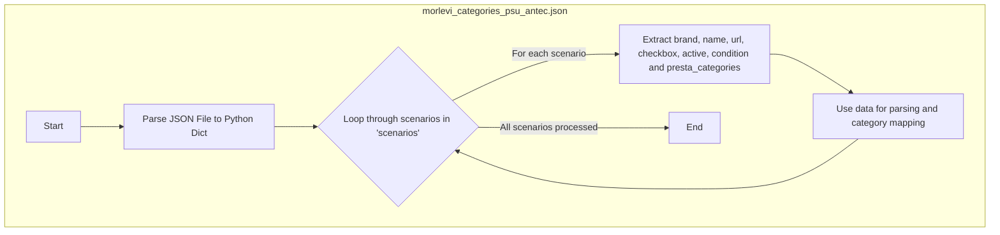

## АНАЛИЗ JSON ФАЙЛА

### 1. <алгоритм>

**Описание:**

Файл `morlevi_categories_psu_antec.json` содержит структуру данных в формате JSON, которая описывает сценарии для парсинга блоков питания (PSU) бренда "ANTEC" с сайта "morlevi.co.il". Каждый сценарий представляет собой конфигурацию для конкретной модели PSU, включая ее название, URL-адрес страницы товара, состояние (`condition`), а также набор категорий `presta_categories`.

**Блок-схема:**

1.  **Начало**: Загрузка JSON-файла.
    *   *Пример*:  Файл загружается в память.
2.  **Разбор JSON**: Парсинг JSON-данных в структуру данных (словарь в Python).
    *   *Пример*: Python интерпретирует JSON и создает словарь, где ключом является "scenarios", а значением - словарь с описанием сценариев парсинга для PSU ANTEC.
3.  **Обход сценариев**: Проход по ключам словаря `scenarios`. Каждый ключ является названием модели блока питания.
    *   *Пример*: Цикл проходит по ключам "ANTEC 450W", "ANTEC 500W" и т.д.
4.  **Извлечение данных сценария**: Для каждого сценария извлекаются значения полей:
    *   `brand`: Бренд блока питания ("ANTEC").
        *   *Пример*: `brand` = "ANTEC".
    *   `name`: Мощность блока питания ("450W", "500W" и т.д.).
        *   *Пример*: `name` = "450W".
    *   `url`: URL-адрес страницы с товаром на сайте morlevi.co.il.
        *   *Пример*: `url` = "https://www.morlevi.co.il/Cat/66?p_145=634&sort=datafloat2%2Cprice&keyword=".
    *   `checkbox`: Флаг активности (всегда `false` в данном файле).
        *   *Пример*: `checkbox` = `false`.
    *   `active`: Флаг активности (всегда `true` в данном файле).
         *   *Пример*: `active` = `true`.
    *   `condition`: Состояние товара ("new").
        *   *Пример*: `condition` = "new".
    *   `presta_categories`: Строка с ID категорий PrestaShop, к которым относится товар.
        *   *Пример*: `presta_categories` = "158,511,188,577".
5.  **Обработка данных**: Данные каждого сценария используются для парсинга соответствующей страницы товара. На основе `presta_categories` товар сопоставляется с категориями магазина.
6.  **Конец**: Обработка всех сценариев завершена.

### 2. <mermaid>

**Объяснение `mermaid` диаграммы:**

*   `JSON_File`: Обозначает контейнер для всего процесса, подчеркивая, что начальной точкой является JSON файл.
*   `Start`: Начало процесса.
*   `Parse_JSON`: Операция разбора JSON файла в структуру данных Python.
*   `Loop_Scenarios`: Цикл, перебирающий все сценарии, находящиеся в ключе `scenarios` в словаре.
*   `Extract_Data`: Извлечение значений ключей каждого сценария: `brand`, `name`, `url`, `checkbox`, `active`, `condition` и `presta_categories`.
*   `Process_Data`: Шаг обработки данных, где информация используется для парсинга веб-страницы и сопоставления товаров с категориями магазина.
*   `End`: Конец процесса.

### 3. <объяснение>

**Общее описание:**

Файл `morlevi_categories_psu_antec.json` представляет собой конфигурационный файл в формате JSON, который содержит данные для автоматизации процесса сбора информации о блоках питания (PSU) производства ANTEC с сайта morlevi.co.il. Каждый элемент в разделе `"scenarios"` описывает отдельный SKU (Stock Keeping Unit) блока питания и содержит URL, параметры для его парсинга и категории, соответствующие этому товару в PrestaShop.
**Импорты:**

В данном файле импорты отсутствуют, так как это файл конфигурации, а не исполняемый код.

**Классы:**

Классы также отсутствуют в данном файле, так как это файл конфигурации, а не исполняемый код.

**Функции:**

Функции не используются, так как это файл конфигурации.

**Переменные:**

*   `scenarios`: Это основной ключ в JSON файле. Значение — это словарь, где ключи представляют собой названия конкретных моделей блоков питания (например, "ANTEC 450W"), а значения — это словари с атрибутами этих моделей.
*   `brand` (string): Название бренда блока питания. В данном случае всегда "ANTEC".
*   `name` (string): Название модели блока питания, обычно включающее мощность в ваттах (например, "450W").
*   `url` (string): URL-адрес страницы товара на сайте поставщика.
*   `checkbox` (boolean): Логическая переменная, указывающая, выбран ли этот сценарий для обработки. В данном файле всегда false.
*   `active` (boolean): Логическая переменная, указывающая, активен ли этот сценарий для обработки. В данном файле всегда true.
*   `condition` (string): Состояние товара. В данном файле всегда new.
*    `presta_categories` (string): Строка, содержащая ID категорий PrestaShop, к которым должен быть отнесен этот товар.

**Взаимосвязь с другими частями проекта:**

1.  **Парсеры**: Данный JSON файл вероятно используется в качестве входных данных для парсеров, которые автоматически собирают информацию о товарах с сайтов. URL-адреса используются для доступа к страницам товаров, а данные о `brand`, `name` и `presta_categories` используются для классификации и сохранения данных о товаре в базе данных.
2.  **PrestaShop API**: Значение `presta_categories`, скорее всего, используется для взаимодействия с API PrestaShop, что позволяет автоматически связывать товары с категориями в магазине.
3.  **Управление настройками**: Этот файл может быть частью более крупной системы управления настройками парсинга. С помощью него можно добавлять или отключать новые сценарии парсинга.

**Потенциальные ошибки и области для улучшения:**

1.  **Отсутствие валидации**: Нет валидации формата и типов данных. Это может привести к ошибкам во время обработки, если какой-либо из параметров будет иметь некорректное значение (например, неправильный URL или строка в числовом поле).
2.  **Жестко заданные параметры**: Все значения в `checkbox` всегда `false`, а `active` всегда `true`. Это может указывать на неиспользуемые возможности.
3.  **Множественные категории**:  `presta_categories` сейчас строка, которую нужно будет парсить. Лучше хранить их в виде списка в JSON, чтобы упростить обработку.
4.  **Ручная правка**: Вероятно, файл редактируется вручную. Это увеличивает риск ошибок. Можно использовать более удобный интерфейс для редактирования таких конфигураций.
5.  **Состояние товара**: Все товары `condition: new`, нужно добавить поддержку других состояний товара если это необходимо.

**Цепочка взаимосвязей:**

JSON → парсер → база данных/ PrestaShop API.