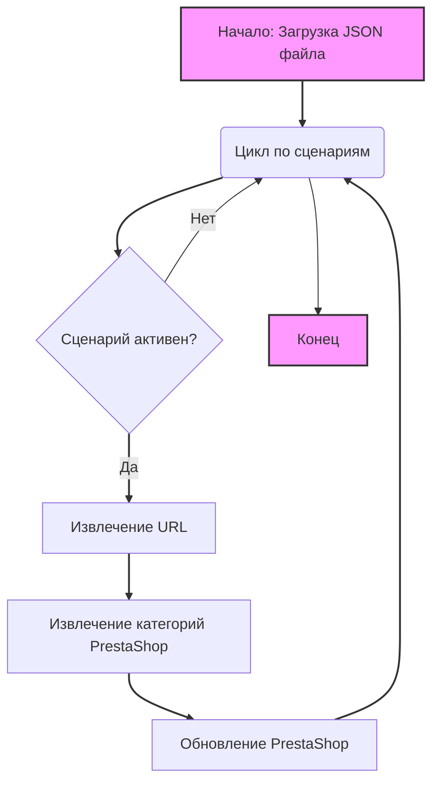

## <алгоритм>

Этот код представляет собой JSON-файл, который определяет сценарии для парсинга категорий товаров Samsung с веб-сайта Morlevi. Каждый сценарий описывает конкретный тип товара (например, "SAMSUNG NVME GEN4 512GB") и содержит информацию, необходимую для его идентификации и обработки.

**Блок-схема:**

```mermaid
graph TD
    A[Начало: Загрузка JSON] --> B{Цикл по сценариям};
    B -- Да --> C[Извлечение данных сценария: <br>название, бренд, URL, активность, <br>состояние, категории PrestaShop];
    C --> D{Проверка активности сценария: <br> `active` == true?};
    D -- Да --> E[Извлечение URL для парсинга];
     E --> F[Извлечение категории PrestaShop];
    F --> G[Использование данных для парсинга <br> и обновления PrestaShop];
    G --> B;
    D -- Нет --> B;
    B -- Нет --> H[Конец: Все сценарии обработаны];
    
    style A fill:#f9f,stroke:#333,stroke-width:2px
    style H fill:#f9f,stroke:#333,stroke-width:2px
    
    linkStyle 0,1,2,3,4,5,6,7,8,9 stroke:#333,stroke-width:2px
```

**Пример обработки одного сценария:**

1. **Начало:** JSON-файл загружается в программу.
2. **Цикл:** Программа переходит к первому сценарию "SAMSUNG NVME GEN4 512GB".
3. **Извлечение:** Извлекаются данные:
   - `brand`: "SAMSUNG"
   - `url`: "https://www.morlevi.co.il/Cat/314?p_315=28&p_175=826&sort=datafloat2%2Cprice&keyword="
   - `active`: true
   - `condition`: "new"
   - `presta_categories`: { "template": { "samsung": "SSD NVME GEN4 512GB" } }
4. **Проверка активности:** Значение `active` равно `true`.
5. **Извлечение URL:** URL "https://www.morlevi.co.il/Cat/314?p_315=28&p_175=826&sort=datafloat2%2Cprice&keyword=" используется для парсинга.
6.  **Извлечение категории PrestaShop:** Извлекается категория "SSD NVME GEN4 512GB" для PrestaShop.
7. **Использование данных:** Данные используются для парсинга товаров и обновления соответствующих категорий в PrestaShop.
8. **Переход к следующему сценарию:** Программа переходит к следующему сценарию и повторяет процесс.
9. **Конец:** После обработки всех сценариев цикл завершается.

## <mermaid>



**Объяснение зависимостей `mermaid`:**

-   **`graph TD`**:  Определяет тип диаграммы как направленный граф (Top-Down).
-   **`A[Начало: Загрузка JSON файла]`**:  Начальный узел диаграммы, представляющий загрузку JSON файла, где хранятся сценарии.
-  **`B(Цикл по сценариям)`**: Узел, представляющий цикл, перебирающий все сценарии в JSON.
-   **`C{Сценарий активен?}`**: Узел принятия решения. Проверяется флаг `active` для каждого сценария.
-   **`D[Извлечение URL]`**: Узел, представляющий извлечение URL для парсинга со страницы поставщика.
-  **`E[Извлечение категорий PrestaShop]`**: Узел, представляющий извлечение соответствующей категории PrestaShop для товара.
-   **`F[Обновление PrestaShop]`**: Узел, представляющий обновление или создание записей в PrestaShop с помощью извлечённых данных.
-   **`G[Конец]`**: Конечный узел, означающий завершение обработки всех сценариев.

**Зависимости:**

-   **Цикл по сценариям:** Зависимость от структуры JSON-файла, который содержит список сценариев.
-   **Проверка активности:** Зависимость от атрибута `active` каждого сценария.
-   **Извлечение URL и категорий:** Зависимость от структуры JSON, где URL и категории находятся внутри каждого сценария.
-   **Обновление PrestaShop:** Зависимость от стороннего API или модуля, который используется для взаимодействия с PrestaShop.

## <объяснение>

**Импорты:**

В данном коде нет явных импортов. Этот JSON-файл представляет собой конфигурационные данные, а не исполняемый код Python. Импорты будут использоваться в коде Python, который будет обрабатывать этот JSON-файл. В этом коде предполагается, что для обработки JSON-файла будут использоваться стандартные Python библиотеки, такие как `json`.

**Классы:**

В этом JSON-файле нет классов, поскольку это конфигурационный файл. Однако, можно предположить, что в коде, который будет использовать эти данные, будут использоваться классы для представления сценариев и товаров.

**Функции:**

В этом файле нет функций. Однако, в коде, который будет использовать эти данные, будут функции для:

-   Загрузки JSON-файла.
-   Итерации по сценариям.
-   Извлечения URL.
-   Извлечения категорий PrestaShop.
-   Парсинга веб-страниц.
-   Обновления PrestaShop.

**Переменные:**

-   **`scenarios`**:  Словарь, где ключами являются названия сценариев (например, "SAMSUNG NVME GEN4 512GB"), а значениями – словари с данными сценария.
-   **`brand`**: Строка, представляющая бренд товара.
-   **`url`**: Строка, представляющая URL страницы товара на сайте Morlevi.
-   **`checkbox`**: Логическое значение (всегда `false` в данном случае), предположительно указывающее, нужно ли использовать checkbox.
-   **`active`**: Логическое значение, указывающее, активен ли сценарий.
-   **`condition`**: Строка, указывающая состояние товара (всегда `new` в данном случае).
-   **`presta_categories`**: Словарь, содержащий информацию о категориях товара в PrestaShop.
-   **`template`**: Словарь, содержащий шаблон сопоставления, где ключ "samsung" и значение - строка с категорией для PrestaShop.

**Подробное объяснение:**

-   Файл `morlevi_categories_storage_samsung.json` содержит конфигурации для парсинга товаров Samsung с сайта Morlevi.
-   Каждый ключ в словаре `scenarios` представляет собой название товара.
-   Каждый сценарий содержит:
    -   `brand`: Производитель товара.
    -   `url`: URL-адрес страницы товара на сайте Morlevi, откуда будут парситься данные.
    -   `checkbox`: Логический флаг, который сейчас всегда установлен в `false` и не используется.
    -   `active`: Логический флаг, определяющий, следует ли обрабатывать этот сценарий.
    -   `condition`: Состояние товара, в данном случае всегда `new`.
    -   `presta_categories`: Словарь с категориями, соответствующими товару в PrestaShop.
-   `presta_categories` содержит словарь `template` с ключом `samsung`, значением которого является название категории в PrestaShop.
-   Структура данных позволяет легко добавлять новые сценарии и настраивать соответствие категорий между Morlevi и PrestaShop.

**Потенциальные ошибки и области для улучшения:**

-   **Отсутствие валидации**:  Нет валидации для URL. Желательно добавить валидацию для URL, чтобы убедиться, что они корректны и доступны.
-   **Жестко заданное значение `checkbox`**: Всегда `false`, возможно, стоит пересмотреть необходимость этого поля или дать возможность его изменять.
-   **Отсутствие обработки ошибок**:  Не определена обработка ошибок (например, если URL недоступен).
-   **Жесткое сопоставление категорий**: `template` может быть расширен для более гибкого сопоставления категорий, например, для других брендов.
-   **Зависимость от структуры сайта Morlevi**: Если структура сайта Morlevi изменится, потребуется изменение URL в JSON-файле. Желательно добавить автоматическую проверку.
-  **Несоответствие в названии категорий**:  В одном из сценариев "SAMSUNG SATA 3 512GB" указана категория "SATA 3 521GB", что может быть опечаткой.

**Цепочка взаимосвязей с другими частями проекта:**

1.  **Парсер Morlevi:**  JSON-файл служит конфигурацией для парсера, который будет извлекать данные с сайта Morlevi.
2.  **PrestaShop API:** Данные из этого файла используются для обновления или создания товаров и категорий в PrestaShop.
3.  **Система управления:** Этот файл часть системы управления парсингом и синхронизацией данных с PrestaShop.
4.  **Модуль конфигурации**: Может быть частью более общей системы конфигурации, где настройки хранятся в JSON-файлах.

Этот файл является важной частью процесса автоматизации парсинга и синхронизации данных с PrestaShop. Правильная структура и валидация данных обеспечивают надежность и гибкость системы.