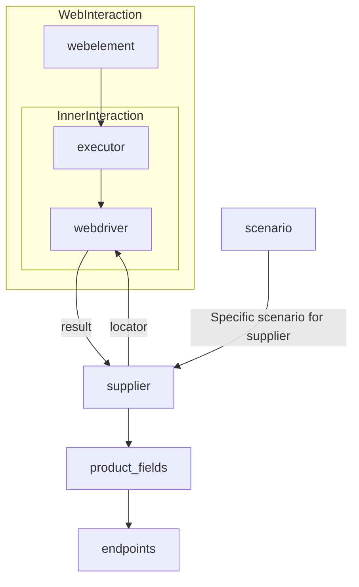

# <input code>

```[Русский](https://github.com/hypo69/hypo/blob/master/README.RU.MD)
# **Class** `Supplier`
### **Base class for all suppliers**
*In the context of the code, `Supplier` represents an information provider.  
A supplier can be a producer of goods, data, or information.  
The supplier's sources include a website's landing page, a document, a database, or a table.  
This class unifies different suppliers under a standardized set of operations.  
Each supplier has a unique prefix. ([Details on prefixes](prefixes.md))*  

The `Supplier` class serves as the foundation for managing interactions with suppliers.  
It handles initialization, configuration, authentication, and execution of workflows for various data sources, such as `amazon.com`, `walmart.com`, `mouser.com`, and `digikey.com`. Clients can also define additional suppliers.  

---

## List of implemented suppliers:

[aliexpress](aliexpress)  - Implemented with two workflows: `webdriver` and `api`  
[amazon](amazon) - `webdriver`  
[bangood](bangood)  - `webdriver`  
[cdata](cdata)  - `webdriver`  
[chat_gpt](chat_gpt)  - Interacts with the ChatGPT interface (NOT THE MODEL!)  
[ebay](ebay)  - `webdriver`  
[etzmaleh](etzmaleh)  - `webdriver`  
[gearbest](gearbest)  - `webdriver`  
[grandadvance](grandadvance)  - `webdriver`  
[hb](hb)  - `webdriver`  
[ivory](ivory) - `webdriver`  
[ksp](ksp) - `webdriver`  
[kualastyle](kualastyle) `webdriver`  
[morlevi](morlevi) `webdriver`  
[visualdg](visualdg) `webdriver`  
[wallashop](wallashop) `webdriver`  
[wallmart](wallmart) `webdriver`  
[Details on WebDriver :class: `Driver`](../webdriver)  
[Details on workflows :class: `Scenario`](../scenarios)


---

## **Attributes**
- **`supplier_id`** *(int)*: Unique identifier for the supplier.  
- **`supplier_prefix`** *(str)*: Supplier prefix, e.g., `'amazon'`, `'aliexpress'`.  
- **`supplier_settings`** *(dict)*: Supplier settings loaded from a JSON file.  
- **`locale`** *(str)*: Localization code (default: `'en'`).  
- **`price_rule`** *(str)*: Rules for price calculations (e.g., VAT rules).  
- **`related_modules`** *(module)*: Helper modules for specific supplier operations.  
- **`scenario_files`** *(list)*: List of scenario files to be executed.  
- **`current_scenario`** *(dict)*: Scenario currently being executed.  
- **`login_data`** *(dict)*: Data for authentication.  
- **`locators`** *(dict)*: Dictionary of web element locators.  
- **`driver`** *(Driver)*: WebDriver instance for interacting with the supplier's website.  
- **`parsing_method`** *(str)*: Data parsing method (e.g., `'webdriver'`, `'api'`, `'xls'`, `'csv'`).  

---

## **Methods**

### **`__init__`**
**Constructor of the `Supplier` class.**

```python
def __init__(self, supplier_prefix: str, locale: str = 'en', webdriver: str | Driver | bool = 'default', *attrs, **kwargs):
    """Initializes an instance of Supplier.

    Args:
        supplier_prefix (str): The supplier's prefix.
        locale (str, optional): Localization code. Defaults to 'en'.
        webdriver (str | Driver | bool, optional): Type of WebDriver. Defaults to 'default'.

    Raises:
        DefaultSettingsException: If default settings are not properly configured.
    """
```

### **`_payload`**
**Loads supplier settings and initializes the WebDriver.**

```python
def _payload(self, webdriver: str | Driver | bool, *attrs, **kwargs) -> bool:
    """Loads settings, locators, and initializes the WebDriver.

    Args:
        webdriver (str | Driver | bool): Type of WebDriver.

    Returns:
        bool: Returns `True` if the loading was successful.
    """
```

### **`login`**
**Handles authentication on the supplier's website.**

```python
def login(self) -> bool:
    """Authenticates the user on the supplier's website.

    Returns:
        bool: Returns `True` if login was successful.
    """
```

### **`run_scenario_files`**
**Executes one or more scenario files.**

```python
def run_scenario_files(self, scenario_files: str | List[str] = None) -> bool:
    """Runs the provided scenario files.

    Args:
        scenario_files (str | List[str], optional): List or path to scenario files.

    Returns:
        bool: Returns `True` if scenarios were executed successfully.
    """
```

### **`run_scenarios`**
**Executes specified scenarios.**

```python
def run_scenarios(self, scenarios: dict | list[dict]) -> bool:
    """Executes specified scenarios.

    Args:
        scenarios (dict | list[dict]): Scenarios to be executed.

    Returns:
        bool: Returns `True` if all scenarios were executed successfully.
    """
```


# <algorithm>

**1. Initialization (`__init__`):**
   - Sets `supplier_prefix`, `locale`, and `webdriver` attributes.
   - Example: `supplier = Supplier(supplier_prefix='aliexpress', locale='ru', webdriver='chrome')`

**2. Loading settings and WebDriver (`_payload`):**
   - Loads settings (e.g., locators) from a configuration file.
   - Initializes the WebDriver based on the `webdriver` argument.
   - Example: `supplier._payload(webdriver='firefox')`

**3. Authentication (`login`):**
   - Executes actions to log in to the supplier's website using `login_data`.
   - Returns `True` if successful, otherwise throws an exception.
   - Example: `supplier.login()`

**4. Executing Scenarios (`run_scenario_files`, `run_scenarios`):**
   - For `run_scenario_files`: Iterates through the list of scenario files and runs them sequentially using the methods within these files.
   - For `run_scenarios`: Takes in a list of scenario dictionaries (presumably each dictionary represents a step). Performs actions specified by each scenario.
   - Example for `run_scenario_files`: `supplier.run_scenario_files(['scenario1.json', 'scenario2.json'])`

**Data Flow:** Data from the configuration files (settings, locators, scenario details) is loaded into the `supplier` object. The `webdriver` interacts with the supplier's website, and the results of the interaction are parsed by the class methods and used to populate `product_fields`.


# <mermaid>

```mermaid
graph LR
    subgraph Supplier Initialization
        A[Supplier] --> B{__init__(supplier_prefix, locale, webdriver)};
        B --> C[supplier_prefix, locale, webdriver];
    end

    subgraph Settings and WebDriver Loading
        C --> D{_payload(webdriver)};
        D --> E[Settings (locators, etc.)];
        D --> F[WebDriver Initialization];
    end

    subgraph Authentication
        F --> G[login()];
        G --> H{Login Successful?};
        H -- Yes --> I[Return True];
        H -- No --> J[Error Handling (Exception)];
    end

    subgraph Scenario Execution
        I --> K[run_scenario_files/run_scenarios];
        K --> L[Scenario Files/Scenarios];
    end
    F --> M[WebDriver Interaction];
    M --> N[Parsing Results];
    N --> O[product_fields];
```


# <explanation>

**Imports:** The code snippet itself doesn't contain imports, so that information is missing.  A `DefaultSettingsException` is mentioned, implying there is a related exception handling module.

**Classes:**

- **`Supplier`:** This class represents a supplier (e.g., `amazon.com`, `aliexpress`).  It encapsulates the logic for interacting with a specific supplier.  Attributes like `supplier_prefix`, `login_data`, and `driver` are crucial for this interaction. Methods like `login` and `run_scenario_files` encapsulate different stages of the supplier interaction process.

**Functions:**

- `__init__`: Initializes the `Supplier` object, setting initial values for attributes and potentially creating the WebDriver instance.
- `_payload`:  Loads settings and locators from external files or sources, and initialises the WebDriver. It returns a boolean value indicating success.
- `login`: Handles supplier-specific login actions, likely performing web interactions.  Returns a boolean success indicator.
- `run_scenario_files`: Executes a predefined set of actions, often defined in external files.  Returns a boolean success indicator.
- `run_scenarios`: Executes a list of specific scenarios, each potentially representing a series of actions.  Returns a boolean success indicator.


**Variables:**

Variables such as `supplier_prefix`, `login_data`, `webdriver` store data critical for interacting with the specific supplier system. `scenario_files` is a list of files that contain scenarios to be executed, and `driver` is a variable that holds a WebDriver object that handles website interactions.


**Possible Errors/Improvements:**

- **Error Handling:** The code mentions `DefaultSettingsException`, but more specific exception handling for web interactions (network issues, timeout, invalid elements, etc.) would enhance robustness.
- **Testability:**  Unit tests for the `Supplier` methods would be beneficial to ensure each function operates as expected without relying on external website dependencies.
- **Flexibility:** The use of `scenario_files` suggests potential for reusability. Adding more structure to the scenario files (e.g., structured JSON) to describe actions clearly will increase maintainability and readability.
- **Logging:** Incorporating logging to track actions, errors, and the progress of interactions with the supplier would provide critical information during debugging and monitoring.


**Relationships:** The `Supplier` class interacts with other parts of the project through potentially different modules such as: `Driver`, `Scenario`.  These relationships likely handle web interaction management, scenario execution, and other helper functionalities. The relationships are not explicitly defined in this excerpt but are implicit. This would be more clear with additional context/imports.