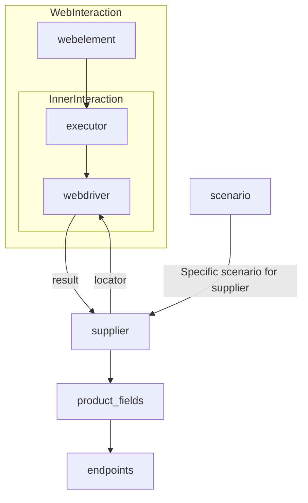

# <input code>

```[Русский](https://github.com/hypo69/hypo/blob/master/README.RU.MD)
# **Class** `Supplier`
### **Base class for all suppliers**
*In the context of the code, `Supplier` represents an information provider.  
A supplier can be a producer of goods, data, or information.  
The supplier's sources include a website's landing page, a document, a database, or a table.  
This class unifies different suppliers under a standardized set of operations.  
Each supplier has a unique prefix. ([Details on prefixes](prefixes.md))*  

The `Supplier` class serves as the foundation for managing interactions with suppliers.  
It handles initialization, configuration, authentication, and execution of workflows for various data sources, such as `amazon.com`, `walmart.com`, `mouser.com`, and `digikey.com`. Clients can also define additional suppliers.  

---

## List of implemented suppliers:

[aliexpress](aliexpress)  - Implemented with two workflows: `webdriver` and `api`  
[amazon](amazon) - `webdriver`  
[bangood](bangood)  - `webdriver`  
[cdata](cdata)  - `webdriver`  
[chat_gpt](chat_gpt)  - Interacts with the ChatGPT interface (NOT THE MODEL!)  
[ebay](ebay)  - `webdriver`  
[etzmaleh](etzmaleh)  - `webdriver`  
[gearbest](gearbest)  - `webdriver`  
[grandadvance](grandadvance)  - `webdriver`  
[hb](hb)  - `webdriver`  
[ivory](ivory) - `webdriver`  
[ksp](ksp) - `webdriver`  
[kualastyle](kualastyle) `webdriver`  
[morlevi](morlevi) `webdriver`  
[visualdg](visualdg) `webdriver`  
[wallashop](wallashop) `webdriver`  
[wallmart](wallmart) `webdriver`  
[Details on WebDriver :class: `Driver`](../webdriver)  
[Details on workflows :class: `Scenario`](../scenarios)


---

## **Attributes**
- **`supplier_id`** *(int)*: Unique identifier for the supplier.  
- **`supplier_prefix`** *(str)*: Supplier prefix, e.g., `'amazon'`, `'aliexpress'`.  
- **`supplier_settings`** *(dict)*: Supplier settings loaded from a JSON file.  
- **`locale`** *(str)*: Localization code (default: `'en'`).  
- **`price_rule`** *(str)*: Rules for price calculations (e.g., VAT rules).  
- **`related_modules`** *(module)*: Helper modules for specific supplier operations.  
- **`scenario_files`** *(list)*: List of scenario files to be executed.  
- **`current_scenario`** *(dict)*: Scenario currently being executed.  
- **`login_data`** *(dict)*: Data for authentication.  
- **`locators`** *(dict)*: Dictionary of web element locators.  
- **`driver`** *(Driver)*: WebDriver instance for interacting with the supplier's website.  
- **`parsing_method`** *(str)*: Data parsing method (e.g., `'webdriver'`, `'api'`, `'xls'`, `'csv'`).  


---

## **Methods**

### **`__init__`**
**Constructor of the `Supplier` class.**

```python
def __init__(self, supplier_prefix: str, locale: str = 'en', webdriver: str | Driver | bool = 'default', *attrs, **kwargs):
    """Initializes an instance of Supplier.

    Args:
        supplier_prefix (str): The supplier's prefix.
        locale (str, optional): Localization code. Defaults to 'en'.
        webdriver (str | Driver | bool, optional): Type of WebDriver. Defaults to 'default'.

    Raises:
        DefaultSettingsException: If default settings are not properly configured.
    """
```

### **`_payload`**
**Loads supplier settings and initializes the WebDriver.**

```python
def _payload(self, webdriver: str | Driver | bool, *attrs, **kwargs) -> bool:
    """Loads settings, locators, and initializes the WebDriver.

    Args:
        webdriver (str | Driver | bool): Type of WebDriver.

    Returns:
        bool: Returns `True` if the loading was successful.
    """
```

### **`login`**
**Handles authentication on the supplier's website.**

```python
def login(self) -> bool:
    """Authenticates the user on the supplier's website.

    Returns:
        bool: Returns `True` if login was successful.
    """
```

### **`run_scenario_files`**
**Executes one or more scenario files.**

```python
def run_scenario_files(self, scenario_files: str | List[str] = None) -> bool:
    """Runs the provided scenario files.

    Args:
        scenario_files (str | List[str], optional): List or path to scenario files.

    Returns:
        bool: Returns `True` if scenarios were executed successfully.
    """
```

### **`run_scenarios`**
**Executes specified scenarios.**

```python
def run_scenarios(self, scenarios: dict | list[dict]) -> bool:
    """Executes specified scenarios.

    Args:
        scenarios (dict | list[dict]): Scenarios to be executed.

    Returns:
        bool: Returns `True` if all scenarios were executed successfully.
    """
```


# <algorithm>

A step-by-step description of the algorithm is not readily apparent from the provided text. The description gives a conceptual understanding of the `Supplier` class, its purpose, and how it interacts with other components, but no particular algorithm for data processing is presented in terms of specific steps and logic flow between methods.


# <mermaid>

The provided mermaid code represents a high-level interaction diagram, not a precise algorithm.  It depicts a relationship between a `Supplier` object, a `Driver` (presumably for web interaction), web elements, and scenarios.

# <explanation>

The `Supplier` class is a base class for interacting with various online retailers (suppliers).  It encapsulates the logic for interacting with these suppliers, including initialization, configuration, authentication, and running predefined workflows (scenarios).

* **Imports:** There are no explicit imports shown in the code snippet, but the presence of `Driver` and `Scenario` classes, along with mentions of `prefixes.md`, `../webdriver`, `../scenarios`, suggest that this class likely interacts with modules/classes defined in other parts of the `src` directory, presumably handling aspects of web automation (driver initialization, scenario execution)

* **Classes:**
    * **`Supplier`:**  This class is responsible for managing interactions with a specific supplier.  Its methods handle tasks like loading configurations, authenticating, and executing pre-defined workflows, providing consistency in the logic for interacting with different suppliers.
    * **`Driver` (implied):** The class `Driver` is referenced but not detailed, representing a web driver instance (like Selenium) for interacting with web pages, crucial for automated actions.
    * **`Scenario` (implied):**  Also implicit, `Scenario` likely defines specific actions (e.g., locating products, adding items to cart) and their sequence, that the `Supplier` runs. The `run_scenarios` method suggests this.


* **Functions:**
    * **`__init__`**: Initializes a `Supplier` object with the supplier prefix, locale, and optional web driver configuration.
    * **`_payload`**: Crucial for loading settings, locators, and setting up the driver connection. It's likely where the actual web driver instance is created.
    * **`login`**: Handles supplier-specific authentication steps.
    * **`run_scenario_files`**: Executes a set of pre-defined scenarios.
    * **`run_scenarios`**:  Executes pre-defined scenarios, a more flexible approach to workflow execution (as opposed to solely relying on files).

* **Variables:** `supplier_prefix`, `locale`, `driver`, and `scenario_files` are examples of variables utilized within the class to hold data relevant to the supplier's operation.  The type annotations make the code more self-documenting and improve code maintainability.

* **Possible Errors/Improvements:**
    * **Error Handling:** The code snippets lack error handling (e.g., checking for successful `login` or `_payload` execution). Implementing proper error handling (using `try...except` blocks) is crucial to gracefully manage potential issues, such as invalid configurations, network problems, or timeouts.
    * **Data Validation:** Implementing checks to verify data integrity (e.g., checking if `scenario_files` exist) would prevent unexpected behavior.
    * **Logging:** Incorporating logging (using Python's `logging` module) will help in debugging and monitoring the execution process.
    * **Resource Management:** The `driver` should be properly closed and released in case of failure or at the end of execution, to prevent resource leaks.

* **Inter-component Relationships:** The `Supplier` class relies on other modules (implied) for web driver initialization and scenario execution, creating a clear dependency structure in the project's architecture. The code assumes that relevant settings, locators, and scenarios are properly structured and loaded in order to function correctly.

The `Supplier` class acts as an abstraction layer, separating the details of interacting with a specific supplier (e.g., website structure, login process) from the general logic of running scenarios. This improves maintainability and reusability.