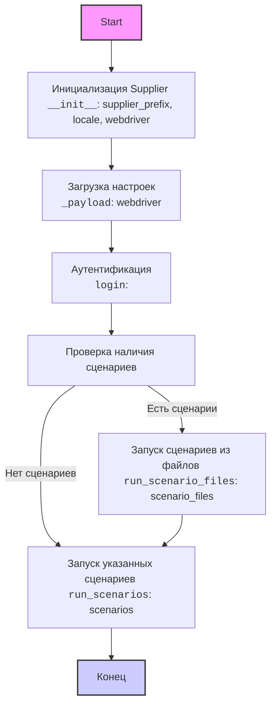
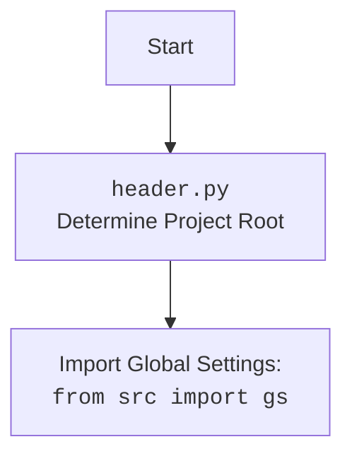

## <алгоритм>

1.  **Инициализация ( `__init__` )**:
    *   Принимает `supplier_prefix` (строка, например, 'amazon'), `locale` (строка, например, 'en'), и `webdriver` (строка или объект `Driver`, или `bool`, например, 'chrome' или `True`).
    *   Сохраняет `supplier_prefix`, `locale`.
    *   Вызывает метод `_payload` для загрузки настроек и инициализации `WebDriver`.
    *   Пример: `supplier = Supplier(supplier_prefix='aliexpress', locale='ru', webdriver='chrome')`
2.  **Загрузка настроек ( `_payload` )**:
    *   Принимает `webdriver` (строка, объект `Driver` или `bool`).
    *   Загружает настройки поставщика из JSON-файла, используя `supplier_prefix`.
    *   Инициализирует веб-драйвер (`webdriver`), если он не был передан.
    *   Устанавливает `locators` из файла настроек.
    *   Возвращает `True`, если загрузка прошла успешно.
    *   Пример: `supplier._payload(webdriver='firefox')`
3.  **Аутентификация ( `login` )**:
    *   Использует `login_data` для выполнения аутентификации на сайте поставщика.
    *   Может включать ввод логина, пароля и другие действия для входа.
    *   Возвращает `True`, если вход успешен.
    *   Пример: `supplier.login()`
4.  **Запуск сценариев ( `run_scenario_files` )**:
    *   Принимает список имен файлов сценариев (`scenario_files`) или одну строку с именем файла.
    *   Загружает каждый файл сценария.
    *   Вызывает метод `run_scenarios` для выполнения сценария из файла.
    *   Возвращает `True`, если все сценарии из файла выполнены успешно.
    *   Пример: `supplier.run_scenario_files(['scenario_1.json', 'scenario_2.json'])`
5.  **Запуск сценариев ( `run_scenarios` )**:
    *   Принимает список сценариев (`scenarios`) в виде словарей или один словарь.
    *   Выполняет каждый сценарий (например, парсинг данных, взаимодействие с веб-элементами).
    *   Возвращает `True`, если все сценарии выполнены успешно.
    *    Пример: `supplier.run_scenarios([{'action': 'scrape', 'target': 'product_list'}, {'action': 'scroll', 'target': 'page_end'}])`

## <mermaid>

**Анализ зависимостей:**

*   `InitializeSupplier` зависит от входных параметров `supplier_prefix`, `locale`, `webdriver`.
*   `LoadSettings` зависит от `webdriver` и  `supplier_prefix`.
*   `Authenticate` использует данные из `login_data`
*   `RunScenarioFiles` и `RunSpecificScenarios`  оба  зависят от `Supplier`
*   Все блоки используют обьект класса `Supplier` для доступа к атрибутам и методам
* `header.py` определяет корневую директорию проекта и импортирует глобальные настройки (gs)

## <объяснение>

**Импорты:**

В предоставленном коде нет явных инструкций `import`. Предполагается, что используемые классы и модули (например, `Driver`) импортируются в других частях проекта и доступны для использования в классе `Supplier`.

**Класс `Supplier`**:

*   **Роль**: Является базовым классом для всех поставщиков. Он абстрагирует общие операции для взаимодействия с различными источниками данных (веб-сайтами, API и т.д.).
*   **Атрибуты:**
    *   `supplier_id` (int): Уникальный идентификатор поставщика.
    *   `supplier_prefix` (str): Префикс поставщика, например, `'amazon'`, `'aliexpress'`.
    *   `supplier_settings` (dict): Настройки поставщика, загруженные из JSON-файла.
    *   `locale` (str): Локаль (по умолчанию `'en'`).
    *   `price_rule` (str): Правила для расчета цен.
    *   `related_modules` (module): Модули для специфических операций поставщика.
    *   `scenario_files` (list): Список файлов сценариев.
    *   `current_scenario` (dict): Текущий выполняемый сценарий.
    *   `login_data` (dict): Данные для аутентификации.
    *   `locators` (dict): Словарь локаторов веб-элементов.
    *   `driver` (Driver): Экземпляр веб-драйвера для взаимодействия с веб-сайтом.
    *   `parsing_method` (str): Метод парсинга данных.
*   **Методы:**
    *   `__init__`: Конструктор класса, инициализирует основные атрибуты и вызывает `_payload`.
    *   `_payload`: Загружает настройки поставщика, локаторы и инициализирует `WebDriver`.
    *   `login`: Выполняет аутентификацию на сайте поставщика.
    *   `run_scenario_files`: Запускает сценарии из файлов.
    *   `run_scenarios`: Запускает указанные сценарии.

**Функции:**

*   `__init__`
    *   **Аргументы**: `supplier_prefix` (str), `locale` (str, по умолчанию 'en'), `webdriver` (str, Driver или bool, по умолчанию 'default'), \*attrs, \*\*kwargs.
    *   **Возвращаемое значение**: Нет.
    *   **Назначение**: Инициализирует объект `Supplier`, устанавливая его атрибуты, включая `supplier_prefix`, `locale`, и вызывает метод `_payload`.
    *   **Пример**: `supplier = Supplier(supplier_prefix='aliexpress', locale='ru', webdriver='chrome')`
*   `_payload`
    *   **Аргументы**: `webdriver` (str, Driver или bool), \*attrs, \*\*kwargs.
    *   **Возвращаемое значение**: `bool` (True, если загрузка прошла успешно).
    *   **Назначение**: Загружает настройки поставщика, инициализирует веб-драйвер и устанавливает локаторы.
    *   **Пример**: `supplier._payload(webdriver='firefox')`
*   `login`
    *   **Аргументы**: Нет.
    *   **Возвращаемое значение**: `bool` (True, если аутентификация прошла успешно).
    *   **Назначение**: Выполняет аутентификацию на веб-сайте поставщика.
    *   **Пример**: `supplier.login()`
*   `run_scenario_files`
    *   **Аргументы**: `scenario_files` (str или list[str], по умолчанию None).
    *   **Возвращаемое значение**: `bool` (True, если все сценарии выполнены успешно).
    *   **Назначение**: Запускает выполнение сценариев, указанных в файлах.
    *   **Пример**: `supplier.run_scenario_files(['scenario_1.json', 'scenario_2.json'])`
*   `run_scenarios`
    *   **Аргументы**: `scenarios` (dict или list[dict]).
    *   **Возвращаемое значение**: `bool` (True, если все сценарии выполнены успешно).
    *   **Назначение**: Запускает выполнение указанных сценариев.
    *   **Пример**: `supplier.run_scenarios([{'action': 'scrape', 'target': 'product_list'}, {'action': 'scroll', 'target': 'page_end'}])`

**Переменные:**

*   Переменные в основном используются как атрибуты класса и предназначены для хранения информации о поставщиках, их настройках, состоянии и т.д.

**Потенциальные ошибки и улучшения:**

*   Отсутствует явная обработка ошибок в методах `_payload`, `login`, `run_scenario_files` и `run_scenarios`. Рекомендуется добавить блоки `try-except` для обработки возможных исключений.
*   Метод `_payload` может быть расширен для более гибкой загрузки настроек. Можно добавить загрузку настроек по умолчанию или мердж настроек с локальными.
*   Следует добавить проверки валидности данных (например, проверка типов данных) перед выполнением операций.
*   Не определено, как именно используется атрибут `parsing_method`. Это может быть вынесено в отдельный класс.

**Взаимосвязи с другими частями проекта:**

*   Класс `Supplier` зависит от класса `Driver` (предположительно, находящегося в `../webdriver`) для взаимодействия с браузером.
*   Использует структуру `Scenario`  (предположительно, находящегося в `../scenarios`) для обработки сценариев.
*   Использует JSON-файлы для хранения настроек поставщиков.
*   Предполагается наличие других модулей, которые связаны с классами Driver, Scenario, а также утилитами парсинга.

В целом, класс `Supplier` является хорошо структурированной базовой абстракцией, предоставляющей необходимый функционал для взаимодействия с различными поставщиками.