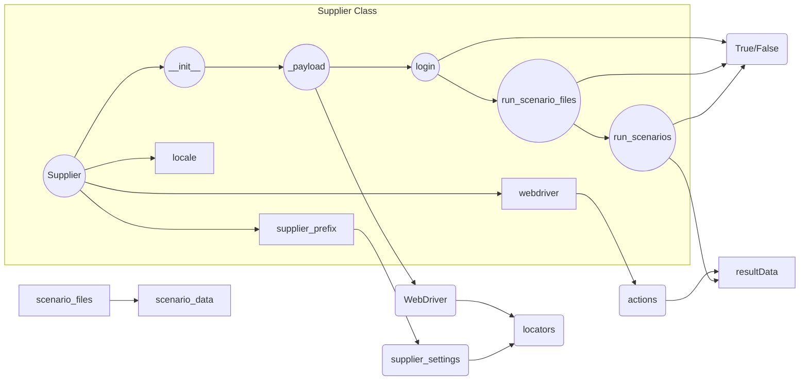

# <input code>

```[Русский](https://github.com/hypo69/hypo/blob/master/README.RU.MD)
# **Class** `Supplier`
### **Base class for all suppliers**
*In the context of the code, `Supplier` represents an information provider.  
A supplier can be a producer of goods, data, or information.  
The supplier's sources include a website's landing page, a document, a database, or a table.  
This class unifies different suppliers under a standardized set of operations.  
Each supplier has a unique prefix. ([Details on prefixes](prefixes.md))*  

The `Supplier` class serves as the foundation for managing interactions with suppliers.  
It handles initialization, configuration, authentication, and execution of workflows for various data sources, such as `amazon.com`, `walmart.com`, `mouser.com`, and `digikey.com`. Clients can also define additional suppliers.  

---

## List of implemented suppliers:

[aliexpress](aliexpress)  - Implemented with two workflows: `webdriver` and `api`  
[amazon](amazon) - `webdriver`  
[bangood](bangood)  - `webdriver`  
[cdata](cdata)  - `webdriver`  
[chat_gpt](chat_gpt)  - Interacts with the ChatGPT interface (NOT THE MODEL!)  
[ebay](ebay)  - `webdriver`  
[etzmaleh](etzmaleh)  - `webdriver`  
[gearbest](gearbest)  - `webdriver`  
[grandadvance](grandadvance)  - `webdriver`  
[hb](hb)  - `webdriver`  
[ivory](ivory) - `webdriver`  
[ksp](ksp) - `webdriver`  
[kualastyle](kualastyle) `webdriver`  
[morlevi](morlevi) `webdriver`  
[visualdg](visualdg) `webdriver`  
[wallashop](wallashop) `webdriver`  
[wallmart](wallmart) `webdriver`  
[Details on WebDriver :class: `Driver`](../webdriver)  
[Details on workflows :class: `Scenario`](../scenarios)

---

## **Attributes**
- **`supplier_id`** *(int)*: Unique identifier for the supplier.  
- **`supplier_prefix`** *(str)*: Supplier prefix, e.g., `'amazon'`, `'aliexpress'`.  
- **`supplier_settings`** *(dict)*: Supplier settings loaded from a JSON file.  
- **`locale`** *(str)*: Localization code (default: `'en'`).  
- **`price_rule`** *(str)*: Rules for price calculations (e.g., VAT rules).  
- **`related_modules`** *(module)*: Helper modules for specific supplier operations.  
- **`scenario_files`** *(list)*: List of scenario files to be executed.  
- **`current_scenario`** *(dict)*: Scenario currently being executed.  
- **`login_data`** *(dict)*: Data for authentication.  
- **`locators`** *(dict)*: Dictionary of web element locators.  
- **`driver`** *(Driver)*: WebDriver instance for interacting with the supplier's website.  
- **`parsing_method`** *(str)*: Data parsing method (e.g., `'webdriver'`, `'api'`, `'xls'`, `'csv'`).  

---

## **Methods**

### **`__init__`**
**Constructor of the `Supplier` class.**

```python
def __init__(self, supplier_prefix: str, locale: str = 'en', webdriver: str | Driver | bool = 'default', *attrs, **kwargs):
    """Initializes an instance of Supplier.

    Args:
        supplier_prefix (str): The supplier's prefix.
        locale (str, optional): Localization code. Defaults to 'en'.
        webdriver (str | Driver | bool, optional): Type of WebDriver. Defaults to 'default'.

    Raises:
        DefaultSettingsException: If default settings are not properly configured.
    """
```

---


# <algorithm>

The algorithm for the `Supplier` class involves several steps:

1. **Initialization (`__init__`):**
   - Takes the `supplier_prefix`, `locale`, and `webdriver` type as input.
   - Stores these values in the object's attributes.
   - (Potentially) Initializes a `Driver` instance if required.

2. **Loading settings and initializing WebDriver (`_payload`):**
   - Loads the `supplier_settings` from a JSON file (or similar).
   - Initializes the `webdriver` (likely a WebDriver instance from a `Driver` class).
   - Retrieves and stores `locators` if they exist in the settings.

3. **Authentication (`login`):**
   - Executes the login procedure for the specified `supplier` using information from the `supplier_settings`.
   - Returns `True` if successful; `False` otherwise.

4. **Executing scenarios (`run_scenario_files`, `run_scenarios`):**
   - Takes a list or a dictionary of scenarios as input.
   - Executes each scenario according to its specific instructions (e.g., scraping, data retrieval).
   - Returns `True` if all scenarios were completed successfully; `False` otherwise.

**Example for `run_scenario_files`:**

Input: `supplier.run_scenario_files(['scenario1.json'])`

1. The method loads `scenario1.json`.
2. It parses the scenario data (e.g., actions, targets).
3. Executes each action (e.g., scraping product lists, extracting prices).

**Example for `run_scenarios`:**

Input: `supplier.run_scenarios([{'action': 'scrape', 'target': 'product_list'}])`

1. The method processes the list of scenarios.
2. Executes the 'scrape' action on the 'product_list' target.

# <mermaid>



**Explanation of Dependencies:**

- **`Supplier` class:**  This class is central and depends on the `Driver` class (for WebDriver interactions) and potentially other modules (`scenario` module for scenario execution).
- **`Driver` class:**  Handles low-level web interaction (it's not directly in this code snippet, implied by `webdriver: str | Driver` type).
- **Scenario module:** Provides the logic for individual scenario executions (not shown, but implied by `run_scenario_files` and `run_scenarios` interacting with data in scenario JSONs).

# <explanation>

**Imports:**

There are no explicit import statements shown in the code snippets.  The example code assumes that necessary classes and modules (like `Driver`, `DefaultSettingsException`, and the scenario handling module) are imported from other parts of the project (`src` directory).  This is implied by `webdriver: str | Driver` type.

**Classes:**

- **`Supplier`:**  This is the core class, responsible for managing interactions with various data sources (suppliers).  It has attributes like `supplier_prefix`, `locale`, `driver`, and `settings` to hold relevant data and a method `__init__`  to configure the supplier.  The `_payload` method sets up essential parts, like locators and the driver.  Other methods (`login`, `run_scenario_files`, and `run_scenarios`) encapsulate the specific logic for interaction with different providers.

**Functions:**

- **`__init__`**:  Initializes the `Supplier` object with necessary parameters (`supplier_prefix`, `locale`, `webdriver`).  Sets up the basic structure for interaction and potentially initializes the driver.
- **`_payload`**:  Loads the supplier's settings from a configuration file, initializes the WebDriver, and retrieves locators (necessary for web interaction).  Handles potential issues with driver initialization and configuration loading.
- **`login`**:  Handles the authentication process, ensuring successful connection to the target website or data source.  Returns a boolean indicating success or failure.
- **`run_scenario_files`**:  Executes a list of scenario files, which presumably contain the instructions for data extraction or processing. Returns a boolean that signals if the processing completed successfully or not.
- **`run_scenarios`**:   Executes a set of predefined scenarios.  This is likely more flexible and can handle a broader range of tasks than `run_scenario_files`. Returns a boolean indicating success or failure.

**Variables:**

Variables like `supplier_prefix`, `locale`, and `webdriver` are strings, controlling the supplier type, language, and the WebDriver to use. `supplier_settings` is a dictionary, holding the specific supplier configurations.


**Potential Errors and Improvements:**

- **Error Handling:** The code lacks detailed error handling for various scenarios (e.g., incorrect configuration files, authentication failures, issues with WebDriver).  Adding `try...except` blocks could significantly improve robustness.
- **Scenario Structure:**  The use of a standardized structure for scenarios (like JSON files) is very important and makes the code more maintainable and readable.
- **Driver Initialization:** The use of `webdriver` as a string parameter (`'chrome'`, `'firefox'`) requires appropriate handling (e.g., a driver initialization function) within the `_payload` method to create and configure the WebDriver.
- **Data Validation:**  Validating the data obtained from the scenarios or configurations would prevent unexpected issues and incorrect results.
- **Logging:** Implementing logging would help track the execution process and identify problems effectively.
- **Code Organization**: If the project involves a lot of scenarios, creating a dedicated scenario module will significantly enhance readability and maintainability.


**Relationships to Other Parts of the Project:**

The `Supplier` class relies on configuration files (JSON format) and the `Driver` class for web interaction.  It likely interacts with a `Scenario` class or a similar module for handling scenario execution, possibly making calls to other helper functions that are not included in this snippet. The `prefixes.md` file is a crucial part of the project context and establishes a way to identify and classify suppliers. The `../webdriver` and `../scenarios` paths suggest that there are classes (`Driver`, `Scenario`) and potentially modules (`webdriver`, `scenarios`) related to web interaction and handling of scenarios, respectively, located in other parts of the project structure (nested directories) within the `src` folder.