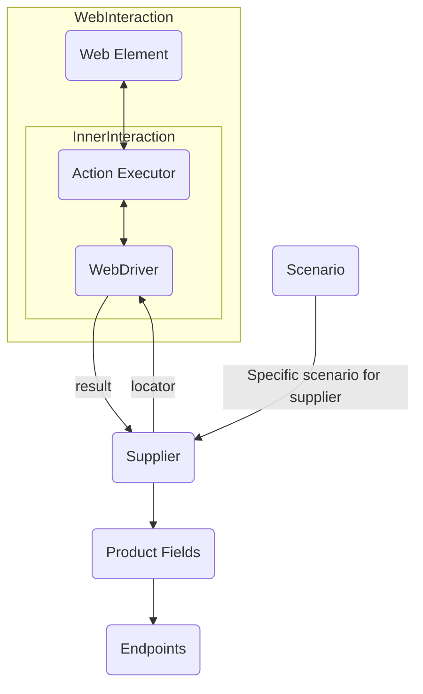

## Анализ кода `hypotez/src/suppliers/readme.md`

### 1. **<алгоритм>**

**Общий процесс работы класса `Supplier`:**

1.  **Инициализация (`__init__`)**:
    *   Принимает `supplier_prefix` (строка, например, `'amazon'`), `locale` (строка, например, `'en'`), и тип `webdriver` (строка или объект `Driver`, например, `'chrome'` или экземпляр класса `Driver`.)
    *   Устанавливает значения атрибутов экземпляра класса, таких как `supplier_prefix` и `locale`.
    *   Вызывает метод `_payload` для загрузки настроек и инициализации `webdriver`.
    *   **Пример**: `supplier = Supplier(supplier_prefix='aliexpress', locale='ru', webdriver='chrome')`

2.  **Загрузка настроек (`_payload`)**:
    *   Принимает тип `webdriver` (строка или объект `Driver`).
    *   Загружает настройки поставщика из JSON-файла на основе `supplier_prefix`.
    *   Загружает локаторы веб-элементов для данного поставщика.
    *   Инициализирует объект `webdriver` в зависимости от переданного типа.
    *   Возвращает `True` в случае успеха.
    *  **Пример**: `supplier._payload(webdriver='firefox')`

3.  **Аутентификация (`login`)**:
    *   Использует данные для входа (если имеются) и `webdriver` для входа на сайт поставщика.
    *   Возвращает `True` если вход выполнен успешно.
    *   **Пример**: `supplier.login()`

4.  **Выполнение сценариев**:
    *   `run_scenario_files` принимает список или путь к файлам сценариев.
        *   Читает файлы сценариев и передает их в `run_scenarios`.
    *  `run_scenarios` принимает список или словарь со сценариями.
         *   Для каждого сценария, вызывает соответствующие действия (например, скрейпинг данных).
    *   Возвращает `True`, если все сценарии выполнены успешно.
    *   **Примеры**:
        *   `supplier.run_scenario_files(['scenario1.json', 'scenario2.json'])`
        *   `supplier.run_scenarios([{'action': 'scrape', 'target': 'product_list'}])`

**Поток данных:**
    1.  `__init__` → `_payload` (передаёт тип вебдрайвера)
    2.  `_payload` → загрузка настроек и локаторов, создание `webdriver`
    3. `_payload`→ `__init__` (сигнал об успехе)
    4.  `login` → (использование `webdriver` для аутентификации)
    5.  `run_scenario_files` → чтение сценариев из файлов
    6.  `run_scenario_files` → `run_scenarios` (передает сценарии)
    7. `run_scenarios` → (использует `webdriver`, `locators` и настройки для выполнения сценариев)

### 2. **<mermaid>**

**Разбор диаграммы `mermaid`:**

*   **WebInteraction (подграф):** Представляет взаимодействие с веб-сайтом.
    *   **webelement (Web Element):** Веб-элемент на странице, с которым взаимодействует автоматизация.
    *   **executor (Action Executor):**  Компонент, ответственный за выполнение действий над веб-элементами (клик, ввод текста и т. д.).
    *   **InnerInteraction (подграф):** Описывает внутреннее взаимодействие между `executor` и `webdriver`.
        *   **webdriver (WebDriver):** Инструмент для управления браузером (например, Chrome, Firefox) и взаимодействия с веб-страницами.
*   **webdriver --> supplier:** `WebDriver` передает результаты своих действий (например, HTML-код страницы или данные элементов) классу `Supplier`.
*   **supplier --> webdriver:**  `Supplier` предоставляет `WebDriver` локаторы для поиска веб-элементов.
*   **supplier --> product_fields:** `Supplier` определяет структуру данных для извлечения информации о продуктах.
*   **product_fields --> endpoints:** Структура полей продукта определяет какие конечные точки могут быть использованы для запросов.
*   **scenario --> supplier:** Сценарий определяет конкретные действия, которые `Supplier` должен выполнить.
    *   **scenario (Scenario):** Набор действий (например, "scrape product details", "add to cart"), предназначенных для выполнения конкретной задачи.

**Зависимости:**

Диаграмма показывает следующие зависимости:

*   `WebDriver` (взаимодействие с браузером) зависит от `Web Elements` и `Action Executor` (управление браузером).
*   `Supplier` зависит от `WebDriver` (для сбора данных), `locators` (для поиска элементов) и сценариев (определение последовательности действий).
*   `Product Fields` зависит от поставщика (`Supplier`).
*   `Endpoints` зависят от структуры полей товара (`Product Fields`).
*  `Supplier` зависит от `Scenario` для выполнения конкретных действий.

### 3. **<объяснение>**

#### **Импорты:**

В предоставленном коде импорты не указаны. Однако, судя по контексту,  необходимы импорты из других частей проекта:
* `src.webdriver` -  содержит класс `Driver`.
* `src.scenarios` - содерждит класс `Scenario`.
* `src.exceptions` - содежит класс `DefaultSettingsException`

#### **Класс `Supplier`:**

*   **Роль:** Базовый класс для всех поставщиков данных. Он абстрагирует взаимодействие с различными источниками данных (веб-сайты, API и т.д.).
*   **Атрибуты:**
    *   `supplier_id` (int): Уникальный идентификатор поставщика.
    *   `supplier_prefix` (str): Префикс поставщика (например, `'amazon'`, `'aliexpress'`). Используется для поиска настроек и локаторов.
    *   `supplier_settings` (dict): Настройки поставщика, загруженные из JSON.
    *   `locale` (str): Локализация, например, `'en'`, `'ru'`.
    *   `price_rule` (str): Правила расчёта цен, например, с учетом НДС.
    *   `related_modules` (module): Дополнительные модули для поставщика.
    *   `scenario_files` (list): Список файлов сценариев.
    *   `current_scenario` (dict): Текущий выполняемый сценарий.
    *   `login_data` (dict): Данные для аутентификации.
    *   `locators` (dict): Локаторы веб-элементов.
    *   `driver` (Driver): Экземпляр класса `Driver` для управления браузером.
    *   `parsing_method` (str): Метод парсинга данных (например, `'webdriver'`, `'api'`, `'xls'`, `'csv'`).
*   **Методы:**
    *   `__init__`: Конструктор класса. Инициализирует атрибуты экземпляра класса и вызывает метод `_payload`.
    *   `_payload`: Загружает настройки поставщика, локаторы, и инициализирует `WebDriver`.
    *   `login`: Выполняет аутентификацию на веб-сайте.
    *   `run_scenario_files`: Выполняет сценарии из файлов.
    *   `run_scenarios`: Выполняет конкретные сценарии.

#### **Функции:**

*   `__init__(self, supplier_prefix: str, locale: str = 'en', webdriver: str | Driver | bool = 'default', *attrs, **kwargs)`
    *   **Аргументы:** `supplier_prefix` (обязательный, строка), `locale` (необязательный, строка, по умолчанию 'en'), `webdriver` (необязательный, строка или `Driver` или `bool`, по умолчанию 'default').
    *   **Возвращает:** `None`
    *   **Назначение:** Конструктор класса, инициализирует атрибуты и вызывает метод `_payload`.
    *   **Пример:** `Supplier(supplier_prefix='amazon', locale='en', webdriver='chrome')`
*   `_payload(self, webdriver: str | Driver | bool, *attrs, **kwargs) -> bool`
    *   **Аргументы:** `webdriver` (обязательный, строка или `Driver` или `bool`).
    *   **Возвращает:** `True`, если загрузка выполнена успешно, в противном случае - вызывает исключение.
    *   **Назначение:** Загружает настройки, локаторы, и инициализирует вебдрайвер.
    *   **Пример:** `supplier._payload(webdriver='firefox')`
*   `login(self) -> bool`
    *   **Аргументы:** Нет.
    *   **Возвращает:** `True`, если вход выполнен успешно.
    *   **Назначение:** Выполняет аутентификацию на сайте поставщика.
    *   **Пример:** `supplier.login()`
*    `run_scenario_files(self, scenario_files: str | List[str] = None) -> bool`
    *   **Аргументы:** `scenario_files` (необязательный, строка или список строк, по умолчанию `None`).
    *   **Возвращает:** `True`, если выполнение всех сценариев прошло успешно.
    *   **Назначение:** Выполняет сценарии из указанных файлов.
    *   **Пример:** `supplier.run_scenario_files(['scenario1.json', 'scenario2.json'])`
*   `run_scenarios(self, scenarios: dict | list[dict]) -> bool`
    *   **Аргументы:** `scenarios` (обязательный, словарь или список словарей).
    *   **Возвращает:** `True`, если все сценарии выполнены успешно.
    *   **Назначение:** Выполняет указанные сценарии.
    *   **Пример:** `supplier.run_scenarios([{'action': 'scrape', 'target': 'product_list'}])`

#### **Переменные:**

*   Переменные класса и экземпляра (`supplier_id`, `supplier_prefix`, `locale`, `driver` и другие) описаны в разделе **Атрибуты** класса `Supplier`.
*   Переменные, которые используются внутри методов (`scenario_files` и `scenarios` в `run_scenario_files` и `run_scenarios` соответственно) описаны в разделе **Функции**.

#### **Потенциальные ошибки и области для улучшения:**

*   **Обработка ошибок:** В коде не показана явная обработка ошибок при загрузке настроек, выполнении сценариев, и взаимодействии с вебдрайвером. Необходимо добавить блоки `try-except` для обработки возможных исключений.
*   **Валидация данных:** Необходимо добавить валидацию входных данных, таких как `supplier_prefix`, `locale`, и `webdriver`, чтобы предотвратить некорректную работу программы.
*   **Конфигурация:** Загрузка настроек из JSON-файлов может быть расширена для поддержки других форматов (например, YAML) и более гибкой конфигурации.
*   **Логирование:** Необходимо добавить логирование действий для отладки и мониторинга работы программы.
*   **Параллельное выполнение:** Реализация параллельного выполнения сценариев может ускорить работу программы.

#### **Цепочка взаимосвязей с другими частями проекта:**

*   **`src.webdriver`**: Класс `Supplier` использует класс `Driver` из `src.webdriver` для управления браузером.
*   **`src.scenarios`**:  Сценарии, которые используются в `run_scenario_files` и `run_scenarios`, скорее всего определены в `src.scenarios`.
*   **`src.exceptions`**:  Класс `Supplier` обрабатывает `DefaultSettingsException`, который, вероятно, находится в `src.exceptions`.
*   **`src.settings`**:  Настройки поставщиков (supplier settings) вероятно, должны быть  расположены в  `src.settings`.
*   **`src.locators`**: Локаторы веб-элементов (`locators`) для каждого поставщика вероятно должны быть расположены в `src.locators`.

**В целом, класс `Supplier` является ключевым компонентом системы, который обеспечивает гибкую и расширяемую архитектуру для работы с различными поставщиками данных. Необходимо обратить внимание на обработку ошибок и расширение функциональности для более эффективной работы.**