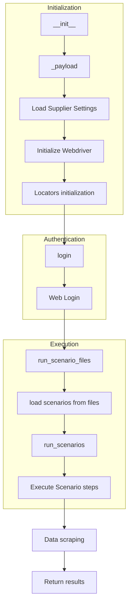
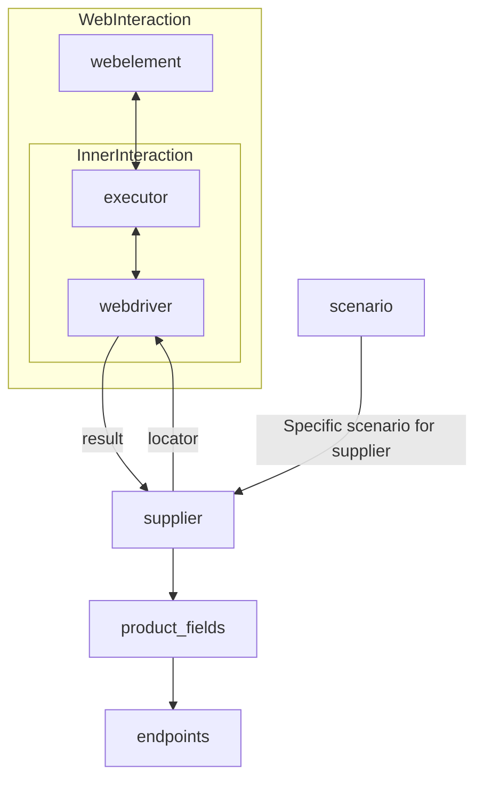

## <алгоритм>

### Общая схема работы класса `Supplier`

1.  **Инициализация (`__init__`)**:
    *   Принимает `supplier_prefix` (строка, например, `'amazon'`), `locale` (строка, например, `'en'`), и `webdriver` (строка `'default'`, экземпляр `Driver` или булево значение).
    *   Сохраняет `supplier_prefix`, `locale` и вызывает метод `_payload` для загрузки настроек и инициализации веб-драйвера.
    *   Пример: `supplier = Supplier(supplier_prefix='aliexpress', locale='en', webdriver='chrome')`
    *   Поток данных: `__init__` -> `_payload`

2.  **Загрузка настроек и инициализация веб-драйвера (`_payload`)**:
    *   Загружает настройки поставщика из JSON-файла, используя `supplier_prefix`.
    *   Инициализирует `locators` (словари с локаторами веб-элементов).
    *   Инициализирует экземпляр `Driver` (веб-драйвера), если `webdriver` является строкой или булевым значением.
    *   Пример: `supplier._payload(webdriver='firefox')`
    *   Поток данных: `_payload` -> Загрузка настроек из JSON, инициализация `locators`, инициализация `Driver`

3.  **Аутентификация (`login`)**:
    *   Выполняет вход на веб-сайт поставщика, используя сохраненные данные аутентификации (`login_data`).
    *   Пример: `supplier.login()`
    *   Поток данных: `login` -> взаимодействие с веб-сайтом через `driver`, использование данных из `login_data`

4.  **Запуск сценариев (`run_scenario_files` и `run_scenarios`)**:
    *   **`run_scenario_files`**: Принимает список путей к файлам сценариев (`scenario_files`). Загружает сценарии из JSON-файлов и передает их в `run_scenarios`.
        *   Пример: `supplier.run_scenario_files(['example_scenario.json'])`
    *   **`run_scenarios`**: Принимает список или словарь со сценариями. Выполняет каждый сценарий, используя `driver`, `locators` и другие атрибуты класса.
        *   Пример: `supplier.run_scenarios([{'action': 'scrape', 'target': 'product_list'}])`
    *   Поток данных: `run_scenario_files` -> `run_scenarios` -> выполнение сценариев с использованием `driver` и `locators`

### Блок-схема



## <mermaid>



**Объяснение:**

*   **WebInteraction**: Подграф, представляющий взаимодействие с веб-страницей.
    *   **webelement**: Представляет HTML-элемент на веб-странице.
    *   **executor**: Отвечает за выполнение действий с `webelement`.
    *   **InnerInteraction**: Подграф, представляющий внутреннее взаимодействие с веб-драйвером.
        *   **webdriver**: Управляет браузером и веб-элементами.

*   **webdriver**: Экземпляр веб-драйвера, который взаимодействует с браузером.
*   **supplier**: Экземпляр класса `Supplier`, который управляет веб-драйвером и выполняет сценарии.
*   **product_fields**: Словарь с полями товара, которые нужно извлечь.
*   **endpoints**: URL-адреса для взаимодействия.
*   **scenario**: Представляет сценарий (последовательность действий) для конкретного поставщика.

**Зависимости:**

*   **Веб-взаимодействие**: Зависимость от `webelement`, `executor`, и `webdriver` для взаимодействия с веб-страницами.
*   **Supplier**: Зависимость от `webdriver` для управления браузером и от `scenario` для выполнения действий.
*   **Поля продукта**: Зависимость от поставщика `supplier`, чтобы определить, какие поля нужно извлечь.
*   **Сценарий**: Зависимость от `supplier` для выполнения сценариев.

## <объяснение>

### Импорты

В предоставленном коде нет явных импортов, но на основе описания и контекста можно заключить, что класс `Supplier` зависит от следующих компонентов:

*   **`Driver`**: Класс `Driver` (вероятно, определенный в `../webdriver`), который отвечает за взаимодействие с веб-браузером. Это обертка над webdriver, например, selenium.
*   **`Scenario`**: Класс `Scenario` (вероятно, определенный в `../scenarios`), который представляет сценарии (наборы действий) для конкретных поставщиков.
*   **`src.gs`** (неявный импорт): `gs` (глобальные настройки) из `src`, которые могут включать пути к файлам конфигураций, общие параметры и т. д.

### Классы

*   **`Supplier`**:
    *   **Роль**: Базовый класс для всех поставщиков данных. Он управляет взаимодействием с поставщиком, загружает конфигурации, инициализирует веб-драйвер и выполняет сценарии.
    *   **Атрибуты**:
        *   `supplier_id` (int): Уникальный идентификатор поставщика.
        *   `supplier_prefix` (str): Префикс поставщика (например, `'amazon'`).
        *   `supplier_settings` (dict): Настройки поставщика из JSON-файла.
        *   `locale` (str): Код локализации (например, `'en'`, `'ru'`).
        *   `price_rule` (str): Правила расчета цены.
        *   `related_modules` (module): Модули для специфичных операций поставщика.
        *   `scenario_files` (list): Список файлов сценариев.
        *   `current_scenario` (dict): Текущий выполняемый сценарий.
        *   `login_data` (dict): Данные для аутентификации.
        *   `locators` (dict): Словарь с локаторами веб-элементов.
        *   `driver` (`Driver`): Экземпляр веб-драйвера.
        *   `parsing_method` (str): Метод парсинга данных (`'webdriver'`, `'api'`, `'xls'`, `'csv'`).
    *   **Методы**:
        *   `__init__(self, supplier_prefix: str, locale: str = 'en', webdriver: str | Driver | bool = 'default', *attrs, **kwargs)`: Конструктор, инициализирует атрибуты и вызывает `_payload`.
        *   `_payload(self, webdriver: str | Driver | bool, *attrs, **kwargs) -> bool`: Загружает настройки, инициализирует локаторы и веб-драйвер.
        *   `login(self) -> bool`: Выполняет аутентификацию на веб-сайте.
        *   `run_scenario_files(self, scenario_files: str | List[str] = None) -> bool`: Запускает сценарии из файлов.
        *   `run_scenarios(self, scenarios: dict | list[dict]) -> bool`: Запускает конкретные сценарии.

### Функции

*   `__init__`:
    *   **Аргументы**:
        *   `supplier_prefix` (str): Префикс поставщика (обязательный).
        *   `locale` (str, по умолчанию: `'en'`): Код локализации.
        *   `webdriver` (str | `Driver` | bool, по умолчанию: `'default'`): Тип или экземпляр веб-драйвера.
        *   `*attrs`, `**kwargs`: Дополнительные атрибуты и параметры.
    *   **Возвращаемое значение**: Нет (метод-конструктор).
    *   **Назначение**: Инициализирует объект поставщика.

*   `_payload`:
    *   **Аргументы**:
        *   `webdriver` (str | `Driver` | bool): Тип или экземпляр веб-драйвера.
        *   `*attrs`, `**kwargs`: Дополнительные атрибуты и параметры.
    *   **Возвращаемое значение**: `bool` (`True` при успехе).
    *   **Назначение**: Загружает настройки поставщика, инициализирует локаторы и веб-драйвер.

*   `login`:
    *   **Аргументы**: Нет.
    *   **Возвращаемое значение**: `bool` (`True` при успешном входе).
    *   **Назначение**: Выполняет аутентификацию на веб-сайте поставщика.

*   `run_scenario_files`:
    *   **Аргументы**:
        *   `scenario_files` (str | List[str], по умолчанию: `None`): Список или путь к файлам сценариев.
    *   **Возвращаемое значение**: `bool` (`True` при успешном выполнении).
    *   **Назначение**: Запускает сценарии из файлов.

*   `run_scenarios`:
    *   **Аргументы**:
        *   `scenarios` (dict | list[dict]): Словарь или список словарей со сценариями.
    *   **Возвращаемое значение**: `bool` (`True` при успешном выполнении).
    *   **Назначение**: Запускает конкретные сценарии.

### Переменные

*   `supplier_prefix` (str): Префикс поставщика (например, `'amazon'`, `'aliexpress'`).
*   `locale` (str): Код локализации (например, `'en'`, `'ru'`).
*   `webdriver` (str | `Driver` | bool): Тип или экземпляр веб-драйвера.
*   `supplier_settings` (dict): Настройки поставщика из JSON.
*   `locators` (dict): Словарь с локаторами веб-элементов.
*   `driver` (`Driver`): Экземпляр веб-драйвера.
*   `scenario_files` (list): Список файлов сценариев.
*   `scenarios` (dict | list[dict]): Сценарии для выполнения.

### Потенциальные ошибки и области для улучшения

*   **Обработка ошибок**: Код не имеет явной обработки исключений. Следует добавить try-except блоки для обработки ошибок при загрузке файлов, выполнении веб-драйвера и т.д.
*   **Логирование**: Нет логирования. Для отладки и мониторинга следует добавить логирование.
*   **Конфигурация веб-драйвера**:  Нужно обеспечить более гибкую конфигурацию веб-драйвера.
*   **Гибкость сценариев**:  Нужно обеспечить гибкое определение сценариев, которые можно было бы переиспользовать для разных поставщиков.

### Взаимосвязи с другими частями проекта

*   **`webdriver`**: Класс `Supplier` зависит от класса `Driver`, который инкапсулирует взаимодействие с браузером.
*   **`scenarios`**: Класс `Supplier` использует сценарии, определенные в модуле `scenarios`, для управления действиями веб-драйвера.
*   **`settings`**: Зависит от общей системы настроек для получения конфигурационных данных, общих путей и параметров.
*   **`prefix`**: При инициализации используется для определения файлов настроек поставщика.
*   **`locators`**: При загрузке настроек используются для идентификации веб-элементов.

```mermaid
flowchart TD
    Start --> SupplierClass[<code>Supplier</code> Class<br>Base class for suppliers]
    SupplierClass --> InitMethod[<code>__init__</code> Method<br>Initializes supplier instance]
    InitMethod --> PayloadMethod[<code>_payload</code> Method<br>Loads settings & webdriver]
    PayloadMethod --> LoadSettings[Load settings from json ]
    LoadSettings --> InitializeWebdriver[Initialize Webdriver <br>using <code>Driver</code>]
     InitializeWebdriver --> LoginMethod[<code>login</code> Method<br>Authenticates User]
    LoginMethod --> WebLogin[Web Login with<br> login data from settings]
    WebLogin --> RunScenarioFiles[<code>run_scenario_files</code> Method<br>Executes scenario files]
    RunScenarioFiles --> LoadScenario[Load scenario files <br> from JSON]
    LoadScenario --> RunScenarios[<code>run_scenarios</code> Method<br>Executes specified scenarios]
    RunScenarios --> ExecuteScenario[Execute scenario actions <br> using <code>Driver</code> and locators]
        ExecuteScenario -->|Interaction with| WebdriverClass[<code>webdriver</code>  Class<br>Driver for web interaction]
    ExecuteScenario -->|scenario instructions| ScenariosClass[<code>scenarios</code> Class<br>Class to define scenario]
    
    Start --> GlobalSettings[Global Settings<br> <code>src.gs</code>]