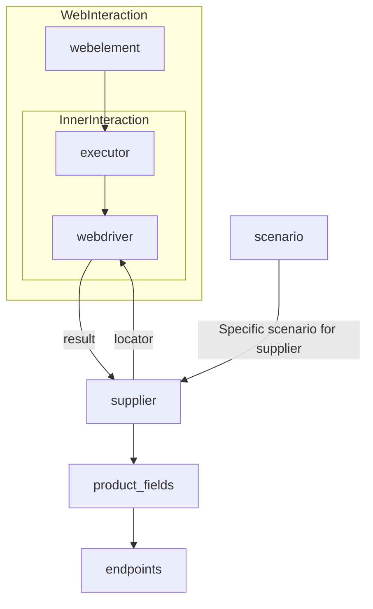
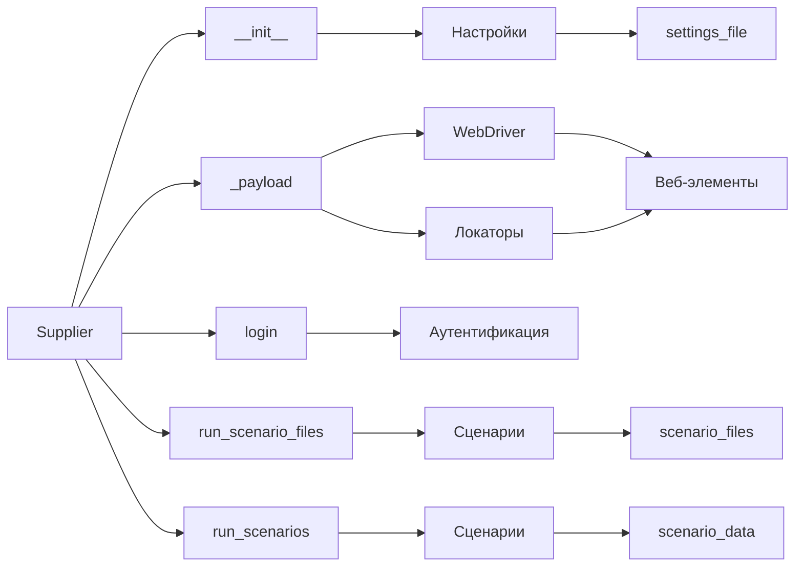

```MD
# Объяснение кода класса Supplier

## <input code>

```
# **Класс** `Supplier`
### **Базовый класс для всех поставщиков**
*В контексте кода `Supplier` - поставщик информации.
Поставщиком может быть производитель какого-либо тавара, данных или информации
Источники потавщика - целевая страница сайта, документ, база данных, таблица.
Класс сводит разных поставщиков к одинаковому алгоритму действий внутри класса.
У каждого поставщика есть свой уникальный префикс. ([подробно о префиксах](prefixes.md))*


Класс `Supplier` служит основой для управления взаимодействиями с поставщиками. 
Он выполняет инициализацию, настройку, аутентификацию и запуск сценариев для различных источников данных, таких как `amazon.com`, `walmart.com`, `mouser.com` и `digikey.com`. Клиент может определить дополнительные поставщики.


---
## Список реализованныx поставщиков:

[aliexpress](aliexpress/README.RU.MD)  - Реализован в двух варианах сценариев: `webriver` и `api` 

[amazon](amazon/README.RU.MD) - `webdriver` 

[bangood](bangood/README.RU.MD)  - `webdriver` 

[cdata](cdata/README.RU.MD)  - `webdriver` 

[chat_gpt](chat_gpt/README.RU.MD)  - Работа с чатом chatgpt (НЕ С МОДЕЛЬЮ!) 

[ebay](ebay/README.RU.MD)  - `webdriver` 

[etzmaleh](etzmaleh/README.RU.MD)  - `webdriver` 

[gearbest](gearbest/README.RU.MD)  - `webdriver` 

[grandadvance](grandadvance/README.RU.MD)  - `webdriver` 

[hb](hb/README.RU.MD)  - `webdriver` 

[ivory](ivory/README.RU.MD) - `webdriver` 

[ksp](ksp/README.RU.MD) - `webdriver`
[kualastyle](kualastyle/README.RU.MD) `webdriver` 

[morlevi](morlevi/README.RU.MD) `webdriver` 

[visualdg](visualdg/README.RU.MD) `webdriver` 

[wallashop](wallashop/README.RU.MD) `webdriver`  

[wallmart](wallmart/README.RU.MD) `webdriver` 

[подробно о вебдрайвере :class: `Driver`](../webdriver/README.RU.MD)    
[подробно о сценариях :class: `Scenario`](../scenarios/README.RU.MD)
---

## <algorithm>

(Блок-схема не приведена, т.к. код описывает структуру класса, а не алгоритм выполнения конкретной задачи.  Пошаговый алгоритм работы зависит от конкретного сценария, реализованного в подклассах.)

## <mermaid>



## <explanation>

**Импорты:**

Код не содержит импортов.  В нем содержится только описание класса и методов.  Зависимости от других модулей (например, `webdriver`) подразумеваются, но не показаны.  Судя по ссылкам в коде, ожидаются импорты из `webdriver`, `scenarios` и других файлов.

**Классы:**

* **`Supplier`:** Базовый абстрактный класс для работы с различными поставщиками данных (например, сайтами).  Он предоставляет общий интерфейс для взаимодействия с поставщиками, включая инициализацию, аутентификацию и запуск сценариев. Подклассы этого класса (например, `aliexpress.Supplier`, `amazon.Supplier`) будут реализовывать конкретное взаимодействие с конкретным поставщиком.

**Функции:**

* **`__init__`:** Конструктор класса. Инициализирует атрибуты класса: `supplier_prefix`, `locale`, `webdriver`.  
* **`_payload`:** Загружает настройки поставщика (`supplier_settings`), инициализирует `webdriver`, загружает `locators`.  Важный метод, определяющий поведение работы с веб-сайтом поставщика.
* **`login`:** Выполняет аутентификацию на сайте поставщика.
* **`run_scenario_files`:** Запускает один или несколько сценариев из файлов.
* **`run_scenarios`:** Запускает список сценариев, заданных в виде словарей.

**Переменные:**

Все переменные в методах имеют типизацию (PEP 484), что повышает читаемость и безопасность.

**Возможные ошибки и улучшения:**

* **Отсутствие проверки данных:** Нет проверки корректности входных данных для методов (например, проверка `supplier_prefix`).
* **Неопределенные зависимости:** Не указаны зависимости от других модулей (например, `webdriver`).
* **Недостаточно детализированная информация:** Не хватает описания, как  `Supplier` взаимодействует с `Scenario` или `Driver`.  Подробности работы методов (`_payload`) не указаны.
* **Не хватает реализации:** Документация описывает, *как* это должно работать, но не *как* это сделано.  Как именно происходит загрузка настроек из `JSON` и обработка ошибок не указано.

**Взаимосвязи с другими частями проекта:**

Класс `Supplier` тесно связан с классами из модуля `webdriver`, модулем `scenarios` (для запуска сценариев). Также предполагается наличие файлов конфигурации (`JSON`, `prefixes.md`).  Взаимодействие строится через вызовы методов, передачу данных и обращение к ресурсам.


**Вывод:**

Документация описывает структуру класса `Supplier` и его функциональность.  Для более глубокого понимания необходимо рассмотреть реализации подклассов `Supplier` и  кода в модулях `webdriver`, `scenarios`.