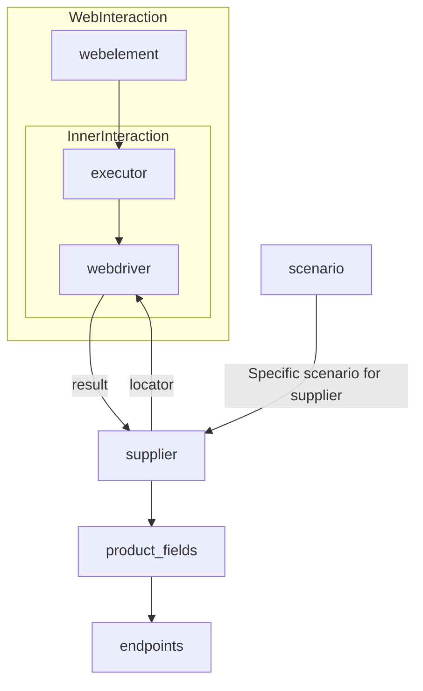
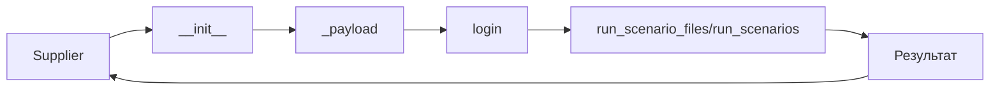

```MD
# Объяснение кода класса Supplier

## <input code>

```
# **Класс** `Supplier`
### **Базовый класс для всех поставщиков**
*В контексте кода `Supplier` - поставщик информации.
Поставщиком может быть производитель какого-либо тавара, данных или информации
Источники потавщика - целевая страница сайта, документ, база данных, таблица.
Класс сводит разных поставщиков к одинаковому алгоритму действий внутри класса.
У каждого поставщика есть свой уникальный префикс. ([подробно о префиксах](prefixes.md))
*

Класс `Supplier` служит основой для управления взаимодействиями с поставщиками. 
Он выполняет инициализацию, настройку, аутентификацию и запуск сценариев для различных источников данных, таких как `amazon.com`, `walmart.com`, `mouser.com` и `digikey.com`. Клиент может определить дополнительные поставщики.

---
## Список реализованныx поставщиков:

[aliexpress](aliexpress/README.RU.MD)  - Реализован в двух варианах сценариев: `webriver` и `api` 
[amazon](amazon/README.RU.MD) - `webdriver` 
[bangood](bangood/README.RU.MD)  - `webdriver` 
[cdata](cdata/README.RU.MD)  - `webdriver` 
[chat_gpt](chat_gpt/README.RU.MD)  - Работа с чатом chatgpt (НЕ С МОДЕЛЬЮ!) 
[ebay](ebay/README.RU.MD)  - `webdriver` 
[etzmaleh](etzmaleh/README.RU.MD)  - `webdriver` 
[gearbest](gearbest/README.RU.MD)  - `webdriver` 
[grandadvance](grandadvance/README.RU.MD)  - `webdriver` 
[hb](hb/README.RU.MD)  - `webdriver` 
[ivory](ivory/README.RU.MD) - `webdriver` 
[ksp](ksp/README.RU.MD) - `webdriver`
[kualastyle](kualastyle/README.RU.MD) `webdriver` 
[morlevi](morlevi/README.RU.MD) `webdriver` 
[visualdg](visualdg/README.RU.MD) `webdriver` 
[wallashop](wallashop/README.RU.MD) `webdriver`  
[wallmart](wallmart/README.RU.MD) `webdriver` 
[подробно о вебдрайвере :class: `Driver`](../webdriver/README.RU.MD)    
[подробно о сценариях :class: `Scenario`](../scenarios/README.RU.MD)
---


## <algorithm>

1. **Инициализация (Supplier.__init__):**
    * Принимает `supplier_prefix`, `locale`, и `webdriver`.
    * Сохраняет эти значения в соответствующих атрибутах объекта `Supplier`.
    * Инициализирует другие атрибуты, например, пустые списки или словари (если таковы есть).

2. **Загрузка настроек (_payload):**
    * Принимает `webdriver` (тип веб-драйвера).
    * Загружает настройки из соответствующего файла (JSON).
    * Инициализирует `webdriver` (на основе предоставленного типа).
    * Возвращает `True`, если загрузка прошла успешно, `False` в противном случае.

3. **Вход в систему (login):**
    * Выполняет аутентификацию на сайте поставщика, используя сохраненные данные и локаторы.
    * Возвращает `True`, если вход удался, и `False`, если произошла ошибка.

4. **Выполнение сценария (run_scenario_files/run_scenarios):**
    * Принимает список файлов сценариев или словарь сценариев.
    * Для каждого сценария:
        * Выполняет соответствующие действия, используя локаторы и настройки.
        * Собирает результаты выполнения сценариев.
    * Возвращает `True`, если все сценарии прошли успешно, иначе – `False`.


## <mermaid>



## <explanation>

**Импорты:**
Код не содержит импортов, но из текста понятно, что он использует классы и функции из модулей `webdriver` и `scenarios`, а также потенциально из других модулей для работы с конкретными поставщиками (aliexpress, amazon, и т.д.).


**Классы:**
* **`Supplier`:** Базовый класс для взаимодействия с поставщиками данных. Атрибуты хранят информацию о поставщике, его настройки, локаторы, веб-драйвер и т.д. Методы предоставляют функциональность для инициализации, загрузки настроек, аутентификации и выполнения сценариев.

**Функции:**
* **`__init__`:** Инициализирует объект `Supplier`, принимая префикс поставщика, локаль и тип веб-драйвера.
* **`_payload`:** Загружает настройки поставщика, инициализирует веб-драйвер и возвращает результат.
* **`login`:** Выполняет вход на сайт поставщика.
* **`run_scenario_files`:** Запускает сценарии, указанные в списке файлов.
* **`run_scenarios`:** Запускает сценарии, указанные в словаре.


**Переменные:**
Переменные `supplier_id`, `supplier_prefix`, `supplier_settings`, `locale`, `price_rule`, `related_modules`, `scenario_files`, `current_scenario`, `login_data`, `locators`, `driver`, `parsing_method` — это атрибуты класса `Supplier`, которые хранят различную информацию о поставщике и его настройках.


**Возможные ошибки или области для улучшений:**
* Не указано, как обрабатываются потенциальные исключения (например, при ошибках в сценариях, при некорректном доступе к веб-сайту, неверных настройках).  Нужны логи.
* Нет проверки корректности входных данных. Например, нужно валидировать  `supplier_prefix`, чтобы он соответствовал существующему поставщику.
* Не указано, как происходит управление состоянием `webdriver`. Необходима информация о том, как производится закрытие `webdriver`.
* Неясно, как происходит обработка ошибок. Нужен более подробный код для понимания стратегий обработки ошибок.
* Сложная логика в `_payload`. Разделение на несколько функций улучшило бы читабельность.

**Взаимосвязи с другими частями проекта:**
`Supplier` зависит от `Driver` (для работы с веб-драйверами), `Scenario` (для выполнения сценариев) и модулей, специфичных для каждого поставщика (например, для `aliexpress`, `amazon`).