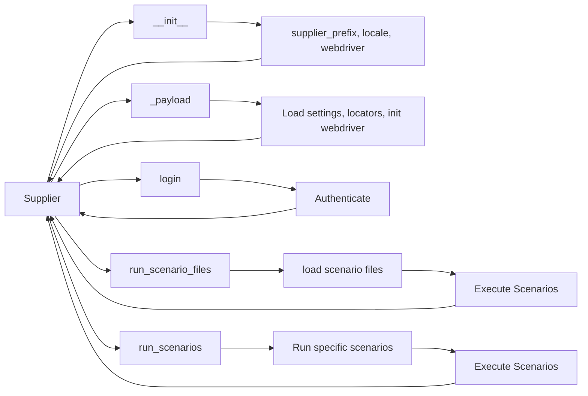

```MD
# Анализ кода класса Supplier

## <input code>

```
# **Класс** `Supplier`
### **Базовый класс для всех поставщиков**
*В контексте кода `Supplier` - поставщик информации.
Поставщиком может быть производитель какого-либо тавара, данных или информации
Источники потавщика - целевая страница сайта, документ, база данных, таблица.
Класс сводит разных поставщиков к одинаковому алгоритму действий внутри класса.
У каждого поставщика есть свой уникальный префикс. ([подробно о префиксах](prefixes.md))*


Класс `Supplier` служит основой для управления взаимодействиями с поставщиками. 
Он выполняет инициализацию, настройку, аутентификацию и запуск сценариев для различных источников данных, таких как `amazon.com`, `walmart.com`, `mouser.com` и `digikey.com`. Клиент может определить дополнительные поставщики.


---
## Список реализованныx поставщиков:

[aliexpress](aliexpress/README.RU.MD)  - Реализован в двух варианах сценариев: `webriver` и `api` 

[amazon](amazon/README.RU.MD) - `webdriver` 

[bangood](bangood/README.RU.MD)  - `webdriver` 

[cdata](cdata/README.RU.MD)  - `webdriver` 

[chat_gpt](chat_gpt/README.RU.MD)  - Работа с чатом chatgpt (НЕ С МОДЕЛЬЮ!) 

[ebay](ebay/README.RU.MD)  - `webdriver` 

[etzmaleh](etzmaleh/README.RU.MD)  - `webdriver` 

[gearbest](gearbest/README.RU.MD)  - `webdriver` 

[grandadvance](grandadvance/README.RU.MD)  - `webdriver` 

[hb](hb/README.RU.MD)  - `webdriver` 

[ivory](ivory/README.RU.MD) - `webdriver` 

[ksp](ksp/README.RU.MD) - `webdriver`
[kualastyle](kualastyle/README.RU.MD) `webdriver` 

[morlevi](morlevi/README.RU.MD) `webdriver` 

[visualdg](visualdg/README.RU.MD) `webdriver` 

[wallashop](wallashop/README.RU.MD) `webdriver`  

[wallmart](wallmart/README.RU.MD) `webdriver` 

[подробно о вебдрайвере :class: `Driver`](../webdriver/README.RU.MD)    
[подробно о сценариях :class: `Scenario`](../scenarios/README.RU.MD)
---


## <algorithm>

(блок-схема здесь невозможна, так как код описывает абстрактный класс и его методы, а не конкретный алгоритм)


## <mermaid>



## <explanation>

**Импорты:**

Код не содержит импортов, он описывает структуру класса и его методов.  Необходимые классы и модули предполагается импортировать в другом месте кода.  `Driver`, `Scenario` и другие предположительно находятся в других модулях проекта, и на них ссылается через пути относительно корневого каталога.  Наличие файлов `README.RU.MD` в подкаталогах говорит о структурировании проекта с документацией.

**Классы:**

Класс `Supplier` является абстрактным базовым классом для управления взаимодействием с поставщиками данных. Он отвечает за инициализацию, настройку, аутентификацию и запуск сценариев для различных источников данных. 

**Атрибуты:**

Атрибуты класса `Supplier` отражают необходимые данные для работы с поставщиком: `supplier_id`, `supplier_prefix`, `supplier_settings`, `locale`, `price_rule`, `related_modules`, `scenario_files`, `current_scenario`, `login_data`, `locators`, `driver`, `parsing_method`.

**Методы:**

* `__init__`: Конструктор класса. Инициализирует атрибуты класса, принимая данные о поставщике, локали и типе WebDriver.
* `_payload`: Загружает настройки поставщика (из JSON или другого источника), локаторы и инициализирует WebDriver.
* `login`: Выполняет аутентификацию на сайте поставщика.
* `run_scenario_files`: Запускает сценарии, указанные в списках файлов.
* `run_scenarios`: Выполняет заданные сценарии,  предоставленные в виде словарей.


**Переменные:**

Переменные `supplier_prefix`, `locale`, `webdriver` (в методе `__init__`) - это входные параметры для настройки класса.


**Возможные ошибки и улучшения:**

* **Обработка исключений:**  Методы должны обрабатывать возможные исключения, например, проблемы с загрузкой настроек, ошибками аутентификации или выполнением сценариев.  Важно добавить `try...except` блоки для устойчивости.
* **Модульная структура:** Класс `Supplier` и связанные с ним классы (например,  `Driver`, `Scenario`) должны быть организованы в отдельные модули для лучшей модульности.
* **Документация:** Дополнительные комментарии к атрибутам и методам улучшат понимание кода.
* **Поддержка разных типов вебдрайверов:**  Возможно, стоит вынести логику выбора WebDriver в отдельный метод.
* **Вариативность сценариев:**   Сценарии должны быть более абстрактными, чтобы  позволять разные типы запросов.


**Взаимосвязь с другими частями проекта:**

Класс `Supplier` взаимодействует с другими частями проекта, такими как модули, определяющие типы WebDriver, файлы сценариев и классы для работы с различными сайтами поставщиков.  Это предполагает наличие дополнительных файлов и классов для работы с конкретными поставщиками.  Например, `aliexpress`  или `amazon` могут содержать специфические классы или модули, которые будут наследоваться от `Supplier` и переопределять методы для работы с этими ресурсами.