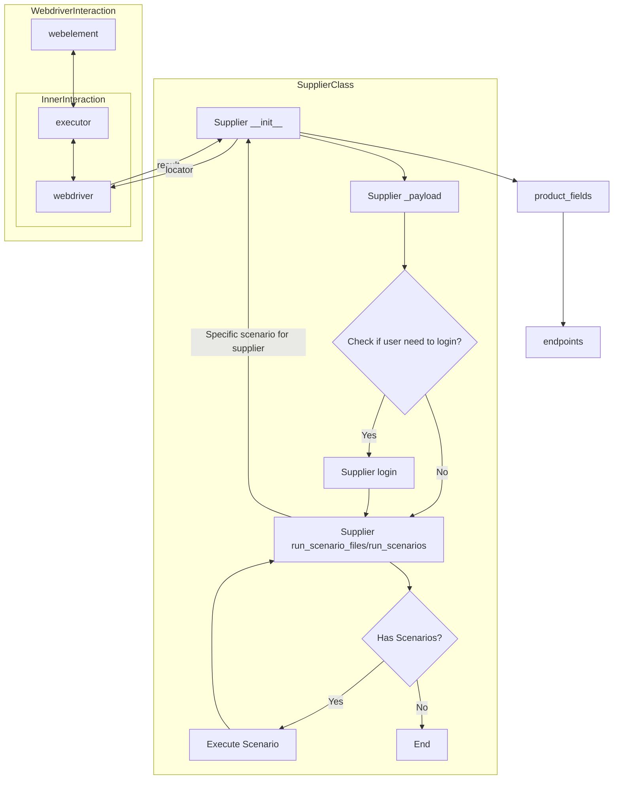

## ИНСТРУКЦИЯ:

Анализируй предоставленный код подробно и объясни его функциональность. Ответ должен включать три раздела:

1.  **<алгоритм>**: Опиши рабочий процесс в виде пошаговой блок-схемы, включая примеры для каждого логического блока, и проиллюстрируй поток данных между функциями, классами или методами.
2.  **<mermaid>**: Напиши код для диаграммы в формате `mermaid`, проанализируй и объясни все зависимости,
    которые импортируются при создании диаграммы.
    **ВАЖНО!** Убедитесь, что все имена переменных, используемые в диаграмме `mermaid`,
    имеют осмысленные и описательные имена. Имена переменных вроде `A`, `B`, `C`, и т.д., не допускаются!

    **Дополнительно**: Если в коде есть импорт `import header`, добавьте блок `mermaid` flowchart, объясняющий `header.py`:
    ```mermaid
    flowchart TD
        Start --> Header[<code>header.py</code><br> Determine Project Root]

        Header --> import[Import Global Settings: <br><code>from src import gs</code>]
    ```

3.  **<объяснение>**: Предоставьте подробные объяснения:
    -   **Импорты**: Их назначение и взаимосвязь с другими пакетами `src.`.
    -   **Классы**: Их роль, атрибуты, методы и взаимодействие с другими компонентами проекта.
    -   **Функции**: Их аргументы, возвращаемые значения, назначение и примеры.
    -   **Переменные**: Их типы и использование.
    -   Выделите потенциальные ошибки или области для улучшения.

Дополнительно, постройте цепочку взаимосвязей с другими частями проекта (если применимо).

Это обеспечивает всесторонний и структурированный анализ кода.
## Формат ответа: `.md` (markdown)
**КОНЕЦ ИНСТРУКЦИИ**
##  Анализ кода `hypotez/src/suppliers/readme.ru.md`

### <алгоритм>

1. **Инициализация `Supplier`**:
   -  Начинается с вызова `__init__` с `supplier_prefix` (например, 'aliexpress'), `locale` (например, 'en'), и `webdriver` (например, 'chrome').
   -  Метод `__init__` устанавливает базовые атрибуты, такие как `supplier_prefix`, `locale`, и инициализирует другие атрибуты, готовые для загрузки настроек.
   -   **Пример:**
        ```python
         supplier = Supplier(supplier_prefix='amazon', locale='en', webdriver='chrome')
        ```

2.  **Загрузка настроек через `_payload`**:
    -   Метод `_payload` вызывается с типом веб-драйвера (например, 'firefox').
    -   Загружает настройки поставщика из соответствующего JSON-файла, опираясь на `supplier_prefix` (например, `amazon.json` из папки `suppliers/amazon`).
    -   Инициализирует локаторы и устанавливает `webdriver`.
    -   Возвращает `True` при успешной загрузке.
    -  **Пример:**
        ```python
        supplier._payload(webdriver='firefox')
        ```

3.  **Аутентификация через `login`**:
    -   Метод `login` вызывается для попытки входа на сайт поставщика.
    -   Использует `login_data`, если они доступны, для выполнения входа.
    -   Метод вызывает методы `Driver`, такие как `find_element` and `send_keys`, для заполнения полей и отправки формы.
    -  Возвращает `True`, если вход выполнен успешно.
     -  **Пример:**
        ```python
         supplier.login()
        ```

4.  **Запуск сценариев через `run_scenario_files` или `run_scenarios`**:
    -   **`run_scenario_files`**:
        -   Получает путь к файлам сценариев (одному или нескольким).
        -   Загружает сценарии из этих файлов.
        -   Передает каждый сценарий в метод `run_scenarios`.
         -   **Пример:**
              ```python
                supplier.run_scenario_files(['example_scenario.json'])
              ```
    -   **`run_scenarios`**:
        -   Получает список словарей `scenarios`, каждый из которых определяет действие и цель (например, `{action: 'scrape', target: 'product_list'}`).
        -   Итерирует по каждому сценарию и выполняет действия, необходимые для каждой цели с использованием `webdriver`.
        -   Использует `current_scenario` для хранения текущего сценария.
         -   **Пример:**
            ```python
            supplier.run_scenarios([{'action': 'scrape', 'target': 'product_list'}])
            ```

5. **Завершение работы**:
    - После выполнения всех сценариев, драйвер может быть закрыт.
    -   Результаты парсинга сохраняются.

### <mermaid>

### <объяснение>

**Импорты:**

В предоставленном файле `README.RU.MD` нет импортов python. Этот файл предоставляет информацию о классе `Supplier`. Упоминаются другие файлы:
  -  `prefixes.md` - подробная информация о префиксах поставщиков.
  - `../webdriver/README.RU.MD` - подробная информация о классе `Driver`, который управляет веб-драйвером.
  -   `../scenarios/README.RU.MD` - подробная информация о сценариях, которые выполняются для поставщиков.

**Класс `Supplier`:**
- **Роль:** Базовый класс для управления взаимодействиями с различными поставщиками данных.
- **Атрибуты:**
    -   `supplier_id` (int): Уникальный идентификатор поставщика.
    -   `supplier_prefix` (str): Префикс поставщика (например, 'amazon', 'aliexpress').
    -   `supplier_settings` (dict): Настройки поставщика, загружаемые из JSON-файла.
    -   `locale` (str): Код локализации (например, 'en', 'ru').
    -   `price_rule` (str): Правила расчета цен.
    -   `related_modules` (module): Модули-помощники.
    -   `scenario_files` (list): Список файлов сценариев.
    -   `current_scenario` (dict): Текущий выполняемый сценарий.
    -   `login_data` (dict): Данные для аутентификации.
    -   `locators` (dict): Словарь локаторов веб-элементов.
    -   `driver` (Driver): Экземпляр WebDriver.
    -   `parsing_method` (str): Метод парсинга данных.
-   **Методы:**
    -   `__init__`: Конструктор класса, инициализирует атрибуты.
    -   `_payload`: Загружает настройки, локаторы и инициализирует WebDriver.
    -   `login`: Обрабатывает аутентификацию на сайте поставщика.
    -   `run_scenario_files`: Выполняет сценарии из указанных файлов.
    -   `run_scenarios`: Выполняет указанные сценарии.

**Функции:**
-   Методы класса `Supplier` являются функциями и описаны выше.
-  `__init__`: принимает `supplier_prefix`, `locale` и `webdriver`. Возвращает None.
-  `_payload`: принимает `webdriver`. Возвращает `True` если загрузка настроек выполнена успешно.
-  `login`: не принимает аргументов. Возвращает `True` если логин успешен.
-  `run_scenario_files`: принимает один или список путей к файлам сценария. Возвращает `True` при успешном запуске всех сценариев.
- `run_scenarios`: принимает список словарей `scenarios`. Возвращает `True` при успешном запуске всех сценариев.
**Переменные:**
-   Атрибуты класса `Supplier` являются переменными. Их типы и назначение описаны в разделе "Класс `Supplier`".

**Потенциальные ошибки и области для улучшения:**

-   Отсутствует явная обработка ошибок в методах `login`, `run_scenario_files` и `run_scenarios`, необходимо добавить try/except блоки.
-   Необходимо добавить проверки на корректность загрузки настроек и локаторов в `_payload`, а также проверку наличия данных для аутентификации в `login`.
-   Метод `run_scenarios` должен быть более гибким и поддерживать различные типы действий и целей.

**Взаимосвязь с другими частями проекта:**

-   Класс `Supplier` использует класс `Driver` из `../webdriver/README.RU.MD` для взаимодействия с веб-сайтами.
-   Используются JSON-файлы для хранения настроек поставщиков.
-   Загружаются сценарии из файлов (формат пока не определен, предположительно `JSON`).
-   Используются локаторы для поиска веб-элементов на страницах.

Этот анализ предоставляет подробное понимание структуры и функциональности класса `Supplier` и его взаимосвязей с другими частями проекта.