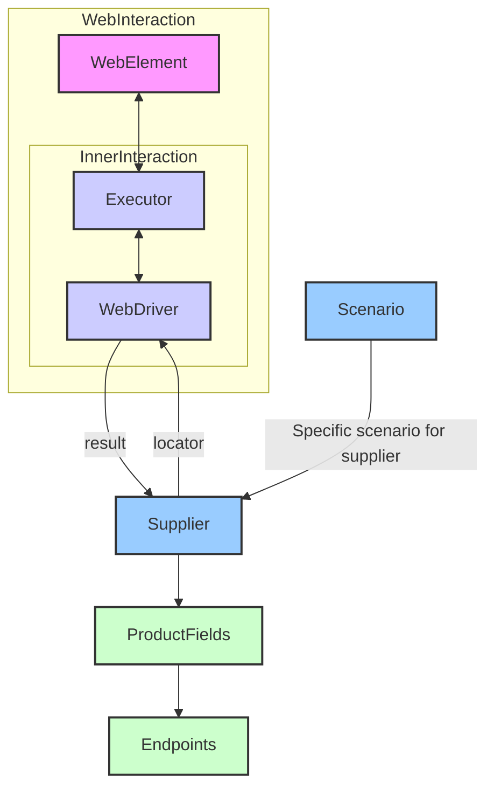

## Анализ кода `Supplier`

### 1. <алгоритм>
**Блок-схема работы класса `Supplier`:**

```mermaid
graph LR
    Start[Начало] --> Init[__init__(): Инициализация Supplier];
    Init --> Payload[_payload(): Загрузка настроек и инициализация WebDriver];
    Payload -- Успешно --> Auth[login(): Аутентификация];
    Payload -- Ошибка --> Error[Ошибка загрузки];
    Auth -- Успешно --> RunScenarios[run_scenario_files() или run_scenarios(): Запуск сценариев];
    Auth -- Ошибка --> ErrorAuth[Ошибка аутентификации];
    RunScenarios -- Успешно --> End[Конец];
    RunScenarios -- Ошибка --> ErrorScenario[Ошибка выполнения сценария];
    Error --> End;
    ErrorAuth --> End;
    ErrorScenario --> End;
    subgraph Init_Example
      I1[supplier = Supplier(supplier_prefix='aliexpress', locale='en', webdriver='chrome')]
    end
    subgraph Payload_Example
      P1[supplier._payload(webdriver='firefox')]
    end
    subgraph Auth_Example
      A1[supplier.login()]
    end
    subgraph Run_Scenarios_Example
    RS1[supplier.run_scenario_files(['example_scenario.json'])]
    RS2[supplier.run_scenarios([{'action': 'scrape', 'target': 'product_list'}])]
    end
    Init -->Init_Example
    Payload-->Payload_Example
    Auth-->Auth_Example
    RunScenarios-->Run_Scenarios_Example

    style Start fill:#f9f,stroke:#333,stroke-width:2px
    style End fill:#f9f,stroke:#333,stroke-width:2px
    style Error fill:#fbb,stroke:#333,stroke-width:2px
    style ErrorAuth fill:#fbb,stroke:#333,stroke-width:2px
    style ErrorScenario fill:#fbb,stroke:#333,stroke-width:2px
```

**Пояснение блок-схемы:**

1.  **Начало**: Процесс начинается с создания экземпляра класса `Supplier`.
2.  **`__init__`**: Метод инициализации (`__init__`) получает префикс поставщика, локализацию и тип WebDriver. В примере `Init_Example`, создается экземпляр поставщика `aliexpress` на английском языке с использованием драйвера Chrome.
3.  **`_payload`**: Загружает настройки и инициализирует драйвер, локаторы. В примере `Payload_Example`, вызывается метод `_payload` с драйвером `firefox`.
4.  **Аутентификация**: Метод `login` проводит аутентификацию на сайте поставщика. В примере `Auth_Example` вызывается метод `login` без параметров.
5.  **`run_scenario_files` / `run_scenarios`**: Выполняются сценарии либо из указанных файлов (`run_scenario_files`), либо напрямую из переданных сценариев (`run_scenarios`). В примере `Run_Scenarios_Example`, демонстрируется выполнение сценария из файла и выполнение конкретного сценария.
6.  **Конец**: Процесс завершается успешно или с ошибкой.

### 2. <mermaid>



**Пояснения:**

*   **`WebElement`**: Представляет веб-элемент на странице, с которым взаимодействует `webdriver`.
*   **`Executor`**: Интерфейс для выполнения действий через `webdriver` (напр. клик, ввод текста).
*   **`WebDriver`**: Инструмент для автоматического управления браузером (например, Chrome, Firefox).
*   **`Supplier`**: Основной класс, управляющий взаимодействием с поставщиками.
*   **`ProductFields`**: Определяет поля продукта для извлечения данных.
*   **`Endpoints`**:  URL-адреса для получения данных от поставщика.
*   **`Scenario`**: Определяет последовательность действий для поставщика.

**Зависимости:**

*   `WebElement` взаимодействует с `executor` для выполнения действий.
*   `executor` и `webdriver` связаны для управления браузером.
*   `webdriver` отправляет результат работы в `supplier`.
*   `supplier` предоставляет локаторы для `webdriver`, а также использует  `ProductFields` и `Endpoints` для получения информации.
*   `scenario` передает конкретный сценарий `supplier`.

### 3. <объяснение>

#### Импорты

В представленном коде импорты не показаны, но из контекста и описания класса `Supplier` можно сделать вывод об их назначении и взаимосвязи с другими пакетами `src`.
На основании других файлов проекта, можно предположить следующие импорты:
*  `from src.webdriver.driver import Driver` - `Driver` для управления браузером.
*  `from src.scenarios.scenario import Scenario` - `Scenario` для выполнения сценариев.
*  `from src.settings.default import DefaultSettingsException` - Ошибка загрузки настроек по умолчанию.
*  `from typing import List` - Для аннотаций типов.
*  `from src import gs` - Глобальные настройки проекта.

#### Класс `Supplier`

Класс `Supplier` является **базовым классом** для всех поставщиков данных. Он инкапсулирует логику взаимодействия с поставщиками и предоставляет единый интерфейс для работы с ними.

**Атрибуты:**

*   **`supplier_id`** (*int*): Уникальный ID поставщика. (предположительно)
*   **`supplier_prefix`** (*str*): Префикс поставщика (например, `aliexpress`, `amazon`). Используется для загрузки настроек.
*   **`supplier_settings`** (*dict*): Настройки поставщика, загружаются из JSON-файла на основе `supplier_prefix`.
*   **`locale`** (*str*): Код локализации (например, `en`, `ru`). Влияет на загрузку локализованных настроек и контента.
*   **`price_rule`** (*str*): Правила расчета цен, может использоваться для применения налогов или скидок.
*   **`related_modules`** (*module*): Специальные модули для поставщика (предположительно, хелперы для парсинга или других действий).
*   **`scenario_files`** (*list*): Список файлов сценариев для выполнения, в формате json.
*   **`current_scenario`** (*dict*): Текущий сценарий для обработки.
*   **`login_data`** (*dict*): Данные для аутентификации на сайте поставщика (логин, пароль и т.д.).
*   **`locators`** (*dict*): Словарь локаторов веб-элементов для взаимодействия с веб-страницами.
*   **`driver`** (*Driver*): Экземпляр WebDriver для автоматизации браузера.
*   **`parsing_method`** (*str*): Метод парсинга (`webdriver`, `api`, `xls`, `csv`).

**Методы:**

*   **`__init__`**:
    *   **Аргументы**: `supplier_prefix` (строка), `locale` (строка, по умолчанию 'en'), `webdriver` (строка, Driver или bool, по умолчанию 'default').
    *   Инициализирует атрибуты класса на основе переданных аргументов.
    *   Вызывает метод `_payload` для загрузки настроек.
    *   **Пример:** `supplier = Supplier('aliexpress', locale='en', webdriver='chrome')`
*   **`_payload`**:
    *   **Аргументы**: `webdriver` (строка, `Driver` или `bool`).
    *   Загружает настройки поставщика (из JSON-файла), локаторы и настраивает `webdriver`.
    *   Возвращает `True`, если загрузка успешна, иначе `False` (ошибка).
*   **`login`**:
    *   **Аргументы**: нет.
    *   Выполняет аутентификацию пользователя на сайте.
    *   Возвращает `True`, если аутентификация успешна, иначе `False`.
*   **`run_scenario_files`**:
    *   **Аргументы**: `scenario_files` (строка или список строк).
    *   Выполняет сценарии из указанных файлов.
    *   Возвращает `True`, если все сценарии выполнены успешно, иначе `False`.
    *   **Пример:** `supplier.run_scenario_files(['scenario1.json', 'scenario2.json'])`
*   **`run_scenarios`**:
    *   **Аргументы**: `scenarios` (словарь или список словарей).
    *   Выполняет переданные сценарии.
    *   Возвращает `True`, если все сценарии выполнены успешно, иначе `False`.
    *   **Пример:** `supplier.run_scenarios([{'action': 'scrape', 'target': 'product_list'}, {'action': 'save', 'target': 'database'}])`

#### Взаимосвязь с другими частями проекта

*   **`src.webdriver`**: Класс `Supplier` использует  `Driver` из `src.webdriver` для взаимодействия с браузером.
*   **`src.scenarios`**: Класс `Supplier` использует  `Scenario` из `src.scenarios` для выполнения действий на основе сценариев.
*   **`src.settings`**: Класс `Supplier` использует настройки из `src.settings`.
*   **`src.gs`**: Глобальные настройки используются для получения основных параметров системы.

#### Потенциальные ошибки и улучшения

*   **Отсутствие обработки ошибок:** В коде не показана обработка исключений. Следует добавить блоки `try/except` для обработки ошибок загрузки настроек, аутентификации и выполнения сценариев.
*   **Неявные зависимости:** Зависимости от JSON-файлов и структуры данных для сценариев не документированы в коде. Следует их специфицировать, чтобы предотвратить ошибки при использовании.
*   **Унификация аргумента `webdriver`**: Аргумент `webdriver` в `__init__` и `_payload` может быть строкой, `Driver` или `bool`. Это усложняет понимание и может привести к ошибкам. Следует унифицировать тип, например использовать только `Driver`, если он необходим.
*   **Типизация**: Добавить аннотации типов ко всем методам и атрибутам для улучшения читаемости и предотвращения ошибок.
*   **Логирование**: Добавить логирование всех действий, особенно загрузки настроек, аутентификации и выполнения сценариев.

Этот класс обеспечивает гибкую архитектуру для работы с различными поставщиками данных, но требует тщательной обработки ошибок и унификации параметров для надежной работы.