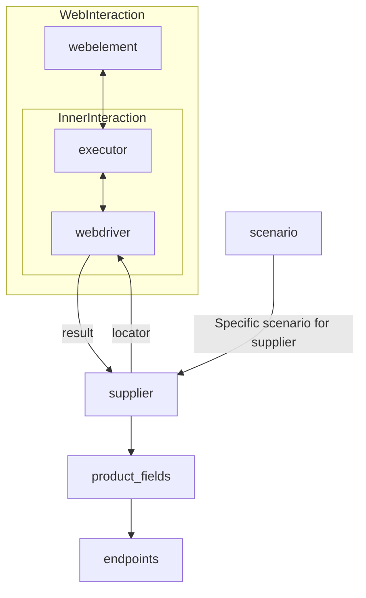

# Анализ кода `suppliers/readme.ru.md`

## 1. <алгоритм>

**Блок-схема работы класса `Supplier`:**

```mermaid
graph LR
    A[Начало: Создание Supplier] --> B{Инициализация __init__};
    B -- supplier_prefix, locale, webdriver --> C[Загрузка настроек _payload];
    C --> D{Инициализация WebDriver};
    D --> E{Загрузка настроек поставщика};
    E --> F{Загрузка локаторов};
    F --> G{Аутентификация login};
    G --> H{Выполнение сценариев run_scenario_files/run_scenarios};
    H -- scenario_files --> I[Загрузка файлов сценариев];
    H -- scenarios --> J[Выполнение конкретных сценариев];
    I --> K[Итерация по сценариям];
    J --> K
    K --> L{Выполнение действия из сценария};
    L --> M{Получение данных с помощью WebDriver/API/etc};
    M --> N[Обработка данных];
    N --> O{Сохранение результатов};
    O --> K
    K -- все сценарии обработаны --> P[Конец]
    
   style A fill:#f9f,stroke:#333,stroke-width:2px
   style B fill:#ccf,stroke:#333,stroke-width:2px
   style C fill:#ccf,stroke:#333,stroke-width:2px
   style D fill:#ccf,stroke:#333,stroke-width:2px
   style E fill:#ccf,stroke:#333,stroke-width:2px
   style F fill:#ccf,stroke:#333,stroke-width:2px
   style G fill:#ccf,stroke:#333,stroke-width:2px
   style H fill:#ccf,stroke:#333,stroke-width:2px   
   style I fill:#ddf,stroke:#333,stroke-width:2px
   style J fill:#ddf,stroke:#333,stroke-width:2px
   style K fill:#ddf,stroke:#333,stroke-width:2px
   style L fill:#ffc,stroke:#333,stroke-width:2px
   style M fill:#ffc,stroke:#333,stroke-width:2px
   style N fill:#ffc,stroke:#333,stroke-width:2px
   style O fill:#ffc,stroke:#333,stroke-width:2px
   style P fill:#f9f,stroke:#333,stroke-width:2px

```

**Примеры для каждого блока:**

*   **A (Начало):** `supplier = Supplier(supplier_prefix='amazon', locale='en', webdriver='chrome')`
*   **B (Инициализация):** Устанавливает атрибуты `supplier_prefix`, `locale`, `webdriver`.
*   **C (Загрузка настроек):** Загрузка `supplier_settings` из `settings.json`, инициализация `locators`, настройка `Driver`.
*   **D (Инициализация WebDriver):** Создание экземпляра `Driver` для управления браузером. Пример: `Driver(webdriver='chrome')`.
*   **E (Загрузка настроек поставщика):** Загрузка конфигурации поставщика из JSON (например, `amazon_settings.json`).
*   **F (Загрузка локаторов):** Загрузка локаторов элементов со страницы (`amazon_locators.json`).
*   **G (Аутентификация):** Выполнение входа пользователя на сайт. Пример: `supplier.login()`, используя `login_data` из настроек.
*   **H (Выполнение сценариев):** Запуск сценариев.
    *   `run_scenario_files`: `supplier.run_scenario_files(['scenario1.json', 'scenario2.json'])`
    *   `run_scenarios`: `supplier.run_scenarios([{'action': 'scrape', 'target': 'product_list'}])`
*   **I (Загрузка файлов сценариев):** Загрузка списка действий из JSON файла.
*   **J (Выполнение конкретных сценариев):** Запуск действий из списка scenario.
*   **K (Итерация по сценариям):**  Цикл перебора действий по всем сценариям.
*   **L (Выполнение действия из сценария):**  Выполнение конкретного действия: `scrape`, `click`, `input`.
*  **M (Получение данных):** Получение данных в зависимости от `parsing_method` (webdriver, api, ...).
*   **N (Обработка данных):**  Обработка полученных данных: парсинг, преобразование, валидация.
*   **O (Сохранение результатов):** Сохранение результатов в БД, файл или отправка в API.
*   **P (Конец):** Завершение работы.

**Поток данных:**

1.  **Инициализация:** Исходные данные (префикс, локаль, тип WebDriver) передаются в конструктор `__init__`.
2.  **Загрузка настроек:** Загружаются настройки, локаторы, и создаётся экземпляр WebDriver.
3.  **Аутентификация:** Данные аутентификации используются для входа на сайт поставщика.
4.  **Выполнение сценариев:** Файлы или наборы сценариев используются для выполнения последовательности действий.
5.  **Сбор данных:** WebDriver или API используются для извлечения данных.
6.  **Обработка:** Данные очищаются, преобразуются и сохраняются.

## 2. <mermaid>

**Объяснение диаграммы `mermaid`:**

*   **`WebInteraction`:** Представляет общую область взаимодействия с веб-страницей.
    *   **`webelement`:** Общий элемент веб-страницы.
    *   **`executor`:** Выполняет команды для `webelement`.
    *   **`InnerInteraction`:** Вложенная область взаимодействия драйвера.
    *   **`webdriver`:** Экземпляр WebDriver, взаимодействующий с браузером через `executor`.
*   **`webdriver` --> `supplier`:** WebDriver возвращает результаты (данные) поставщику.
*   **`supplier` --> `webdriver`:** Поставщик передает локаторы элементов (например, xpath, css) для веб-драйвера.
*   **`supplier` --> `product_fields`:** Поставщик предоставляет информацию о полях продукта (название, цена, описание).
*   **`product_fields` --> `endpoints`:** Поля продукта могут быть использованы для построения конечных точек API.
*   **`scenario` --> `supplier`:** Сценарий (набор действий) направляет работу поставщика (например, "найти товары", "добавить в корзину").

**Зависимости импорта (явные из диаграммы):**

В диаграмме не указаны импорты явно, но подразумеваются:

*   **`webdriver`:**  Импорт драйвера веб-браузера (например, `selenium`).
*   **`scenario`**: Импорт классов и функций для работы со сценариями.
*   **`supplier`:**  Импорт класса `Supplier` или связанных классов.

## 3. <объяснение>

### Импорты:

В предоставленном коде явно не указаны импорты, но из контекста и описания подразумеваются следующие:

*   **`selenium`:** Для работы с веб-драйвером. Он используется для автоматического взаимодействия с веб-страницами.
*   **`json`:** Для обработки JSON файлов с настройками поставщиков и локаторами.
*   **`os` и `pathlib`**: для работы с файловой системой и путями файлов.
*   **`typing` (List, Dict)**:  для аннотации типов.
*   **Модули поставщиков** (например, `amazon`, `aliexpress`): Каждый поставщик, вероятно, имеет свой модуль.
*   **Модули `Driver` и `Scenario`:** Взаимодействие с веб-драйвером и управление сценариями.

### Классы:

*   **`Supplier`:**
    *   **Роль:** Базовый класс для всех поставщиков. Служит для стандартизации и упрощения взаимодействия с разными поставщиками.
    *   **Атрибуты:**
        *   `supplier_id` (int): Уникальный идентификатор поставщика.
        *   `supplier_prefix` (str): Префикс, определяющий поставщика (например, `amazon`).
        *   `supplier_settings` (dict): Настройки поставщика из JSON.
        *   `locale` (str): Язык локализации.
        *   `price_rule` (str): Правила расчёта цен.
        *   `related_modules` (module): Модули-помощники.
        *   `scenario_files` (list): Список файлов сценариев.
        *   `current_scenario` (dict): Текущий сценарий.
        *   `login_data` (dict): Данные для входа.
        *   `locators` (dict): Локаторы веб-элементов.
        *   `driver` (Driver): Экземпляр WebDriver.
        *   `parsing_method` (str): Метод парсинга данных (например, `webdriver`, `api`).
    *   **Методы:**
        *   `__init__`: Конструктор, инициализирует объект `Supplier`.
        *   `_payload`: Загружает настройки, локаторы и инициализирует WebDriver.
        *   `login`: Аутентифицирует пользователя.
        *   `run_scenario_files`: Запускает сценарии из файлов.
        *   `run_scenarios`: Запускает конкретные сценарии.

### Функции:

*   **`__init__`**
    *   **Аргументы:** `supplier_prefix` (str), `locale` (str, default 'en'), `webdriver` (str | Driver | bool, default 'default').
    *   **Возвращаемое значение:** None.
    *   **Назначение:** Инициализация объекта `Supplier`. Загружает базовые настройки.
*   **`_payload`**
    *   **Аргументы:** `webdriver` (str | Driver | bool).
    *   **Возвращаемое значение:** `True` (если загрузка прошла успешно).
    *   **Назначение:** Загрузка настроек, инициализация WebDriver и установка локаторов.
*   **`login`**
    *   **Аргументы:** Нет.
    *   **Возвращаемое значение:** `True` (если вход выполнен успешно).
    *   **Назначение:** Процесс аутентификации пользователя на сайте.
*   **`run_scenario_files`**
    *   **Аргументы:** `scenario_files` (str | List[str], optional).
    *   **Возвращаемое значение:** `True` (если сценарии выполнены успешно).
    *   **Назначение:** Запуск выполнения сценариев из указанных файлов.
*   **`run_scenarios`**
    *   **Аргументы:** `scenarios` (dict | list[dict]).
    *   **Возвращаемое значение:** `True` (если все сценарии выполнены успешно).
    *   **Назначение:** Запуск выполнения конкретных сценариев.

### Переменные:

*   **`supplier_prefix`**: (str) Префикс, уникально идентифицирующий поставщика.
*  **`locale`**: (str) Язык, для которого настраивается поставщик.
*   **`webdriver`**: (str | Driver | bool) Параметр, указывающий тип или экземпляр веб-драйвера.
*  **`supplier_settings`**: (dict) Словарь настроек для конкретного поставщика.
*   **`locators`**: (dict) Словарь, где ключами являются имена элементов на странице, а значениями — локаторы этих элементов (xpath, css, и т. д.).
*   **`scenario_files`**: (list) Список путей к файлам сценариев.
*  **`current_scenario`**: (dict) Текущий сценарий для выполнения.
* **`login_data`**: (dict) Словарь данных для авторизации пользователя.
*   **`driver`**: (Driver) Объект веб-драйвера.
* **`parsing_method`**: (str) Метод парсинга (webdriver, api, и т.д.).

### Потенциальные ошибки и области улучшения:

1.  **Обработка ошибок:** Отсутствует явная обработка исключений при загрузке настроек, выполнении сценариев, или при взаимодействии с WebDriver.
2.  **Логирование:** Отсутствует система логирования для отслеживания выполнения скриптов и диагностики проблем.
3.  **Управление зависимостями:** Нет явного управления зависимостями, что может вызвать проблемы при развёртывании.
4.  **Абстракция WebDriver:** Возможно, стоит абстрагировать взаимодействие с `webdriver` в отдельный класс или интерфейс, чтобы упростить переключение между разными драйверами.
5.  **Параллелизация:** Отсутствует возможность параллельного выполнения сценариев, что может замедлить процесс.
6.  **Валидация данных:** Отсутствует валидация данных, полученных от поставщиков.
7. **Общая структура:** Класс supplier содержит в себе логику веб-драйвера, что не совсем правильно. Лучше разделить их на 2 разных класса.
8. **Хранение локаторов:** В данной структуре локаторы хранятся в виде словаря. Их лучше выделить в отдельный класс, чтобы было проще обращаться к локаторам с помощью методов.

### Цепочка взаимосвязей:

1.  **`Supplier`** (текущий класс) является базовым классом для конкретных поставщиков (например, `AmazonSupplier`, `AliexpressSupplier`).
2.  **`Driver`**:  Класс, отвечающий за управление веб-драйвером.
3.  **`Scenario`**:  Класс или модуль, отвечающий за управление сценариями.
4.  **Файлы настроек**: JSON-файлы с конфигурацией поставщиков, локаторами и сценариями.
5.  **Модули поставщиков**: Модули, специфичные для каждого поставщика, обычно содержат логику сбора данных и специфические методы.
6.  **Веб-драйвер**: Сторонний инструмент для управления браузером (например, `selenium`).

В целом, код предоставляет хорошую основу для создания системы сбора данных с разных поставщиков, но нуждается в доработке в плане обработки ошибок, логирования и архитектуры.