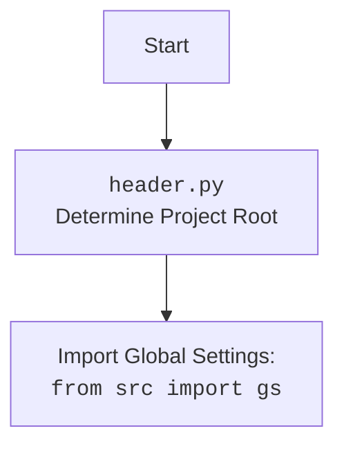

# Проект `hypotez`
# Роль `code explainer`
## АНАЛИЗ КОДА: `hypotez/src/suppliers/supplier.py`

### 1. <алгоритм>

#### Блок-схема рабочего процесса класса `Supplier`:

1.  **Инициализация объекта `Supplier`**:
    *   При создании экземпляра класса `Supplier` вызывается метод `__init__`.
    *   Вызывается метод `_payload` для загрузки конфигурации поставщика.
    *   Если `_payload` возвращает `False`, выбрасывается исключение `DefaultSettingsException`.

2.  **Метод `_payload`**:
    *   Формируется путь к файлу настроек поставщика (`{supplier_prefix}_settings.json`) на основе префикса поставщика.
        *   Пример: для `supplier_prefix = 'test_supplier'` путь будет `src/suppliers/test_supplier_settings.json`.
    *   Импортируется модуль, связанный с поставщиком, используя `importlib.import_module`.
        *   Пример: для `supplier_prefix = 'test_supplier'` импортируется модуль `src.suppliers.test_supplier`.
    *   Загружаются настройки из JSON-файла с использованием `j_loads_ns`.
    *   Если файл настроек не найден или не может быть загружен, возвращается `False`.
    *   Извлечение атрибутов из загруженных настроек.
        *   Атрибуты: `price_rule`, `locale`, `scenario_files`, `locators`.
    *   Если загрузка и обработка настроек прошли успешно, возвращается `True`.

3.  **Метод `login`**:
    *   Вызывает метод `login` из соответствующего модуля поставщика (`related_modules`).
    *   Возвращает результат выполнения метода `login`.

4.  **Метод `run_scenario_files`**:
    *   Определяет список файлов сценариев для выполнения. Если аргумент `scenario_files` не указан, используются файлы из `self.scenario_files`.
    *   Вызывает функцию `run_scenario_files` из модуля `src.scenario` для выполнения указанных файлов сценариев.
    *   Возвращает результат выполнения функции `run_scenario_files`.

5.  **Метод `run_scenarios`**:
    *   Вызывает функцию `run_scenarios` из модуля `src.scenario` для выполнения переданных сценариев.
    *   Возвращает результат выполнения функции `run_scenarios`.

#### Поток данных:

```mermaid
graph TD
    A[Инициализация Supplier] --> B{Вызов _payload()}
    B -- True --> C[Загрузка настроек]
    C --> D{Импорт модуля поставщика}
    D --> E[Загрузка JSON настроек]
    E --> F[Извлечение атрибутов]
    F --> G[Успешная загрузка]
    B -- False --> H[Ошибка запуска]
    I[Вызов login()] --> J{Вызов related_modules.login()}
    K[Вызов run_scenario_files()] --> L{Определение файлов сценариев}
    L --> M{Вызов run_scenario_files (src.scenario)}
    N[Вызов run_scenarios()] --> O{Вызов run_scenarios (src.scenario)}
    style H fill:#f9f,stroke:#333,stroke-width:2px
```

### 2. <mermaid>

```mermaid
graph TD
    A[Supplier Initialization] --> B{_payload()}
    B -- Success --> C[Load Settings]
    C --> D{Import Supplier Module}
    D --> E[Load JSON Settings]
    E --> F[Extract Attributes]
    F --> G[Settings Loaded Successfully]
    B -- Failure --> H[DefaultSettingsException]
    I[login()] --> J{related_modules.login()}
    K[run_scenario_files()] --> L{Determine Scenario Files}
    L --> M{run_scenario_files (src.scenario)}
    N[run_scenarios()] --> O{run_scenarios (src.scenario)}
    style H fill:#f9f,stroke:#333,stroke-width:2px
```

**Зависимости:**

*   `import importlib`: Используется для динамического импорта модулей, связанных с поставщиками.
*   `from typing import List, Optional, Dict, Any`: Используется для аннотации типов.
*   `from types import ModuleType, SimpleNamespace`: Используется для работы с типами модулей и пространств имен.
*   `from pydantic import BaseModel, Field, validator`: Используется для определения структуры класса `Supplier` и валидации данных.
*   `import header`: Определяет корень проекта.
*   `from src import gs`: Импортирует глобальные настройки проекта.
*   `from src.utils.jjson import j_loads_ns`: Используется для загрузки JSON-файлов в виде пространства имен.
*   `from src.webdriver.driver import Driver`: Используется для управления веб-драйвером.
*   `from src.scenario import run_scenarios, run_scenario_files`: Используется для выполнения сценариев.
*   `from src.logger.logger import logger`: Используется для логирования.
*   `from src.logger.exceptions import DefaultSettingsException`: Используется для обработки исключений.



### 3. <объяснение>

#### Импорты:

*   `import importlib`: Используется для динамической загрузки модулей, связанных с конкретным поставщиком. Это позволяет расширять функциональность системы, добавляя новые модули поставщиков без изменения основного кода.
*   `from typing import List, Optional, Dict, Any`: Модуль `typing` используется для статической типизации, что улучшает читаемость и облегчает отладку кода.
*   `from types import ModuleType, SimpleNamespace`: `ModuleType` используется для аннотации типов модулей, а `SimpleNamespace` используется для представления данных в виде атрибутов объекта.
*   `from pydantic import BaseModel, Field, validator`: `pydantic` используется для определения структуры данных класса `Supplier`, автоматической валидации типов и преобразования данных. `BaseModel` - базовый класс для моделей данных, `Field` - используется для определения атрибутов модели и их свойств, `validator` - декоратор для определения методов валидации.
*   `import header`: `header.py` определяет корень проекта.
*   `from src import gs`: Импортирует глобальные настройки из модуля `gs` в пакете `src`. Эти настройки могут включать пути к файлам, параметры конфигурации и другие глобальные переменные, используемые в проекте.
*   `from src.utils.jjson import j_loads_ns`: Импортирует функцию `j_loads_ns` из модуля `src.utils.jjson`, которая используется для загрузки JSON-файлов и представления их в виде пространства имен (`SimpleNamespace`). Это упрощает доступ к данным в JSON-файле через атрибуты объекта.
*   `from src.webdriver.driver import Driver`: Импортирует класс `Driver` из модуля `src.webdriver.driver`, который, вероятно, предоставляет интерфейс для управления веб-драйвером (например, Selenium).
*   `from src.scenario import run_scenarios, run_scenario_files`: Импортирует функции `run_scenarios` и `run_scenario_files` из модуля `src.scenario`, которые используются для выполнения сценариев тестирования или автоматизации.
*   `from src.logger.logger import logger`: Импортирует объект `logger` из модуля `src.logger.logger`, который используется для логирования событий и ошибок в приложении.
*   `from src.logger.exceptions import DefaultSettingsException`: Импортирует класс исключения `DefaultSettingsException` из модуля `src.logger.exceptions`, который используется для обработки ситуаций, когда не удается загрузить настройки поставщика.

#### Классы:

*   `Supplier(BaseModel)`:
    *   **Роль**: Базовый класс для представления поставщиков. Отвечает за загрузку настроек, выполнение сценариев и вход на сайт поставщика.
    *   **Атрибуты**:
        *   `supplier_id (Optional[int])`: Уникальный идентификатор поставщика.
        *   `supplier_prefix (str)`: Префикс поставщика, используемый для формирования имени файла настроек и имени модуля.
        *   `locale (str)`: Локаль поставщика (например, "en" для английского).
        *   `price_rule (Optional[str])`: Правило расчета цен для данного поставщика.
        *   `related_modules (Optional[ModuleType])`: Ссылка на модуль, содержащий специфичные для поставщика функции (например, функцию входа на сайт).
        *   `scenario_files (List[str])`: Список файлов сценариев для выполнения.
        *   `current_scenario (Dict[str, Any])`: Текущий выполняемый сценарий.
        *   `locators (Dict[str, Any])`: Локаторы элементов на странице поставщика.
        *   `driver (Optional[Driver])`: Экземпляр веб-драйвера для взаимодействия с сайтом поставщика.
    *   **Методы**:
        *   `__init__(self, **data)`: Инициализирует объект `Supplier`, загружает конфигурацию поставщика с использованием метода `_payload`. Если загрузка не удалась, выбрасывает исключение `DefaultSettingsException`.
        *   `_payload(self) -> bool`: Загружает настройки поставщика из JSON-файла с использованием функции `j_loads_ns`. Возвращает `True`, если загрузка прошла успешно, и `False` в противном случае.
        *   `login(self) -> bool`: Вызывает метод `login` из модуля `related_modules` для выполнения входа на сайт поставщика. Возвращает `True`, если вход выполнен успешно, и `False` в противном случае.
        *   `run_scenario_files(self, scenario_files: Optional[str | List[str]] = None) -> bool`: Выполняет сценарии, определенные в указанных файлах. Если `scenario_files` не указан, используются файлы из `self.scenario_files`.
        *   `run_scenarios(self, scenarios: dict | List[dict]) -> bool`: Выполняет переданные сценарии.

#### Функции:

*   `check_supplier_prefix(cls, value: str) -> str`:
    *   **Аргументы**:
        *   `cls`: Ссылка на класс.
        *   `value (str)`: Префикс поставщика.
    *   **Возвращаемое значение**: Префикс поставщика.
    *   **Назначение**: Проверяет, что префикс поставщика не является пустым. Если префикс пустой, выбрасывает исключение `ValueError`.

#### Переменные:

*   `supplier_id (Optional[int])`: Идентификатор поставщика (может быть `None`).
*   `supplier_prefix (str)`: Префикс поставщика (обязательное поле).
*   `locale (str)`: Локаль поставщика (по умолчанию "en").
*   `price_rule (Optional[str])`: Правило расчета цен (может быть `None`).
*   `related_modules (Optional[ModuleType])`: Связанные модули поставщика (может быть `None`).
*   `scenario_files (List[str])`: Список файлов сценариев (по умолчанию пустой список).
*   `current_scenario (Dict[str, Any])`: Текущий сценарий (по умолчанию пустой словарь).
*   `locators (Dict[str, Any])`: Локаторы элементов (по умолчанию пустой словарь).
*   `driver (Optional[Driver])`: Веб-драйвер (может быть `None`).
*   `settings_path (str)`: Путь к файлу настроек поставщика.
*   `settings (SimpleNamespace)`: Настройки поставщика, загруженные из JSON-файла.

#### Потенциальные ошибки и области для улучшения:

*   Обработка исключений:
    *   В методе `_payload` логируются ошибки при импорте модуля поставщика и при загрузке настроек, но не предпринимается никаких действий для восстановления после ошибки. Возможно, следует предусмотреть механизм повторной загрузки настроек или использования настроек по умолчанию.
*   Валидация данных:
    *   В классе `Supplier` используется `pydantic` для валидации данных, но не все атрибуты имеют валидаторы. Например, можно добавить валидаторы для `locale` (проверка на соответствие формату ISO 639-1) и для `scenario_files` (проверка на существование файлов).
*   Безопасность:
    *   При динамическом импорте модулей поставщиков следует убедиться, что имена модулей формируются безопасно, чтобы избежать возможности выполнения произвольного кода.

#### Взаимосвязи с другими частями проекта:

*   `src.gs`: Класс `Supplier` использует глобальные настройки из модуля `src.gs` для определения пути к файлам настроек поставщиков.
*   `src.utils.jjson`: Функция `j_loads_ns` используется для загрузки JSON-файлов настроек поставщиков.
*   `src.webdriver.driver`: Класс `Driver` используется для управления веб-драйвером при выполнении сценариев.
*   `src.scenario`: Функции `run_scenarios` и `run_scenario_files` используются для выполнения сценариев, специфичных для каждого поставщика.
*   `src.logger.logger`: Объект `logger` используется для логирования событий и ошибок, возникающих в классе `Supplier`.