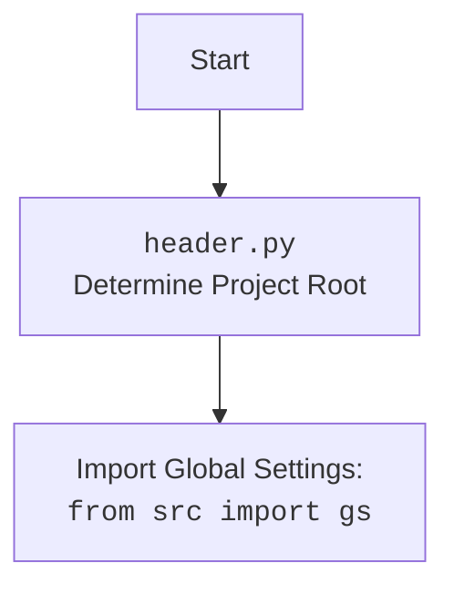

## <алгоритм>
1.  **Инициализация `Supplier`:**
    *   При создании экземпляра `Supplier` вызывается метод `__init__`.
    *   В `__init__` вызывается `_payload()`. Если `_payload()` возвращает `False`, выбрасывается исключение `DefaultSettingsException`.
    *   **Пример:** `supplier = Supplier(supplier_prefix="test_supplier")`

2.  **Загрузка параметров в `_payload()`:**
    *   Логируется начало загрузки настроек поставщика.
    *   Импортируется модуль, связанный с поставщиком, используя `importlib.import_module()`, например, `src.suppliers.test_supplier`. Если модуль не найден, логируется ошибка и возвращается `False`.
    *   **Пример:** `importlib.import_module('src.suppliers.test_supplier')`
    *   Формируется путь к файлу настроек поставщика:  `src/suppliers/test_supplier_settings.json`
    *   Вызывается функция `j_loads_ns` для загрузки настроек из JSON файла. Если настройки не загружены, логируется ошибка и возвращается `False`.
    *   **Пример:** `j_loads_ns('src/suppliers/test_supplier_settings.json')`
    *   Извлечение и установка атрибутов `price_rule`, `locale`, `scenario_files`, `locators` из загруженных настроек. Если атрибут отсутствует, используются значения по умолчанию.
    *   Логируется успешная загрузка настроек.
    *   Возвращается `True`, если все операции успешны.
    *   В случае любой ошибки на любом из этапов (кроме  `ModuleNotFoundError`), логируется ошибка и возвращается `False`.
    
3. **Валидация префикса поставщика `check_supplier_prefix`:**
    *   Перед инициализацией, вызывается валидатор `check_supplier_prefix`.
    *   Проверяет, что `supplier_prefix` не является пустым. Если пустой, то вызывает `ValueError`.

4.  **Выполнение входа в систему в `login()`:**
    *   Вызывает метод `login()` из импортированного модуля, связанного с поставщиком.
    *   **Пример:** `supplier.login()`
    *   Возвращает результат выполнения `login()` из `related_modules`.

5.  **Запуск файлов сценариев `run_scenario_files()`:**
    *   Принимает необязательный параметр `scenario_files` (строка или список строк). Если не передан, используется `self.scenario_files`.
    *   Вызывает функцию `run_scenario_files` из `src.scenario` передавая текущий экземпляр поставщика и список файлов сценариев.
    *   **Пример:** `supplier.run_scenario_files(['scenario1.json', 'scenario2.json'])`
    *   Возвращает результат выполнения `run_scenario_files`.

6.  **Запуск сценариев `run_scenarios()`:**
    *   Принимает параметр `scenarios` (словарь или список словарей).
    *   Вызывает функцию `run_scenarios` из `src.scenario` передавая текущий экземпляр поставщика и список сценариев.
    *   **Пример:** `supplier.run_scenarios([{'step1': 'data'}, {'step2': 'data2'}])`
    *   Возвращает результат выполнения `run_scenarios`.

## <mermaid>
```mermaid
flowchart TD
    Start[Start] --> Init[<code>__init__</code>: Supplier Initialization]
    Init --> Payload[<code>_payload</code>: Load Supplier Settings]
    Payload --> ImportModule{Import Supplier Module: <code>importlib.import_module</code>}
    ImportModule -- Module Found --> SettingsPath[Construct Settings File Path]
    ImportModule -- Module Not Found --> PayloadErrorLog[Log Error]
    PayloadErrorLog --> PayloadReturnFalse[Return False]
    SettingsPath --> LoadSettings[<code>j_loads_ns</code>: Load Settings from JSON]
    LoadSettings -- Settings Loaded --> ExtractAttributes[Extract Attributes: <code>price_rule</code>, <code>locale</code>, <code>scenario_files</code>, <code>locators</code>]
    LoadSettings -- Settings Not Loaded --> SettingsErrorLog[Log Error]
    SettingsErrorLog --> PayloadReturnFalse
    ExtractAttributes --> PayloadSuccessLog[Log Success]
    PayloadSuccessLog --> PayloadReturnTrue[Return True]
    Payload --> PayloadError[Error During Payload Process]
    PayloadError --> PayloadErrorLog
    Init -- Payload Failed --> RaiseException[Raise <code>DefaultSettingsException</code>]
    Init -- Payload Successful --> SupplierReady[Supplier Ready]
    SupplierReady --> ValidatePrefix[<code>check_supplier_prefix</code>: Validate <code>supplier_prefix</code>]
    ValidatePrefix -- Invalid Prefix --> PrefixError[Raise ValueError]
    ValidatePrefix -- Valid Prefix --> LoginCall[<code>login()</code>: Supplier Login]
    LoginCall --> LoginModuleCall[Call <code>login()</code> from <code>related_modules</code>]
    LoginModuleCall --> LoginResult[Return Login Result]
    SupplierReady --> RunScenarioFiles[<code>run_scenario_files()</code>: Execute Scenario Files]
    RunScenarioFiles --> GetScenarioFiles[Get <code>scenario_files</code>]
    GetScenarioFiles --> CallRunScenarioFiles[Call <code>run_scenario_files()</code> from <code>src.scenario</code>]
    CallRunScenarioFiles --> ReturnRunFilesResult[Return Run Files Result]
    SupplierReady --> RunScenarios[<code>run_scenarios()</code>: Execute Scenarios]
    RunScenarios --> CallRunScenarios[Call <code>run_scenarios()</code> from <code>src.scenario</code>]
    CallRunScenarios --> ReturnRunScenariosResult[Return Run Scenarios Result]
    
    PayloadReturnTrue --> SupplierReady
    PayloadReturnFalse --> RaiseException
```
### Анализ зависимостей `mermaid` диаграммы:

*   `Start`: Начало процесса.
*   `Init`: Инициализация экземпляра класса `Supplier` с вызовом метода `__init__`.
*   `Payload`: Метод `_payload`, отвечающий за загрузку настроек поставщика.
*   `ImportModule`:  Импорт модуля поставщика с использованием `importlib.import_module`.
*   `SettingsPath`: Построение пути к файлу настроек поставщика.
*   `LoadSettings`: Загрузка настроек из JSON файла с использованием `j_loads_ns`.
*   `ExtractAttributes`: Извлечение и установка атрибутов из загруженных настроек.
*   `LoginCall`: Вызов метода `login`, отвечающего за вход на сайт поставщика.
*  `LoginModuleCall`: Вызов функции `login()` из импортированного модуля поставщика `related_modules`.
*   `RunScenarioFiles`: Вызов метода `run_scenario_files`, отвечающего за выполнение файлов сценариев.
*   `GetScenarioFiles`: Получение списка файлов сценариев для выполнения.
*   `CallRunScenarioFiles`: Вызов функции `run_scenario_files()` из модуля `src.scenario`.
*   `RunScenarios`: Вызов метода `run_scenarios`, отвечающего за выполнение сценариев.
*   `CallRunScenarios`: Вызов функции `run_scenarios()` из модуля `src.scenario`.
*   `SupplierReady`: Состояние, когда поставщик инициализирован и готов к работе.
*   `ValidatePrefix`: Валидация префикса поставщика.
*   `PayloadReturnTrue`: Возврат `True` из `_payload`, указывая на успешную загрузку настроек.
*   `PayloadReturnFalse`: Возврат `False` из `_payload`, указывая на ошибку загрузки настроек.
*   `PayloadErrorLog`: Логирование ошибки при загрузке настроек.
*   `SettingsErrorLog`: Логирование ошибки, если файл настроек не найден.
*   `RaiseException`: Возбуждение исключения `DefaultSettingsException` при ошибке загрузки.
*    `PrefixError`: Выброс исключения `ValueError` если префикс поставщика пустой.
*   `LoginResult`: Возврат результата выполнения функции `login()`.
*    `ReturnRunFilesResult`: Возврат результата выполнения функции `run_scenario_files()`.
*   `ReturnRunScenariosResult`: Возврат результата выполнения функции `run_scenarios()`.
### `header.py`



## <объяснение>
### Импорты:
*   `importlib`: Используется для динамической загрузки модулей поставщиков.
*   `typing`: Используется для аннотации типов, что повышает читаемость и помогает в отладке. `List`, `Optional`, `Dict`, `Any`  - определяют типы данных
*   `types`: Используется для получения типов модулей.
*   `pydantic`: Используется для создания модели данных и валидации атрибутов `Supplier`.
*   `header`: Модуль для определения корневого каталога проекта.
*   `src.gs`:  Глобальные настройки проекта.
*   `src.utils.jjson`: Модуль для загрузки данных из JSON файлов.
*   `src.webdriver.driver`: Модуль для управления веб-драйвером.
*   `src.scenario`: Модуль для запуска сценариев.
*    `src.logger.logger`: Модуль для логирования.
*    `src.logger.exceptions`: Модуль для работы с исключениями.

### Класс `Supplier`:
*   **Роль:** Базовый класс для представления поставщика и управления его сценариями.
*   **Атрибуты:**
    *   `supplier_id`: (Optional[int]) Идентификатор поставщика (может быть `None`).
    *   `supplier_prefix`: (str) Префикс поставщика, который используется для импорта модуля и файла настроек поставщика (обязательный атрибут).
    *   `locale`: (str) Локаль поставщика (по умолчанию 'en').
    *   `price_rule`: (Optional[str]) Правило расчета цен (может быть `None`).
    *   `related_modules`: (Optional[ModuleType]) Модуль, связанный с конкретным поставщиком (может быть `None`).
    *   `scenario_files`: (List[str]) Список файлов сценариев поставщика.
    *   `current_scenario`: (Dict[str, Any]) Текущий исполняемый сценарий.
    *   `locators`: (Dict[str, Any]) Локаторы элементов страницы.
    *   `driver`: (Optional[Driver]) Веб-драйвер (может быть `None`).
*   **Методы:**
    *   `__init__`: Конструктор класса, загружает настройки поставщика с помощью метода `_payload`.
    *   `_payload`: Загружает настройки поставщика из JSON-файла и устанавливает значения атрибутов.
    *   `check_supplier_prefix`: Валидирует `supplier_prefix`, проверяя, что он не является пустым.
    *   `login`: Вызывает метод `login` из модуля поставщика.
    *   `run_scenario_files`: Выполняет сценарии из указанных файлов.
    *   `run_scenarios`: Выполняет сценарии из переданного словаря или списка словарей.
*   **Config:** Позволяет устанавливать произвольные типы.
### Функции:
*   `__init__` : Инициализирует класс, вызывет метод `_payload`, при ошибке выбрасывает `DefaultSettingsException`.
*   `_payload`: Метод загружает модуль поставщика,  путь к файлу настроек, вызывает `j_loads_ns` для загрузки настроек из json файла, извлекает  `price_rule`, `locale`, `scenario_files`, `locators` из загруженных настроек, устанавливает их как атрибуты текущего экземпляра класса, логирует загрузку настроек, возвращает `True` при успехе, `False` при ошибке.
*   `check_supplier_prefix`: Валидирует `supplier_prefix`, проверяя, что он не является пустым.
*   `login`: Вызывает функцию `login` из импортированного модуля `related_modules`, возвращает результат ее выполнения.
*   `run_scenario_files`: Вызывает функцию `run_scenario_files` из `src.scenario`, возвращает результат ее выполнения.
*   `run_scenarios`: Вызывает функцию `run_scenarios` из `src.scenario`, возвращает результат ее выполнения.

### Переменные:
*   `MODE`: Определяет режим работы приложения (по умолчанию 'dev').
*   `settings_path`: Путь к файлу настроек поставщика (формируется динамически).
*  `related_module` :  Ссылка на импортированный модуль поставщика.
*   `settings` :  `SimpleNamespace` объект,  содержащий настройки из файла.
*   `scenario_files`:  Список файлов сценариев, передаваемых для выполнения.

### Взаимосвязь с другими частями проекта:
*   Зависит от `header` для определения корневого каталога проекта.
*   Использует `src.gs` для доступа к глобальным настройкам.
*   Использует `src.utils.jjson` для загрузки настроек из JSON файлов.
*   Использует `src.webdriver.driver` для управления веб-драйвером.
*   Использует `src.scenario` для запуска сценариев.
*   Использует `src.logger.logger` для логирования.

### Потенциальные ошибки и области для улучшения:
*   **Отсутствие обработки ошибок:**  Метод `_payload`  обрабатывает только `ModuleNotFoundError`  и общие исключения ( `Exception` ),  не обрабатывая другие возможные исключения, которые могут возникнуть при работе с файловой системой,  например `FileNotFoundError` или `JSONDecodeError`.
*   **Жесткая зависимость от структуры проекта:** Пути к модулям и файлам настроек жестко закодированы, что может затруднить перенос или рефакторинг проекта.
*   **Использование `object.__setattr__`:**  Использование `object.__setattr__` обходит стандартные механизмы Pydantic, потенциально может привести к проблемам.
*   **Дублирование логики:** Функции `run_scenario_files` и `run_scenarios` по сути являются обертками для вызовов других функций из `src.scenario`,  возможно, стоит рассмотреть использование их напрямую.
*   **Отсутствие типизации:**  Атрибуты `current_scenario` и `locators` имеют тип `Dict[str, Any]`, это допускает гибкость, но при этом  делает код менее предсказуемым.  Рассмотреть возможность использования более конкретных типов, или схем валидации Pydantic для них.
*  **Отсутствие проверок на None:**  В `run_scenario_files`  используется  `scenario_files = scenario_files if scenario_files else self.scenario_files`, стоит добавить проверку на None, например `scenario_files = scenario_files if scenario_files is not None else self.scenario_files` для большей надежности.