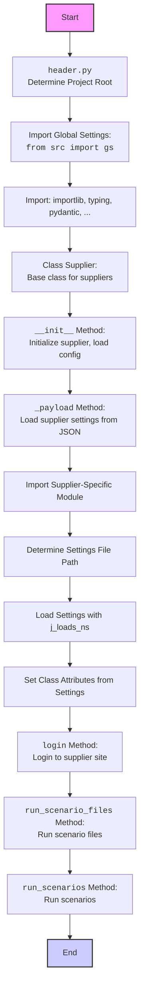

## ИНСТРУКЦИЯ:

Анализируй предоставленный код подробно и объясни его функциональность. Ответ должен включать три раздела:

1. **<алгоритм>**: Опиши рабочий процесс в виде пошаговой блок-схемы, включая примеры для каждого логического блока, и проиллюстрируй поток данных между функциями, классами или методами.
2. **<mermaid>**: Напиши код для диаграммы в формате `mermaid`, проанализируй и объясни все зависимости,
    которые импортируются при создании диаграммы.
    **ВАЖНО!** Убедитесь, что все имена переменных, используемые в диаграмме `mermaid`,
    имеют осмысленные и описательные имена. Имена переменных вроде `A`, `B`, `C`, и т.д., не допускаются!

    **Дополнительно**: Если в коде есть импорт `import header`, добавьте блок `mermaid` flowchart, объясняющий `header.py`
    ```mermaid
    flowchart TD
        Start --> Header[<code>header.py</code><br> Determine Project Root]

        Header --> import[Import Global Settings: <br><code>from src import gs</code>]
    ```

3. **<объяснение>**: Предоставьте подробные объяснения:
    - **Импорты**: Их назначение и взаимосвязь с другими пакетами `src.`.
    - **Классы**: Их роль, атрибуты, методы и взаимодействие с другими компонентами проекта.
    - **Функции**: Их аргументы, возвращаемые значения, назначение и примеры.
    - **Переменные**: Их типы и использование.
    - Выделите потенциальные ошибки или области для улучшения.

Дополнительно, постройте цепочку взаимосвязей с другими частями проекта (если применимо).

Это обеспечивает всесторонний и структурированный анализ кода.
## Формат ответа: `.md` (markdown)
**КОНЕЦ ИНСТРУКЦИИ**

## <алгоритм>

```mermaid
flowchart TD
    Start[Начало] --> Init[Инициализация класса Supplier];
    Init --> CheckPrefix{Проверка supplier_prefix};
    CheckPrefix -- Пустой префикс --> PrefixError[ValueError: supplier_prefix не может быть пустым];
    CheckPrefix -- Не пустой префикс --> LoadSettings[Загрузка настроек _payload()];
    LoadSettings -- Успешно --> LoginCheck{Вызов метода login()};
    LoadSettings -- Ошибка --> SettingsError[DefaultSettingsException];
    LoginCheck --> RunScenarioFilesCheck{Вызов метода run_scenario_files()};
    RunScenarioFilesCheck --> RunScenariosCheck{Вызов метода run_scenarios()};
    RunScenariosCheck --> End[Конец];
    
    subgraph _payload()
        LoadSettingsStart[Начало _payload()] --> ImportModule[Импорт модуля поставщика];
        ImportModule -- ModuleNotFoundError --> ModuleError[Логирование ошибки ModuleNotFoundError];
        ImportModule -- Успешно --> GetSettingsPath[Определение пути к файлу настроек];
        GetSettingsPath --> LoadSettingsFile[Загрузка настроек из JSON];
        LoadSettingsFile -- Настройки не найдены --> SettingsNotFoundError[Логирование ошибки, возвращаем False];
        LoadSettingsFile -- Ошибка загрузки --> LoadSettingsError[Логирование ошибки загрузки];
        LoadSettingsFile -- Успешно --> SetAttributes[Установка атрибутов из настроек];
        SetAttributes --> LoadSettingsEnd[Конец _payload(), возвращаем True];
        ModuleError --> LoadSettingsEnd
        SettingsNotFoundError --> LoadSettingsEnd
        LoadSettingsError --> LoadSettingsEnd
    end
    
    subgraph login()
        LoginStart[Начало login()] --> CallLoginModule[Вызов метода login из related_modules]
        CallLoginModule --> LoginEnd[Конец login(), возвращаем результат]
    end

    subgraph run_scenario_files()
        RunScenarioFilesStart[Начало run_scenario_files()] --> CheckScenarioFiles[Проверка входных параметров];
        CheckScenarioFiles -- Есть входные параметры --> UseInputScenarioFiles[Использовать входные scenario_files];
        CheckScenarioFiles -- Нет входных параметров --> UseDefaultScenarioFiles[Использовать self.scenario_files];
        UseInputScenarioFiles --> RunScenarioFiles[Вызов функции run_scenario_files из src.scenario];
        UseDefaultScenarioFiles --> RunScenarioFiles;
        RunScenarioFiles --> RunScenarioFilesEnd[Конец run_scenario_files(), возвращаем результат];
    end
    
    subgraph run_scenarios()
        RunScenariosStart[Начало run_scenarios()] --> RunScenariosCall[Вызов функции run_scenarios из src.scenario];
         RunScenariosCall --> RunScenariosEnd[Конец run_scenarios(), возвращаем результат];
    end
```

**Примеры:**

1. **Инициализация `Supplier`:**
    ```python
    supplier = Supplier(supplier_prefix="test_supplier", supplier_id=123)
    ```
    - Начинается с создания экземпляра класса `Supplier` с `supplier_prefix` равным `"test_supplier"` и `supplier_id` равным `123`.
    - Вызывается метод `__init__`, который, в свою очередь, вызывает `_payload()` для загрузки настроек.

2. **Загрузка настроек (`_payload()`):**
    - Пытается импортировать модуль `src.suppliers.test_supplier`.
    - Определяет путь к файлу настроек `src/suppliers/test_supplier_settings.json`.
    - Загружает JSON-конфигурацию с помощью `j_loads_ns`.
        - Пример JSON:
            ```json
            {
              "price_rule": "custom_rule",
              "locale": "ru",
              "scenario_files": ["scenario1.json", "scenario2.json"],
              "locators": {
                "button": "//*[@id='button']"
              }
            }
            ```
    - Устанавливает атрибуты `price_rule`, `locale`, `scenario_files` и `locators` на основе загруженных данных.

3. **Вызов `login()`:**
    ```python
    supplier.login()
    ```
    - Вызывает метод `login()` в модуле, связанном с поставщиком (например, `src.suppliers.test_supplier`).
    - Предполагается, что модуль имеет функцию `login(self)`

4. **Вызов `run_scenario_files()`:**
   ```python
   supplier.run_scenario_files()  # Использование scenario_files из настроек
   supplier.run_scenario_files(['custom_scenario.json']) # Использование входных scenario_files
   ```
   - Первый пример использует `scenario_files` загруженные из файла настроек.
   - Второй пример использует список сценариев, переданный в качестве аргумента.
   - Вызывает функцию `run_scenario_files` из модуля `src.scenario`

5. **Вызов `run_scenarios()`:**
   ```python
   supplier.run_scenarios([{'name': 'test_scenario', 'steps': []}])
   ```
   - Вызывает функцию `run_scenarios` из модуля `src.scenario` с переданными сценариями.
## <mermaid>



**Анализ зависимостей:**

1. **`header.py`**:
   -  Определяет корень проекта и обеспечивает доступ к глобальным настройкам через `src.gs`.

2. **`importlib`**:
   - Используется для динамического импорта модулей, специфичных для каждого поставщика (например, `src.suppliers.test_supplier`).

3. **`typing`**:
   - Используется для аннотации типов, что повышает читаемость и помогает в отладке (например, `List`, `Optional`, `Dict`, `Any`).

4. **`pydantic`**:
   - Используется для создания модели данных `Supplier` с валидацией и автоматической конвертацией типов.
   - `BaseModel`: Базовый класс для моделей данных.
   - `Field`: Используется для определения полей модели с дополнительными настройками (например, `default`).
   - `validator`: Декоратор для создания валидационных методов.

5. **`src.gs`**:
   -  Глобальные настройки проекта, включая пути к файлам и другие общие параметры.

6. **`src.utils.jjson`**:
   - `j_loads_ns`: Функция для загрузки JSON-файлов и конвертации их в `SimpleNamespace` для удобного доступа к данным через точечную нотацию.

7.  **`src.webdriver.driver`**:
    - `Driver`: Класс для управления веб-драйвером (например, Selenium), используется для взаимодействия с веб-сайтами.

8. **`src.scenario`**:
   -  `run_scenarios`, `run_scenario_files`: Функции для выполнения сценариев, определенных в JSON-файлах.

9. **`src.logger.logger`**:
    -  `logger`: Объект для логирования событий и ошибок в приложении.

10. **`src.logger.exceptions`**:
    - `DefaultSettingsException`: Пользовательское исключение, которое вызывается, если настройки поставщика не загружены.

## <объяснение>

**Импорты:**

-   `import importlib`: Позволяет динамически импортировать модули во время выполнения, что необходимо для загрузки модулей поставщиков.
-   `from typing import List, Optional, Dict, Any`: Используется для аннотации типов, улучшая читаемость и предотвращая ошибки типов.
-   `from types import ModuleType, SimpleNamespace`: Используется для работы с типами модулей и пространствами имен.
-   `from pydantic import BaseModel, Field, validator`: Используется для создания модели данных `Supplier` с проверкой типов и валидацией.
-   `import header`: Импортирует модуль `header.py`, который определяет корень проекта и предоставляет доступ к глобальным настройкам.
-   `from src import gs`: Импортирует глобальные настройки проекта из `src.gs`.
-   `from src.utils.jjson import j_loads_ns`: Импортирует функцию `j_loads_ns` для загрузки JSON-файлов в виде `SimpleNamespace`.
-   `from src.webdriver.driver import Driver`: Импортирует класс `Driver` для управления веб-драйвером.
-  `from src.scenario import run_scenarios, run_scenario_files`: Импортирует функции для выполнения сценариев.
-   `from src.logger.logger import logger`: Импортирует объект `logger` для логирования.
-   `from src.logger.exceptions import DefaultSettingsException`: Импортирует пользовательское исключение для обработки ошибок при загрузке настроек.

**Классы:**

-   `class Supplier(BaseModel)`:
    -   **Роль**: Базовый класс для всех поставщиков, обеспечивает общую функциональность для работы с различными поставщиками.
    -   **Атрибуты**:
        -   `supplier_id (Optional[int])`: Идентификатор поставщика (может отсутствовать).
        -   `supplier_prefix (str)`: Уникальный префикс поставщика, используемый для поиска файлов настроек и модулей.
        -   `locale (str)`: Код локали (по умолчанию 'en').
        -   `price_rule (Optional[str])`: Правило расчета цены (может отсутствовать).
        -   `related_modules (Optional[ModuleType])`: Ссылка на модуль, специфичный для поставщика.
        -  `scenario_files (List[str])`: Список файлов сценариев для данного поставщика.
        -   `current_scenario (Dict[str, Any])`: Текущий исполняемый сценарий.
        -   `locators (Dict[str, Any])`: Локаторы для элементов страниц, специфичные для поставщика.
        -   `driver (Optional[Driver])`: Экземпляр веб-драйвера.
    -   **Методы**:
        -   `__init__(self, **data)`: Конструктор, который вызывает `_payload()` для загрузки настроек и проверяет успешность загрузки.
        -   `_payload(self) -> bool`: Загружает настройки поставщика из JSON-файла, импортирует модуль поставщика и устанавливает атрибуты.
        -   `login(self) -> bool`: Выполняет вход на сайт поставщика, используя метод `login` из соответствующего модуля.
        -  `run_scenario_files(self, scenario_files: Optional[str | List[str]] = None) -> bool`: Выполняет один или несколько файлов сценариев.
        -   `run_scenarios(self, scenarios: dict | List[dict]) -> bool`: Выполняет один или несколько сценариев.
        -   `check_supplier_prefix(cls, value: str) -> str`: Валидатор для проверки `supplier_prefix`.
    -   **Взаимодействие**:
        -   Использует `j_loads_ns` для загрузки JSON-конфигурации.
        -   Использует динамический импорт для загрузки модулей, специфичных для поставщика.
        -   Использует `Driver` для взаимодействия с веб-сайтом.
        -   Делегирует выполнение сценариев функциям `run_scenarios`, `run_scenario_files` из модуля `src.scenario`.

**Функции:**

-   `_payload(self) -> bool`:
    -   **Аргументы**: `self` - экземпляр класса `Supplier`.
    -   **Возвращаемое значение**: `True`, если настройки загружены успешно, иначе `False`.
    -   **Назначение**: Загружает настройки поставщика из JSON-файла (например, `test_supplier_settings.json`), импортирует модуль поставщика, устанавливает атрибуты класса.
    -  **Пример**:
        1.  Определяет путь к файлу настроек на основе `supplier_prefix`.
        2.  Загружает JSON-файл с помощью `j_loads_ns`.
        3.  Если загрузка прошла успешно, устанавливает атрибуты `price_rule`, `locale`, `scenario_files`, `locators`.
        4.  Импортирует модуль поставщика (например, `src.suppliers.test_supplier`).

-   `login(self) -> bool`:
    -   **Аргументы**: `self` - экземпляр класса `Supplier`.
    -   **Возвращаемое значение**: `True`, если вход выполнен успешно, иначе `False`.
    -   **Назначение**: Выполняет вход на сайт поставщика, вызывая метод `login` в модуле, специфичном для поставщика (например, `src.suppliers.test_supplier.login()`).
    -   **Пример**:
        1.  Вызывает `self.related_modules.login(self)` (где `related_modules` - импортированный модуль поставщика).
        2.  Возвращает результат выполнения метода `login` модуля поставщика.

- `run_scenario_files(self, scenario_files: Optional[str | List[str]] = None) -> bool`:
  -   **Аргументы**:
        -   `self` - экземпляр класса `Supplier`.
        -   `scenario_files (Optional[str | List[str]])`: Список файлов сценариев или путь к файлу сценариев для выполнения. Если не передан, использует `self.scenario_files`.
    -  **Возвращаемое значение**: `True`, если все сценарии успешно выполнены, иначе `False`.
    -  **Назначение**: Выполняет один или несколько файлов сценариев, делегируя выполнение функции `run_scenario_files` из модуля `src.scenario`.
    -   **Пример**:
          1. Проверяет, передан ли список сценариев как аргумент. Если да, использует его. Если нет, использует список `self.scenario_files`.
          2. Вызывает `run_scenario_files` из `src.scenario` для выполнения файлов сценариев.
          3. Возвращает результат выполнения функции `run_scenario_files`.

-   `run_scenarios(self, scenarios: dict | List[dict]) -> bool`:
    -   **Аргументы**:
        -   `self` - экземпляр класса `Supplier`.
        -   `scenarios (dict | List[dict])`: Список или один сценарий для выполнения.
    -   **Возвращаемое значение**: `True`, если сценарии выполнены успешно, иначе `False`.
    -   **Назначение**: Выполняет один или несколько сценариев, делегируя выполнение функции `run_scenarios` из модуля `src.scenario`.
    -  **Пример**:
        1. Передает входной параметр `scenarios` в функцию `run_scenarios` из модуля `src.scenario`
        2. Возвращает результат выполнения `run_scenarios`.

-   `check_supplier_prefix(cls, value: str) -> str`:
    -  **Аргументы**:
        - `cls`: Ссылка на класс.
        - `value (str)`: Префикс поставщика для валидации.
    -  **Возвращаемое значение**:  `str`: Возвращает префикс поставщика, если он не пуст.
    -  **Назначение**:  Валидирует префикс поставщика, проверяя, что он не является пустой строкой.
    -  **Пример**:
        1. Проверяет, является ли префикс пустой строкой.
        2. Если префикс пустой, вызывает `ValueError`.
        3. Иначе возвращает префикс.

**Переменные:**

-   `supplier_id`: Идентификатор поставщика (может быть `None`).
-   `supplier_prefix`: Префикс поставщика (обязательное поле).
-   `locale`: Код локали (по умолчанию 'en').
-   `price_rule`: Правило расчета цены (может быть `None`).
-   `related_modules`: Ссылка на модуль поставщика (может быть `None`).
-   `scenario_files`: Список файлов сценариев (по умолчанию пустой список).
-   `current_scenario`: Текущий исполняемый сценарий (по умолчанию пустой словарь).
-   `locators`: Локаторы элементов страниц (по умолчанию пустой словарь).
-   `driver`: Экземпляр веб-драйвера (может быть `None`).
-   `settings_path`: Путь к JSON-файлу настроек поставщика.
-   `settings`: Загруженные настройки в виде `SimpleNamespace`.

**Потенциальные ошибки и области для улучшения:**

1.  **Обработка ошибок**:
    - В методе `_payload` ошибки при импорте модуля и загрузке настроек логируются, но не обрабатываются более детально. Следует рассмотреть возможность добавления более специфичных обработчиков исключений для разных типов ошибок.
    - При ошибке загрузки настроек метод `_payload` возвращает `False`, но это может привести к исключению `DefaultSettingsException` в `__init__`, что может не соответствовать желаемому поведению.

2.  **Гибкость**:
    - Класс жестко привязан к структуре JSON-файлов настроек. Можно рассмотреть возможность использования более гибкого формата конфигурации (например, YAML или TOML) или использования Pydantic для валидации настроек.

3.  **Модульность**:
     -  Взаимодействие с веб-драйвером и выполнение сценариев можно вынести в отдельные классы или модули для повышения модульности и переиспользования кода.
     - Класс `Supplier` выполняет несколько ролей (загрузка настроек, вход на сайт, выполнение сценариев), что может нарушать принцип единой ответственности.

4.  **Логирование**:
    -   Логирование можно сделать более детальным и структурированным, включая уровень логирования, время и другие метаданные.

**Взаимосвязи с другими частями проекта:**

-   **`header.py`**: Обеспечивает определение корня проекта и доступ к глобальным настройкам.
-   **`src.gs`**: Предоставляет доступ к глобальным настройкам, включая пути к файлам.
-   **`src.utils.jjson`**: Обеспечивает загрузку JSON-файлов.
-   **`src.webdriver.driver`**: Управляет веб-драйвером.
-   **`src.scenario`**:  Отвечает за выполнение сценариев.
-   **`src.logger`**: Обеспечивает логирование событий и ошибок.
-   **`src.suppliers`**: Содержит модули, специфичные для каждого поставщика, и JSON-файлы настроек.

Этот код представляет собой базовый класс для работы с различными поставщиками, обеспечивая загрузку настроек, управление веб-драйвером и выполнение сценариев. Тем не менее, есть области для улучшения, которые могут повысить его гибкость, надежность и модульность.