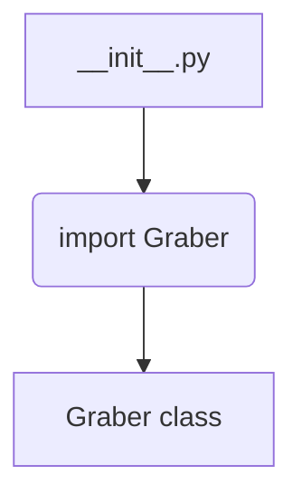
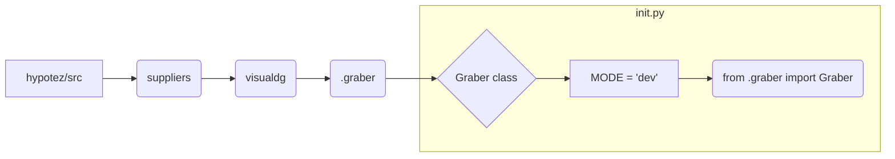

```MD
# Анализ файла `hypotez/src/suppliers/visualdg/__init__.py`

## <input code>

```python
## \file hypotez/src/suppliers/visualdg/__init__.py
# -*- coding: utf-8 -*-\
#! venv/Scripts/python.exe
#! venv/bin/python/python3.12

"""
.. module:: src.suppliers.visualdg 
	:platform: Windows, Unix
	:synopsis:

"""
MODE = 'dev'

from .graber import Graber
```

## <algorithm>

Алгоритм работы файла `__init__.py` тривиален. Файл просто импортирует класс `Graber` из модуля `graber.py`, находящегося в подкаталоге `visualdg`.  Никаких вычислений или действий не производится.  Данных нет.

**Пример:**

Представьте, что `graber.py` содержит класс `Graber`.  При импорте этот класс становится доступен в `visualdg`.




## <mermaid>



## <explanation>

**Импорты:**

Файл `__init__.py` в папке `visualdg` (внутри папки `suppliers`, которая в свою очередь находится в `hypotez/src`) импортирует класс `Graber` из модуля `.graber`.  Это типичная практика для организации модулей Python.  `src` - предполагаемая стартовая директория проекта.

**Классы:**

* `Graber`: Этот класс определён в файле `graber.py` внутри папки `visualdg`. Его функциональность неизвестна из представленного файла.

**Функции:**

Нет функций.

**Переменные:**

* `MODE`: Строковая константа со значением `'dev'`. Скорее всего, используется для управления режимом работы.


**Возможные ошибки или области для улучшений:**

* Отсутствует документация для `Graber` класса.  Добавление docstrings (строки документации) для классов и функций  существенно улучшит читабельность и поддержку кода.
* Нет проверки существования модуля `graber.py`.  Если `graber.py` не найден, импорт вызовет ошибку `ImportError`.  Стоит добавить проверку, чтобы избежать неожиданных ошибок.
* Нет функционала, связанного с этим файлом. Он просто импортирует.


**Взаимосвязи с другими частями проекта:**

Файл `__init__.py` определяет как проект будет импортировать класс `Graber`.  Чтобы использовать `Graber` в других частях проекта, необходимо импортировать его через `hypotez/src/suppliers/visualdg`. Например:

```python
from hypotez.src.suppliers.visualdg import Graber
```

Это даст доступ к классу `Graber` для использования в других модулях.  Без других файлов кода невозможно точно определить, как используется `Graber`.