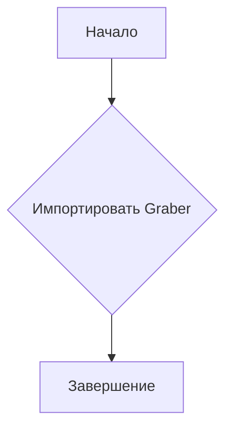
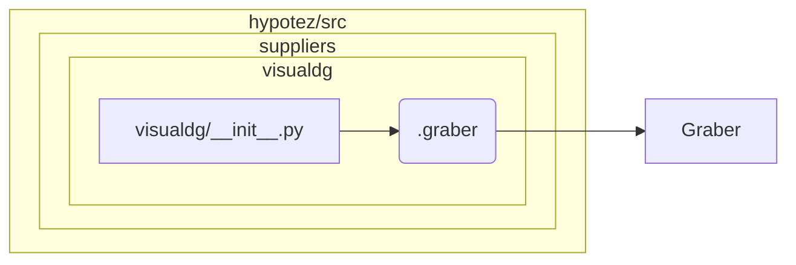

# <input code>

```python
## \file hypotez/src/suppliers/visualdg/__init__.py
# -*- coding: utf-8 -*-
#! venv/Scripts/python.exe
#! venv/bin/python/python3.12

"""
.. module: src.suppliers.visualdg 
	:platform: Windows, Unix
	:synopsis:

"""
MODE = 'dev'

from .graber import Graber
```

# <algorithm>



**Пример:**

1. Начало выполнения скрипта.
2. Модуль `graber` импортируется из подпапки `graber` внутри текущего модуля (`visualdg`).
3. Завершение выполнения.

В этом алгоритме нет значительных вычислений или обработки данных.  Основная операция - импорт класса `Graber`.


# <mermaid>



**Описание диаграммы:**

Диаграмма показывает импортирование модуля `graber` из пакета `visualdg` в `visualdg/__init__.py`.  Это означает, что код в `visualdg/__init__.py` использует класс `Graber`, определенный в файле `graber.py` в подпапке `graber`.


# <explanation>

**Импорты:**

- `from .graber import Graber`:  Импортирует класс `Graber` из файла `graber.py`, находящегося в той же директории, что и `__init__.py` (`.graber` относительный путь). Это стандартный способ импортировать модули из вложенных папок в Python.


**Классы:**

- `Graber`:  Этот класс, определенный в файле `graber.py`,  вероятно, отвечает за извлечение (grabbing) и/или обработку данных, связанных с визуальной информацией.  Необходимые детали (методы, атрибуты) для полного анализа отсутствуют в предоставленном коде.  По сути, этот файл содержит реализацию механизма обработки визуальной информации.

**Функции:**

В предоставленном `__init__.py` нет определенных функций.  Все действия сводятся к импорту.

**Переменные:**

- `MODE = 'dev'`:  Это константа, которая, скорее всего, используется для определения режима работы приложения (например, 'dev', 'prod').  Без контекста невозможно точно сказать, как эта переменная используется в проекте.

**Возможные ошибки или улучшения:**

- Отсутствие документации внутри файла `graber.py`.  Необходимо добавить документацию, описывающую, что делает этот класс, какие аргументы принимает и что возвращает.
- Отсутствие проверки корректности импорта. (например, проверка существования файла `graber.py`).
- Отсутствует информация о том, что делает класс `Graber`.

**Цепочка взаимосвязей:**

Код в `hypotez/src/suppliers/visualdg/__init__.py`  прямо зависит от класса `Graber`, определенного в `hypotez/src/suppliers/visualdg/graber.py`.  Это означает, что код из других модулей, импортирующих `visualdg/__init__.py`, смогут использовать функциональность класса `Graber`.  Более подробная картина взаимосвязей проекта требует анализа других файлов проекта.


**Вывод:**

`__init__.py` модуля `visualdg` выполняет простую задачу: импортирует нужные компоненты из модуля `graber`.  Он играет роль точки входа для последующего использования  класса `Graber` в других частях приложения.  Для более глубокого понимания необходимо изучить код файла `graber.py` и других связанных модулей.