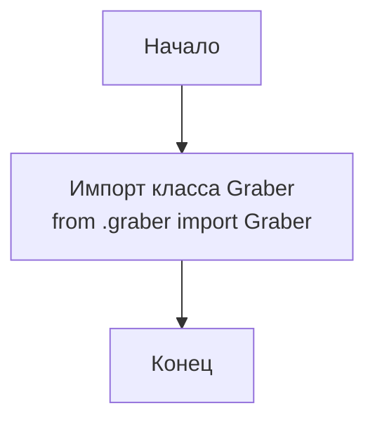

## Анализ кода `hypotez/src/suppliers/visualdg/__init__.py`

### 1. <алгоритм>

**Описание:**

1.  Начало: Запуск скрипта `__init__.py`.
2.  Импорт: Импортируется класс `Graber` из модуля `graber`, который находится в том же пакете `visualdg`.
3.  Конец: Завершение работы скрипта `__init__.py`.

**Блок-схема:**

```
Начало --> Импорт Graber
Импорт Graber --> Конец
```

**Примеры:**

*   **Начало:** Выполнение кода `__init__.py`.
*   **Импорт Graber:**  Выполняется  `from .graber import Graber`.
*   **Конец:** Завершение выполнения файла `__init__.py`.

### 2. <mermaid>



**Объяснение:**

*   **Start:** Начало выполнения скрипта `__init__.py`.
*   **ImportGraber:** Импортируется класс `Graber` из модуля `graber`, который находится в том же пакете `visualdg`. `.` в `from .graber` означает, что `graber` находится в той же директории что и `__init__.py`.
*   **End:** Завершение выполнения скрипта `__init__.py`.

### 3. <объяснение>

**Импорты:**

*   `from .graber import Graber`: Этот импорт импортирует класс `Graber` из модуля `graber.py`, который расположен в той же директории, что и `__init__.py` (внутри пакета `visualdg`).
    `graber` - это подмодуль в `visualdg`. Этот импорт говорит о том, что в `visualdg` используется логика из `graber` (вероятно для сбора каких то данных).
     Используя относительный импорт `.` гарантирует что импорт будет корректно работать даже если проект будет перемещен.
**Классы:**

*   `Graber`: Импортируемый класс. Без дополнительной информации о его содержимом, можно предположить, что `Graber` используется для сбора данных. Судя по названию он может относится к "граббингу" данных.

**Функции:**

*   В предоставленном коде нет функций, только импорт.

**Переменные:**

*   В предоставленном коде нет переменных.

**Дополнительно:**

*   `__init__.py` файл делает директорию `visualdg` Python пакетом. Это позволяет импортировать модули и классы из этой директории.
*   Импорт `Graber` в `__init__.py` позволяет использовать этот класс при импорте пакета `visualdg`. Например, после импорта `from src.suppliers import visualdg`, вы сможете получить доступ к `visualdg.Graber`.

**Потенциальные ошибки и области для улучшения:**

*   Код сейчас очень прост. Он только импортирует `Graber`. В дальнейшем, возможно, понадобится добавить дополнительные классы, функции или переменные в этот `__init__.py`, чтобы сделать пакет `visualdg` более функциональным.
*   Не хватает документации о том, что делает класс `Graber`, а также о других модулях в пакете.

**Цепочка взаимосвязей:**

*   Пакет `visualdg` входит в состав пакета `suppliers` в проекте `hypotez`.
*   Импорт `from .graber import Graber` подразумевает зависимость между модулем `__init__.py` и `graber.py`.

Таким образом, данный код обеспечивает базовую структуру пакета `visualdg`, предоставляя возможность импортировать класс `Graber` через пакетный импорт.