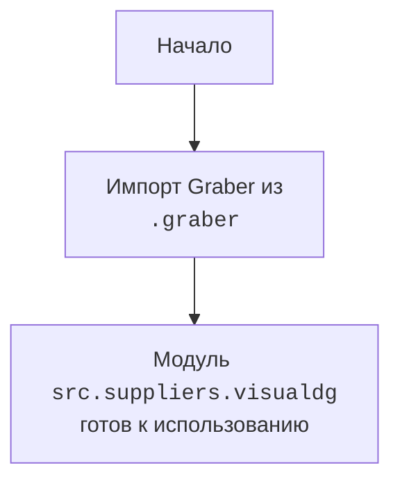

## АНАЛИЗ КОДА: `src/suppliers/visualdg/__init__.py`

### 1. <алгоритм>

1.  **Начало**: Инициализация модуля `src.suppliers.visualdg`.
2.  **Импорт**: Импортируется класс `Graber` из модуля `.graber`.
    *   Пример: `from .graber import Graber`
3.  **Конец**: Модуль `src.suppliers.visualdg` готов к использованию, класс `Graber` доступен для импорта в других модулях.

### 2. <mermaid>

**Объяснение `mermaid`:**

*   **`Start`**: Обозначает начало процесса инициализации модуля `src.suppliers.visualdg`.
*   **`ImportGraber`**:  Указывает на импорт класса `Graber` из модуля `.graber`, расположенного в той же директории.
*   **`ModuleReady`**:  Обозначает состояние, когда модуль `src.suppliers.visualdg` завершил импорт и готов к дальнейшему использованию.

### 3. <объяснение>

**Импорты:**

*   `from .graber import Graber`:
    *   Импортирует класс `Graber` из модуля `graber.py`, находящегося в той же директории (`.`).
    *   Это позволяет использовать класс `Graber` внутри модуля `src.suppliers.visualdg`, а также импортировать его в другие модули, которые зависят от `src.suppliers.visualdg`.

**Классы:**

*   `Graber`:
    *   Класс `Graber` предположительно предназначен для выполнения задач, связанных со сбором данных (граббингом) для поставщиков.  Детали реализации этого класса находятся в файле `graber.py`, который не представлен в данном коде, поэтому можно только предполагать его функциональность.
    *  Взаимодействие с другими частями проекта будет зависеть от того, как именно класс `Graber` используется в других модулях и пакетах. В данном контексте он выступает как зависимость, предоставляемая модулем `visualdg`.
**Общее:**

*   Файл `__init__.py` служит для того, чтобы сделать директорию `visualdg` пакетом Python.  Импортируя `Graber`, он делает этот класс доступным для использования в других модулях, которые импортируют пакет `visualdg`.
*   В текущем виде, этот файл не содержит непосредственной логики, а служит связующим звеном для компонентов.

**Потенциальные улучшения:**

*   Документирование:  Добавить docstring для модуля, а также  для класса `Graber`, после того как мы увидим его реализацию, если она не задокументирована в `graber.py`.  Это сделает код более понятным для других разработчиков.
*   Обработка ошибок:  В данном примере не показано никаких обработок ошибок. В будущих итерациях может быть необходимо добавить проверку и обработку возможных ошибок при импорте.
*   Тесты:  Включить тесты для модуля.
**Взаимосвязи с другими частями проекта:**

*   Этот модуль является частью пакета `suppliers`, что указывает на то, что он может быть связан с управлением или обработкой данных поставщиков.
*   Модуль `visualdg` является подпакетом, и его основная задача заключается в предоставлении функциональности `Graber` для использования в других частях проекта, связанных с визуализацией или обработкой данных.