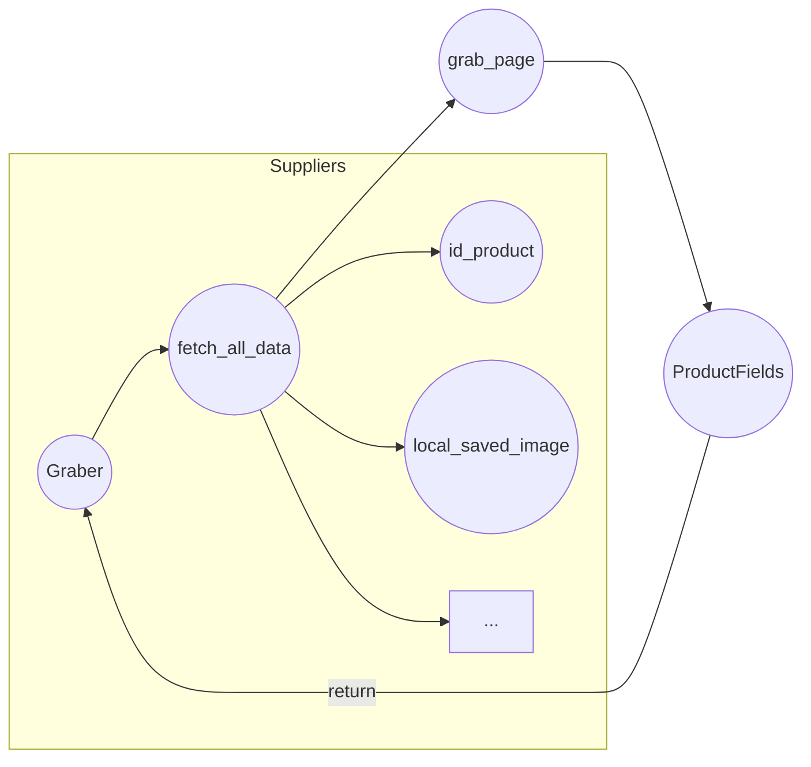

# <input code>

```python
## \file hypotez/src/suppliers/visualdg/graber.py
# -*- coding: utf-8 -*-\
#! venv/Scripts/python.exe
#! venv/bin/python/python3.12

"""
.. module: src.suppliers.visualdg 
	:platform: Windows, Unix
	:synopsis: Класс собирает значение полей на странице  товара `visualdg.co.il`. 
    Для каждого поля страницы товара сделана функция обработки поля в родительском классе.
    Если нужна нестандертная обработка, функция перегружается в этом классе.
    ------------------
    Перед отправкой запроса к вебдрайверу можно совершить предварительные действия через декоратор. 
    Декоратор по умолчанию находится в родительском классе. Для того, чтобы декоратор сработал надо передать значение 
    в `Context.locator`, Если надо реализовать свой декоратор - раскоментируйте строки с декоратором и переопределите его поведение

"""
MODE = 'dev'


import asyncio
from pathlib import Path
from types import SimpleNamespace
from typing import Any, Callable, Optional
from dataclasses import dataclass, field
from functools import wraps
from pydantic import BaseModel
from src import gs

from src.suppliers import Graber as Grbr, Context, close_pop_up, Locator
from src.product import ProductFields
from src.webdriver import Driver
from src.utils.jjson import j_loads_ns
from src.logger import logger
from src.logger.exceptions import ExecuteLocatorException

from dataclasses import dataclass, field
from types import SimpleNamespace
from typing import Any, Callable


# # Определение декоратора для закрытия всплывающих окон
# # В каждом отдельном поставщике (`Supplier`) декоратор может использоваться в индивидуальных целях
# # Общее название декоратора `@close_pop_up` можно изменить 


# def close_pop_up(value: Any = None) -> Callable:
#     """Создает декоратор для закрытия всплывающих окон перед выполнением основной логики функции.

#     Args:
#         value (Any): Дополнительное значение для декоратора.

#     Returns:
#         Callable: Декоратор, оборачивающий функцию.
#     """
#     def decorator(func: Callable) -> Callable:
#         @wraps(func)
#         async def wrapper(*args, **kwargs):
#             try:
#                 # await Context.driver.execute_locator(Context.locator.close_pop_up)  # Await async pop-up close  
#                 ... 
#             except ExecuteLocatorException as e:
#                 logger.debug(f'Ошибка выполнения локатора: {e}')
#             return await func(*args, **kwargs)  # Await the main function
#         return wrapper
#     return decorator


class Graber(Grbr):
    """Класс для операций захвата Morlevi."""
    supplier_prefix: str

    def __init__(self, driver: Driver):
        """Инициализация класса сбора полей товара."""
        self.supplier_prefix = 'visualdg'
        super().__init__(supplier_prefix=self.supplier_prefix, driver=driver)
        # Устанавливаем глобальные настройки через Context
        
        Context.locator_for_decorator = None # <- если будет уастановлено значение - то оно выполнится в декораторе `@close_pop_up`


    async def grab_page(self, driver: Driver) -> ProductFields:
        """Asynchronous function to grab product fields.

        Args:
            driver (Driver): The driver instance to use for grabbing.

        Returns:
            ProductFields: The grabbed product fields.
        """
        global d
        d = self.d = driver  
        
        ...
        # Логика извлечения данных
        async def fetch_all_data(**kwards):
        
            # Call function to fetch specific data
            # await fetch_specific_data(**kwards)  

            # Uncomment the following lines to fetch specific data
            await self.id_product(kwards.get("id_product", ''))
            # ... (many other field fetching functions)
            await self.local_saved_image(kwards.get("local_saved_image", ''))

        # Call the function to fetch all data
        await fetch_all_data()
        return self.fields
```



# <explanation>

**Импорты:**

- `asyncio`: Для асинхронного выполнения задач.
- `pathlib`: Для работы с путями к файлам.
- `types`: Для работы с типом данных `SimpleNamespace`.
- `typing`: Для определения типов.
- `dataclasses`: Для создания классов данных.
- `functools`: Для использования декоратора `wraps`.
- `pydantic`: Для создания моделей данных.
- `src.gs`:  Вероятно, содержит вспомогательные функции или классы для работы с Google Sheets (или другой системой хранения данных).
- `src.suppliers.Graber`, `src.suppliers.Context`, `src.suppliers.close_pop_up`, `src.suppliers.Locator`: Классы и функции, относящиеся к поставщикам данных.
- `src.product.ProductFields`:  Определяет структуру данных для представления поля товара.
- `src.webdriver.Driver`: Класс, представляющий драйвер веб-драйвера (например, Selenium).
- `src.utils.jjson`: Для работы с JSON.
- `src.logger`: Для логгирования.
- `src.logger.exceptions`: Обработка исключений, связанных с логгером.

**Классы:**

- `Graber(Grbr)`: Наследуется от абстрактного класса `Grbr` (видимо, `Graber` из `src.suppliers`), который отвечает за сбор данных с веб-страниц.
    - `supplier_prefix`: Строка, идентифицирующая поставщика ('visualdg').
    - `__init__(self, driver: Driver)`: Инициализирует класс, принимает драйвер веб-драйвера и инициализирует `supplier_prefix`.  
    - `grab_page(self, driver: Driver) -> ProductFields`: Асинхронный метод для получения данных страницы продукта. Запускает внутренние асинхронные функции (`fetch_all_data`) для получения данных по отдельным полям. Возвращает объект `ProductFields`.


**Функции:**

- `fetch_all_data(**kwards)`: Функция для асинхронного сбора данных из веб-страницы. Принимает ключевые аргументы (`kwards`) для отдельных полей и вызывает соответствующие функции (`self.id_product`, `self.local_saved_image` и т.д.) для их получения.

**Переменные:**


- `d`, `self.d`: Внутри `grab_page` объявляется глобальная переменная `d` и присваивается экземпляр `driver`. Это может быть сделано для глобального доступа к веб-драйверу.

**Возможные ошибки и улучшения:**

- **Незавершенная логика:**  Коментарии показывают, что в `grab_page` есть незавершенная логика (некоторые функции могут быть не реализованы). Нужно завершить реализацию функций для сбора данных по всем полям товара.
- **Обработка ошибок:** Внутри `fetch_all_data` нет обработки ошибок.  Если какая-либо из вызываемых функций (`self.id_product`, `self.local_saved_image` и т.д.) вызывает исключение, то код упадет.
- **Документация:** Некоторые функции и атрибуты не имеют хорошей документации. Добавление документации улучшило бы читаемость кода.
- **Глобальная переменная `d`:** Использование глобальной переменной `d`  не является хорошей практикой.  Лучше было бы передавать `driver` как аргумент в функции `fetch_all_data` или использовать атрибуты класса для хранения данных.

**Взаимосвязи с другими частями проекта:**

- `Graber` использует класс `Driver` для взаимодействия с веб-драйвером.
- `Graber` использует `ProductFields` для хранения собранных данных.
- `Graber` полагается на методы из `Grbr` (родительского класса), который, возможно, реализует более общие функции для работы с веб-драйвером и обработки данных.
- `Context` предоставляет глобальные настройки, такие как `locator_for_decorator`.
- Необходимо понимать, как `ProductFields` используется в других частях проекта.

**Вывод:**

Код представляет собой асинхронный парсер данных с веб-страницы, который собирает поля продукта. Нужно завершить реализацию функций, добавить обработку ошибок, улучшить документацию и пересмотреть использование глобальных переменных для повышения качества и надежности кода.