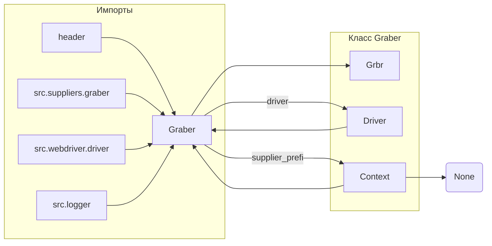

```MD
# <input code>

```python
## \file hypotez/src/suppliers/visualdg/graber.py
# -*- coding: utf-8 -*-\
#! venv/Scripts/python.exe
#! venv/bin/python/python3.12

"""
.. module: src.suppliers.visualdg 
	:platform: Windows, Unix
	:synopsis: Класс собирает значение полей на странице  товара `visualdg.co.il`. 
    Для каждого поля страницы товара сделана функция обработки поля в родительском классе.
    Если нужна нестандертная обработка, функция перегружается в этом классе.
    ------------------
    Перед отправкой запроса к вебдрайверу можно совершить предварительные действия через декоратор. 
    Декоратор по умолчанию находится в родительском классе. Для того, чтобы декоратор сработал надо передать значение 
    в `Context.locator`, Если надо реализовать свой декоратор - раскоментируйте строки с декоратором и переопределите его поведение

"""
MODE = 'dev'

from typing import Any
import header
from src.suppliers.graber import Graber as Grbr, Context, close_pop_up
from src.webdriver.driver import Driver
from src.logger import logger


# # Определение декоратора для закрытия всплывающих окон
# # В каждом отдельном поставщике (`Supplier`) декоратор может использоваться в индивидуальных целях
# # Общее название декоратора `@close_pop_up` можно изменить 


# def close_pop_up(value: Any = None) -> Callable:
#     """Создает декоратор для закрытия всплывающих окон перед выполнением основной логики функции.

#     Args:
#         value (Any): Дополнительное значение для декоратора.

#     Returns:
#         Callable: Декоратор, оборачивающий функцию.
#     """
#     def decorator(func: Callable) -> Callable:
#         @wraps(func)
#         async def wrapper(*args, **kwargs):
#             try:
#                 # await Context.driver.execute_locator(Context.locator.close_pop_up)  # Await async pop-up close  
#                 ... 
#             except ExecuteLocatorException as e:
#                 logger.debug(f'Ошибка выполнения локатора: {e}')
#             return await func(*args, **kwargs)  # Await the main function
#         return wrapper
#     return decorator


class Graber(Grbr):
    """Класс для операций захвата Morlevi."""
    supplier_prefix: str

    def __init__(self, driver: Driver):
        """Инициализация класса сбора полей товара."""
        self.supplier_prefix = 'visualdg'
        super().__init__(supplier_prefix=self.supplier_prefix, driver=driver)
        # Устанавливаем глобальные настройки через Context
        
        Context.locator_for_decorator = None # <- если будет уастановлено значение - то оно выполнится в декораторе `@close_pop_up`

```

# <algorithm>

1. **Импорт модулей**:  Код импортирует необходимые модули, включая `header`, `Graber` и `Context` из `src.suppliers.graber`, `Driver` из `src.webdriver.driver` и `logger` из `src.logger`.  Это позволяет использовать функции и классы из других частей проекта.
2. **Определение класса `Graber`**: Наследуется от класса `Grbr` из `src.suppliers.graber`.  Это означает, что класс `Graber` получает все атрибуты и методы базового класса `Grbr`.
3. **Инициализация класса `Graber`**: В конструкторе (`__init__`) задается `supplier_prefix` и вызывается конструктор родительского класса, передавая `supplier_prefix` и `driver`.
4. **Настройка глобальных параметров**: Устанавливается `Context.locator_for_decorator` в `None`. Это важно для работы декоратора `@close_pop_up`. Если в `Context` будет установлено значение для `Context.locator_for_decorator` то оно будет использовано в декораторе

**Пример:**

Если `Context.locator_for_decorator` будет иметь значение, соответствующее имени локатора для закрытия всплывающих окон, то этот локатор будет исполнен.

**Передвижение данных:**

В данном коде данные передаются через аргументы конструктора (`driver`) и глобальную переменную `Context`.


# <mermaid>



# <explanation>

**Импорты:**

- `header`: Вероятно, содержит вспомогательные функции или константы для текущего модуля.  Связь с `src` не указана, так как `header` может быть локальным модулем.
- `src.suppliers.graber`: Содержит базовый класс `Graber` для работы с веб-драйверами.  Он является важной частью инфраструктуры сбора данных.
- `src.webdriver.driver`:  Предоставляет инструменты для взаимодействия с веб-драйвером (Selenium).  Это часть инфраструктуры для автоматизации веб-тестирования.
- `src.logger`: Обеспечивает логирование (например, в файл), что важно для отладки и мониторинга работы.

**Классы:**

- `Graber`: Наследует от `Grbr`.  Используется для сбора данных с веб-страниц.  Атрибут `supplier_prefix` определяет префикс поставщика данных. Конструктор (`__init__`) принимает `driver` (вероятно, экземпляр `Driver`) и инициализирует `supplier_prefix`, вызывая конструктор родительского класса.  `Context.locator_for_decorator` используется для управления декоратором `@close_pop_up`, но в данном фрагменте реализации декоратора нет.

**Функции:**

- Функции, связанные с декоратором `@close_pop_up` (комментированные) не реализованы.  Они должны были бы быть реализованы в `Graber` для специфической обработки,  но комментирование говорит о том что их реализация может быть в другом месте кода.

**Переменные:**

- `MODE`: Строковая переменная, вероятно, для обозначения режима работы (например, "dev", "prod").
- `supplier_prefix`:  Строковая переменная, указывающая на тип поставщика данных.
- `Context.locator_for_decorator`: Глобальная переменная, которая принимает значение локатора для работы декоратора.


**Возможные ошибки/улучшения:**

- Неопределенный класс `ExecuteLocatorException`. Нужно определить его, если он используется в коде.
- Комментированный декоратор `@close_pop_up`:  Не реализован полностью. Нужно добавить логику для закрытия всплывающих окон и последующей обработки функции.  
- Отсутствие проверки типов (type hinting) для локатора. Необходимо проверять тип возвращаемого значения функцией, которая возвращает локатор.


**Взаимосвязи с другими частями проекта:**

- `Graber` использует классы и функции из `src.suppliers.graber`, `src.webdriver.driver`, и `src.logger`.
- `Graber` взаимодействует с `Context` для передачи и получения данных, что указывает на наличие общей инфраструктуры.
- `Graber` собирает данные с веб-страниц, что указывает на взаимосвязь с компонентами, которые используют полученные данные.