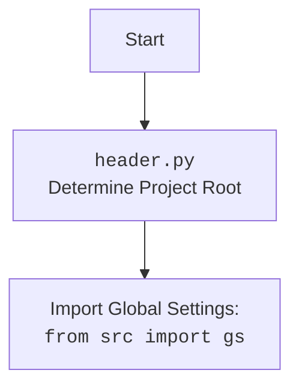

## <алгоритм>
1. **Инициализация**:
   - Создается экземпляр класса `Graber`, при этом передается экземпляр `Driver`.
   - Устанавливается `supplier_prefix` равным "visualdg".
   - Вызывается конструктор родительского класса `Graber` (`Grbr`) с `supplier_prefix` и `driver`.
   - Устанавливается `Context.locator_for_decorator` в `None`.

2. **Захват данных**:
   - Методы для сбора данных с веб-страницы вызываются через экземпляр класса `Graber`.
   - Каждый метод (например, `grab_title`, `grab_price` и т.д.) выполняет следующие шаги:
     - Выполняет предворительное действие - закрытие попапа (если установлен `Context.locator`).
     - Выполняет поиск элемента на странице с помощью локатора (CSS-селектора) из `Context`.
     - Извлекает данные из найденного элемента и возвращает их.
  
3. **Использование декоратора (неактивно)**:
    - В коде присутствует закомментированный шаблон декоратора `close_pop_up`. 
    - Если бы он был активен и `Context.locator_for_decorator` не был бы `None`, он бы выполнялся перед выполнением методов сбора данных. 
    - Декоратор пытался бы закрыть всплывающее окно, используя `Context.locator`.
    
**Примеры**

* **Инициализация:**
    ```python
    driver_instance = Driver() # Создаем экземпляр вебдрайвера
    graber_instance = Graber(driver_instance) # Создаем экземпляр грабера
    ```

* **Сбор данных:**
   ```python
   title = await graber_instance.grab_title()  # Захват заголовка товара
   price = await graber_instance.grab_price()  # Захват цены товара
   # ... и т.д.
   ```
   
**Поток данных**
1. `Driver` -> `Graber` (при инициализации)
2. `Context` -> `Graber` (для параметров поиска и локаторов, декораторов)
3.  Веб-страница -> `Graber` (через `Driver` для извлечения данных)
4. `Graber` ->  Результат сбора данных (например, `title`, `price`)

## <mermaid>

```mermaid
flowchart TD
    Start[Начало работы] --> InitGraber[Инициализация Graber]
    InitGraber --> SetPrefix[Установка supplier_prefix = 'visualdg']
    SetPrefix --> InitParent[Инициализация родительского Graber (Grbr)]
    InitParent --> SetDecoratorLocator[Установка Context.locator_for_decorator = None]
    SetDecoratorLocator -->  GrabData[Вызов методов сбора данных (grab_title, grab_price, ...)]
    
    subgraph Декоратор close_pop_up (неактивно)
    GrabData --> CheckLocator[Проверка Context.locator_for_decorator]
    CheckLocator -- Locator is not None --> ExecuteLocator[Выполнение локатора для закрытия попапа]
     ExecuteLocator --> ContinueGrab[Продолжение сбора данных]
     CheckLocator -- Locator is None --> ContinueGrab
    end

    ContinueGrab --> FindElement[Поиск элемента на странице с помощью локатора]
    FindElement --> ExtractData[Извлечение данных из элемента]
    ExtractData --> ReturnData[Возврат извлеченных данных]
    ReturnData --> End[Конец]
    
    
    classDef classFill fill:#f9f,stroke:#333,stroke-width:2px
    class InitGraber, InitParent classFill
    
    
    
    style InitGraber fill:#ccf,stroke:#333,stroke-width:2px
    style SetPrefix fill:#ccf,stroke:#333,stroke-width:2px
    style InitParent fill:#ccf,stroke:#333,stroke-width:2px
    style SetDecoratorLocator fill:#ccf,stroke:#333,stroke-width:2px
    
    style CheckLocator fill:#ddd,stroke:#333,stroke-width:1px
    style ExecuteLocator fill:#eee,stroke:#333,stroke-width:1px

    style GrabData fill:#cfc,stroke:#333,stroke-width:2px
    style FindElement fill:#cfc,stroke:#333,stroke-width:2px
    style ExtractData fill:#cfc,stroke:#333,stroke-width:2px
    style ReturnData fill:#cfc,stroke:#333,stroke-width:2px


```
### Зависимости `mermaid`

*   `flowchart TD`: Объявляет тип диаграммы как блок-схему с направлением сверху вниз.
*   `Start`, `InitGraber`, `SetPrefix` и т.д.: Узлы диаграммы, представляющие этапы или сущности.
*   `-->`: Обозначает поток управления или данных между узлами.
*   `subgraph`: Создает подграф, выделяя логическую группу шагов (здесь - декоратор).
*   `classDef`, `class`: Определяют стили для узлов.
*   `style`: Применяет стили к конкретным узлам.
*   `CheckLocator -- Locator is not None -->` Условный переход в зависимости от значения локатора

**Импорт `header.py`**

## <объяснение>
### Импорты
-   `from typing import Any`: Импортирует `Any` из модуля `typing`, используется для аннотаций типов, указывая что переменная может быть любого типа.
-   `import header`: Импортирует модуль `header`, который, вероятно, содержит общие настройки и функции проекта, включая определение корневой директории проекта.
-   `from src.suppliers.graber import Graber as Grbr, Context, close_pop_up`: 
    -   Импортирует класс `Graber` (переименован в `Grbr`), `Context` и `close_pop_up` из модуля `src.suppliers.graber`.
    -   `Graber` (родительский класс) - базовый класс для сбора данных, предоставляет общую логику.
    -   `Context` - класс для хранения контекста выполнения (параметры запроса, драйвер, и т.д.).
    -   `close_pop_up` - декоратор, который позволяет выполнять действия до выполнения основной функции (в данном случае - закрытие всплывающего окна).
-   `from src.webdriver.driver import Driver`: Импортирует класс `Driver` из модуля `src.webdriver.driver`, используется для управления веб-драйвером.
-   `from src.logger.logger import logger`: Импортирует объект `logger` из модуля `src.logger.logger` для логирования событий и ошибок.

### Классы
-  `Graber(Grbr)`:
    -  **Роль**: Класс `Graber` унаследован от класса `Grbr`, и предназначен для сбора данных со страниц товаров конкретного поставщика (в данном случае visualdg).
    -  **Атрибуты**:
      -   `supplier_prefix: str`: Указывает префикс поставщика ('visualdg').
    -   **Методы**:
        -   `__init__(self, driver: Driver)`: 
            -  Конструктор класса, инициализирует `supplier_prefix` и вызывает конструктор родительского класса `Grbr`.
            -  Устанавливает `Context.locator_for_decorator` в `None`, отключая выполнение декоратора по умолчанию.
    - **Взаимодействие:**
        - Взаимодействует с классом `Driver` для управления веб-драйвером.
        -   Использует `Context` для доступа к параметрам поиска и т.д.
        - Наследует методы для сбора данных от базового класса `Grbr`.

### Функции
- `close_pop_up`: 
    -  Декоратор (в закомментированном виде), предназначен для выполнения действий до вызова основной функции.
    -   **Аргументы**: `value: Any = None`: Дополнительное значение для декоратора.
    -   **Возвращаемое значение**:  `Callable`: Декоратор, оборачивающий функцию.
    -  **Назначение**:
        -  В закомментированном виде демонстрирует шаблон для закрытия всплывающих окон перед выполнением логики функции сбора данных.
        -   Использует `Context.locator` для выполнения локатора (поиска и действия на элементе).

### Переменные
- `supplier_prefix`: Строка, хранящая префикс поставщика ("visualdg").

### Потенциальные ошибки и области для улучшения

1.  **Закомментированный декоратор**:
   -   Декоратор `close_pop_up` в настоящее время не используется, но определен как шаблон. В случае необходимости его надо раскомментировать и переопределить логику, а также заполнить значения в `Context.locator_for_decorator`.
2.  **Обработка ошибок**:
   -   В закомментированном декораторе есть `try-except` для отлова ошибки `ExecuteLocatorException`, но обработка очень простая (логирование).
   -   Необходимо добавить более надежную обработку ошибок, таких как отсутствие элементов на странице или неправильный формат данных.
3.  **Контекст**:
    -  `Context` используется для передачи параметров, но его структура и возможности не полностью раскрыты.
    -   Нужно понять, как он работает в проекте.
4.  **Асинхронность**:
    -  Код использует `async/await`, что предполагает асинхронное выполнение операций.
    -   Необходимо убедиться, что все части кода, связанные с `Graber`, поддерживают асинхронный режим.
5.  **Использование `...`**:
    -   В закомментированном декораторе есть `...` - его надо заменить реальной логикой (например, вызовом асинхронной функции закрытия попапа).

### Взаимосвязи с другими частями проекта

-   **`src.suppliers.graber`**: Родительский класс `Graber` (базовый класс для всех граберов), предоставляющий общую логику для всех поставщиков, и контекст (класс `Context`).
-   **`src.webdriver.driver`**: Класс `Driver` для управления веб-драйвером и выполнения навигации по сайту.
-   **`src.logger.logger`**: Для логирования событий и ошибок, что помогает при отладке и мониторинге.
-   **`src` (глобальные настройки)**: Через импорт `header` и глобальные настройки `gs`, которые используются в других частях проекта.