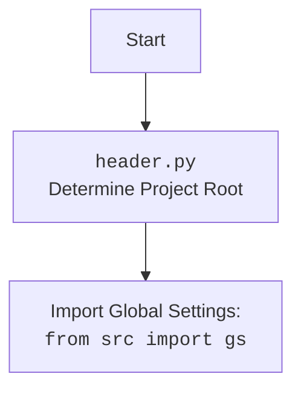

## АНАЛИЗ КОДА: `hypotez/src/suppliers/visualdg/header.py`

### 1. <алгоритм>

**Функция `set_project_root`:**

1.  **Начало**: Функция принимает кортеж `marker_files` (по умолчанию `('__root__', '.git')`) для поиска корневой директории проекта.
2.  **Определение текущего пути**: Получает абсолютный путь к директории, где находится файл `header.py`, и сохраняет его в переменную `current_path`.
    *   **Пример**: Если файл находится в `/home/user/hypotez/src/suppliers/visualdg/header.py`, то `current_path` будет `/home/user/hypotez/src/suppliers/visualdg`.
3.  **Инициализация `__root__`**: Переменная `__root__` инициализируется значением `current_path`.
4.  **Поиск корневой директории**: Проходит по текущему пути и его родительским директориям.
    *   **Пример**: Сначала проверяется `/home/user/hypotez/src/suppliers/visualdg`, затем `/home/user/hypotez/src/suppliers`, потом `/home/user/hypotez/src` и наконец `/home/user/hypotez`.
5.  **Проверка маркеров**: Для каждой директории `parent` проверяется наличие любого из файлов или директорий, перечисленных в `marker_files`.
    *   **Пример**: Для каждого `marker` (например, `'__root__'` или `'.git'`), проверяется существование `parent / marker`, то есть, например, `/home/user/hypotez/src/suppliers/visualdg/__root__`.
6.  **Обновление `__root__`**: Если маркер найден, значение `__root__` обновляется на текущую директорию `parent`, и цикл прерывается.
    *   **Пример**: Если в директории `/home/user/hypotez` найден файл `.git`, то `__root__` становится `/home/user/hypotez`.
7.  **Добавление в `sys.path`**: Если найденный путь `__root__` отсутствует в `sys.path`, он добавляется в начало списка.
8.  **Возврат `__root__`**: Функция возвращает путь к корневой директории.
9.  **Конец**.

**Основная часть кода:**

1.  **Вызов `set_project_root`**: Вызывается `set_project_root` для определения корневой директории проекта. Результат сохраняется в глобальной переменной `__root__`.
2.  **Загрузка настроек**:
    *   Пытается открыть файл `settings.json`, расположенный по пути `__root__/src/settings.json`.
    *   Если файл существует и является валидным JSON, его содержимое загружается в переменную `settings`.
    *   Если файл не найден или JSON невалиден, `settings` остается `None`.
3.  **Загрузка документации**:
    *   Пытается открыть файл `README.MD`, расположенный по пути `__root__/src/README.MD`.
    *   Если файл существует, его содержимое читается в переменную `doc_str`.
    *   Если файл не найден, `doc_str` остается `None`.
4.  **Инициализация глобальных переменных**:
    *   Инициализируются глобальные переменные `__project_name__`, `__version__`, `__doc__`, `__details__`, `__author__`, `__copyright__`, `__cofee__` на основе данных из `settings` и `doc_str`. Если `settings` отсутствует, используются значения по умолчанию.

### 2. <mermaid>

```mermaid
flowchart TD
    Start --> SetProjectRoot[set_project_root()]
    SetProjectRoot --> FindCurrentPath[Get current file's directory]
    FindCurrentPath --> InitRoot[Initialize __root__ to current path]
    InitRoot --> LoopParents[Loop through parent directories]
    LoopParents -- Marker Found --> UpdateRoot[Update __root__ to parent]
    LoopParents -- Marker Not Found --> ContinueLoop[Continue to next parent]
    ContinueLoop --> CheckIfRootIsInSysPath
    UpdateRoot --> BreakLoop[Break loop]
    BreakLoop --> CheckIfRootIsInSysPath
     CheckIfRootIsInSysPath -- Root path not in sys.path --> AddToSysPath[sys.path.insert(0, str(__root__))]
    CheckIfRootIsInSysPath -- Root path already in sys.path --> ReturnRoot[Return __root__]
    AddToSysPath --> ReturnRoot
    ReturnRoot --> InitProjectRoot[__root__ = returned value]
    InitProjectRoot --> LoadSettings[Load settings from settings.json]
    LoadSettings -- Settings Loaded --> SetGlobalSettings[Set global project settings from loaded settings]
    LoadSettings -- Settings Not Loaded --> SetDefaultGlobalSettings[Set default project settings]
    SetGlobalSettings --> LoadDoc[Load documentation from README.MD]
    SetDefaultGlobalSettings --> LoadDoc
    LoadDoc -- Doc Loaded --> SetGlobalDoc[Set global doc from loaded doc]
    LoadDoc -- Doc Not Loaded --> SetDefaultGlobalDoc[Set default global doc]
    SetGlobalDoc --> SetRemainingSettings[Set remaining global project settings]
    SetDefaultGlobalDoc --> SetRemainingSettings
    SetRemainingSettings --> End
```



**Объяснение зависимостей `mermaid`:**

*   **`set_project_root()`**: Функция, определяющая корень проекта.
*   **`FindCurrentPath`**: Блок, представляющий определение текущего пути.
*   **`InitRoot`**: Блок, представляющий инициализацию переменной `__root__`.
*   **`LoopParents`**: Блок цикла, проходящего по родительским директориям.
*   **`UpdateRoot`**: Блок, обновляющий переменную `__root__`, когда маркер найден.
*   **`ContinueLoop`**: Блок, продолжающий цикл, если маркер не найден.
*   **`BreakLoop`**: Блок, прерывающий цикл, если маркер найден.
*    **`CheckIfRootIsInSysPath`**: Проверка наличия корневого каталога проекта в `sys.path`.
*    **`AddToSysPath`**: Добавление корневого каталога в `sys.path`.
*   **`ReturnRoot`**: Блок, возвращающий корневой путь.
*   **`InitProjectRoot`**: Блок, сохраняющий возвращаемое значение `set_project_root()` в переменную `__root__`.
*   **`LoadSettings`**: Блок, представляющий попытку загрузки настроек из `settings.json`.
*   **`SetGlobalSettings`**: Блок, представляющий установку глобальных настроек проекта из загруженных настроек.
*   **`SetDefaultGlobalSettings`**: Блок, устанавливающий значения по умолчанию, если настройки не удалось загрузить.
*  **`LoadDoc`**: Загрузка содержимого файла `README.MD`.
*  **`SetGlobalDoc`**: Установка глобальной переменной `__doc__` из загруженного содержимого.
*   **`SetDefaultGlobalDoc`**: Установка значения по умолчанию для `__doc__`, если не удалось загрузить файл.
*   **`SetRemainingSettings`**: Установка остальных глобальных переменных.

### 3. <объяснение>

**Импорты:**

*   `sys`: Модуль для работы с системными параметрами и функциями, используется для добавления пути к корневой директории проекта в `sys.path`.
*   `json`: Модуль для работы с JSON-данными, используется для чтения файла настроек `settings.json`.
*   `packaging.version.Version`: Модуль для работы с версиями. **В данном коде не используется, возможно, остался от предыдущих итераций.**
*   `pathlib.Path`: Модуль для работы с путями в файловой системе, обеспечивает более объектно-ориентированный подход по сравнению с простыми строками.
*   `src.gs`: Импортирует модуль `gs` из пакета `src`, предположительно, содержит глобальные настройки и константы проекта.

**Функции:**

*   `set_project_root(marker_files: tuple = ('__root__', '.git')) -> Path`:
    *   **Аргументы**:
        *   `marker_files`: Кортеж имен файлов или директорий, которые используются для определения корневой директории проекта.
    *   **Возвращает**:
        *   `Path`: Объект `Path` из `pathlib`, представляющий путь к корневой директории проекта или директорию где расположен скрипт, если корневая директория не найдена.
    *   **Назначение**: Находит корневую директорию проекта путем поиска родительских директорий, содержащих любой из файлов или директорий, указанных в `marker_files`.

**Переменные:**

*   `__root__`: Переменная типа `Path`, хранит путь к корневой директории проекта.
*   `settings`: Переменная типа `dict`, хранит загруженные из `settings.json` настройки проекта. Если файл не найден или невалиден - содержит `None`.
*   `doc_str`: Переменная типа `str`, хранит текст из файла `README.MD`. Если файл не найден - содержит `None`.
*   `__project_name__`: Имя проекта, загружается из `settings.json` или имеет значение по умолчанию "hypotez".
*   `__version__`: Версия проекта, загружается из `settings.json` или имеет значение по умолчанию "".
*   `__doc__`: Документация проекта, загружается из `README.MD` или имеет значение по умолчанию "".
*   `__details__`: Детали проекта, по умолчанию "". **В коде не используется, но может быть использована в будущих версиях.**
*   `__author__`: Автор проекта, загружается из `settings.json` или имеет значение по умолчанию "".
*   `__copyright__`: Копирайт проекта, загружается из `settings.json` или имеет значение по умолчанию "".
*   `__cofee__`: Сообщение с призывом поддержать разработчика, загружается из `settings.json` или имеет значение по умолчанию "Treat the developer to a cup of coffee for boosting enthusiasm in development: https://boosty.to/hypo69".

**Взаимосвязь с другими частями проекта:**

*   Этот модуль `header.py` используется для определения корневой директории проекта и загрузки общих настроек, документации, а также определения глобальных переменных, которые могут быть использованы другими модулями проекта.
*   Импорт `from src import gs` указывает на зависимость от модуля `gs`, предположительно содержащего глобальные настройки проекта, такие как пути и константы.

**Потенциальные ошибки и области для улучшения:**

*   **Обработка ошибок**:  В блоках try/except при загрузке `settings.json` и `README.MD` используется `...` для обработки исключений. Это не является явным способом обработки ошибок, и может быть целесообразно добавить логирование ошибок.
*   **`packaging.version`**: Импорт `packaging.version` не используется. Это может быть удалено из кода.
*   **Переменная `__details__`**: Переменная объявлена, но не используется. Возможно, она предназначена для будущей функциональности.
*   **Настройки по умолчанию**: Значения по умолчанию можно вынести в константы для лучшей читаемости и возможности их изменения в одном месте.
*   **Неявное использование**: Код подразумевает, что `settings.json` и `README.MD` должны лежать в определенном месте, что делает код менее гибким.

**Цепочка взаимосвязей с другими частями проекта:**

1.  **Запуск скрипта**: При запуске любого скрипта в проекте, он может импортировать `header.py`.
2.  **Определение корня**: `header.py` вычисляет корень проекта.
3.  **Импорт `gs`**:  Импортирует `src.gs`, получая глобальные настройки.
4.  **Загрузка настроек**: Загружает `settings.json` (если существует) и  `README.MD` (если существует).
5.  **Инициализация**: Глобальные переменные, такие как `__project_name__`, `__version__` и `__doc__`, инициализируются.
6.  **Использование**: Другие модули могут импортировать `header.py` и использовать эти глобальные переменные и константы, устанавливая единую базу для всего проекта.

В целом, код хорошо структурирован и выполняет свою задачу по определению корня проекта и загрузке настроек. Улучшения могут быть сделаны в обработке ошибок и гибкости кода.