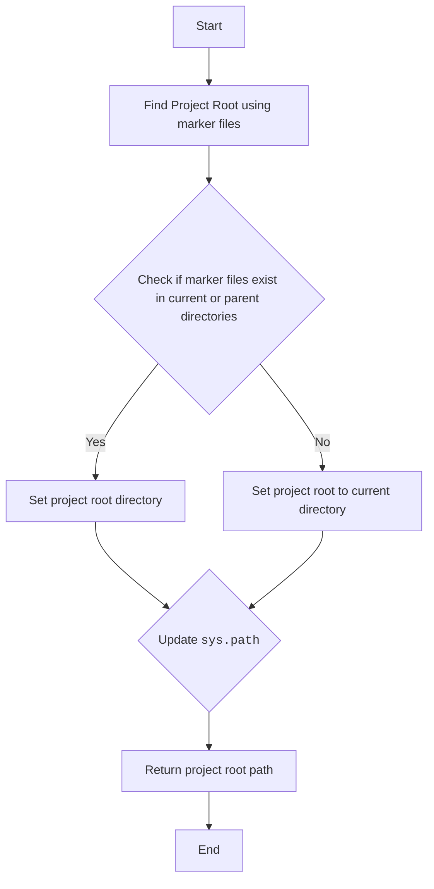
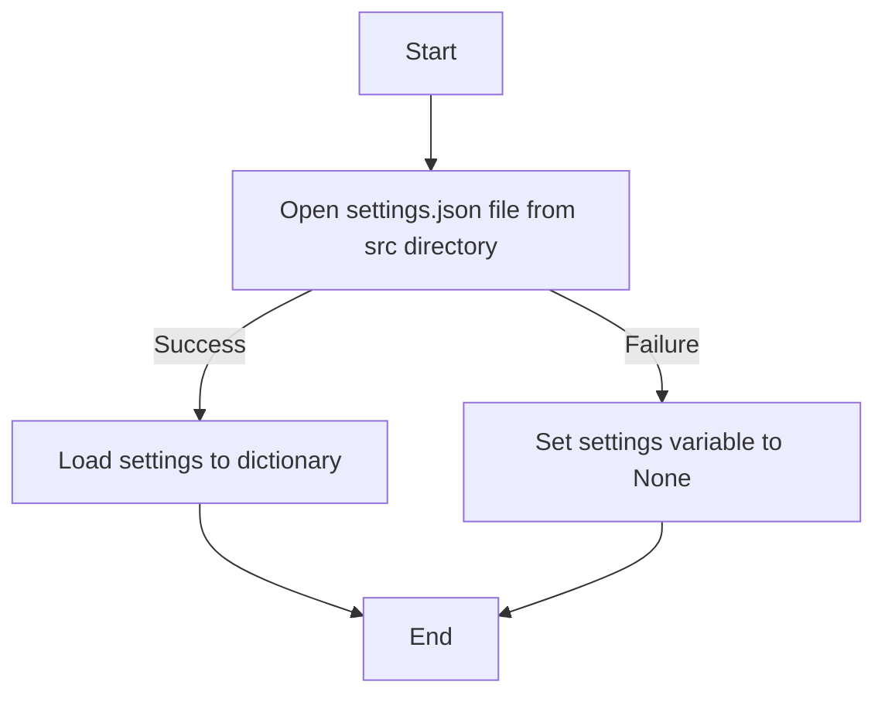
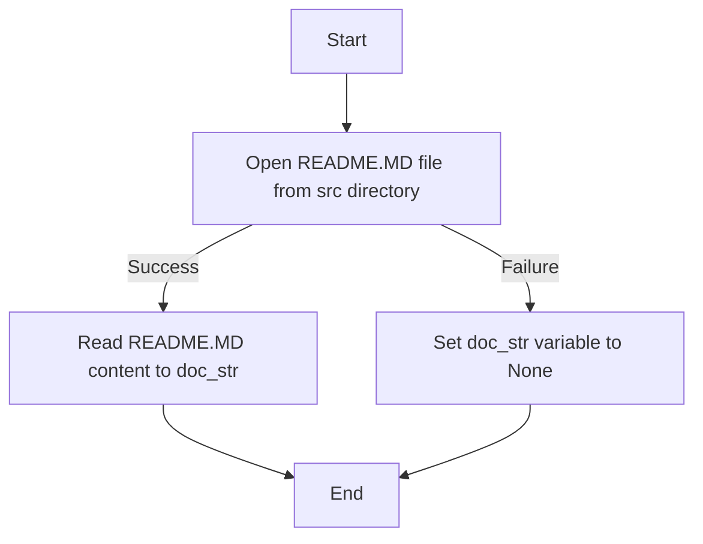
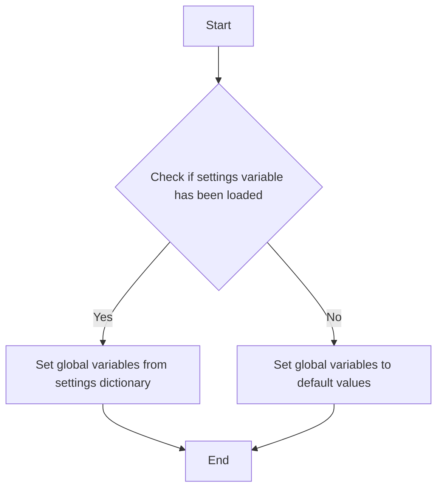

# Анализ кода `hypotez/src/suppliers/visualdg/header.py`

## <алгоритм>

1.  **`set_project_root(marker_files)`**:
    *   **Вход:** `marker_files` - кортеж имен файлов или директорий для поиска корня проекта. По умолчанию `('__root__', '.git')`.
    *   **Начало:** Определяется текущий каталог, где находится файл `header.py`.
    *   **Поиск корня:**
        *   Проверяется, есть ли в текущем каталоге или в одном из его родительских каталогов какой-либо из `marker_files`.
        *   Если найден, каталог становится корнем проекта.
        *   Процесс поиска останавливается на первом найденном маркере.
        *   Если не найден, то корнем проекта становится каталог, где лежит файл `header.py`
    *   **Добавление в `sys.path`**: Корень проекта добавляется в `sys.path` (если его там нет), что позволяет импортировать модули из корня проекта.
    *   **Возврат:** Возвращается путь к корню проекта.

    ```mermaid
    graph TD
        A[Start] --> B{Get Current Directory};
        B --> C{Iterate through Parent Directories};
        C -- Marker File Found --> D{Set Project Root};
        C -- No Marker File --> E{Set Project Root to Current Dir};
        D --> F{Add to sys.path (if not exists)};
        E --> F;
        F --> G(Return Project Root Path);
    ```

    *Пример:*
    Если файл `header.py` находится в `/home/user/hypotez/src/suppliers/visualdg` и в `/home/user/hypotez` существует файл `__root__`, то функция вернет `/home/user/hypotez`.

2. **Получение корня проекта**:
    * Вызывается функция `set_project_root()` без аргументов. Результат присваивается глобальной переменной `__root__`.

3.  **Загрузка настроек из `settings.json`**:
    *   Попытка открыть и прочитать файл `settings.json`, который находится в директории `src` относительно корня проекта.
    *   Если файл успешно открыт, то его содержимое загружается как словарь в переменную `settings`.
    *   Если файл не найден или не может быть прочитан (например, ошибка `json.JSONDecodeError`), то `settings` остаётся `None`.

    ```mermaid
    graph TD
        A[Start] --> B{Open settings.json from src/ directory};
        B -- File exists --> C{Load settings to dictionary};
        B -- File not found or error --> D{settings = None};
        C --> E[End];
        D --> E;
    ```

    *Пример:*
    Если `settings.json` содержит `{"project_name": "hypotez", "version": "1.0.0"}`, то переменная `settings` будет словарем `{"project_name": "hypotez", "version": "1.0.0"}`.

4.  **Загрузка документации из `README.MD`**:
    *   Попытка открыть и прочитать файл `README.MD`, который находится в директории `src` относительно корня проекта.
    *   Если файл успешно открыт, то его содержимое загружается как строка в переменную `doc_str`.
    *   Если файл не найден или не может быть прочитан, то `doc_str` остаётся `None`.

    ```mermaid
    graph TD
        A[Start] --> B{Open README.MD from src/ directory};
        B -- File exists --> C{Read README.MD content into doc_str};
        B -- File not found or error --> D{doc_str = None};
        C --> E[End];
        D --> E;
    ```
5.  **Инициализация глобальных переменных**:
    *   Глобальные переменные: `__project_name__`, `__version__`, `__doc__`, `__details__`, `__author__`, `__copyright__` и `__cofee__` инициализируются либо значениями из словаря `settings`, либо значениями по умолчанию.

    ```mermaid
    graph TD
        A[Start] --> B{Settings Loaded?};
        B -- Yes --> C{Set from settings values};
        B -- No --> D{Set Default Values};
        C --> E[End];
        D --> E;
    ```
    *Пример:*
    Если `settings` содержит `{"project_name": "test_project", "version": "2.0", "author": "Test User"}`, то `__project_name__` будет "test_project", `__version__` будет "2.0", `__author__` будет "Test User". Если  параметра нет то берется значение по умолчанию.
    `__doc__` присваивается значение `doc_str`, если он был прочитан, иначе пустая строка.

## <mermaid>

```mermaid
flowchart TD
    Start --> FindRoot[<code>header.py</code><br>set_project_root(): Determine Project Root];
    FindRoot --> ImportGS[Import Global Settings:<br><code>from src import gs</code>];
    ImportGS --> LoadSettings{Load settings:<br><code>settings = json.load(...)</code>};
    LoadSettings --> LoadDoc{Load documentation:<br><code>doc_str = file.read(...)</code>};
    LoadDoc --> SetGlobals{Set global project variables<br>(<code>__project_name__</code>, <code>__version__</code>, etc.)};
    SetGlobals --> End;
```






## <объяснение>

### Импорты
-   `sys`: Используется для работы с системными параметрами и функциями, включая `sys.path` для управления путями поиска модулей.
-   `json`: Используется для работы с JSON-файлами, загрузка файла настроек `settings.json`.
-   `packaging.version.Version`: Импортируется для сравнения версий. В данном коде не используется, но может пригодиться в будущем, если потребуется работа с версиями.
-   `pathlib.Path`: Используется для удобной работы с путями файловой системы.

### Функции
-   `set_project_root(marker_files: tuple) -> Path`:
    -   **Аргументы:**
        -   `marker_files`: Кортеж строк, представляющих имена файлов или директорий, которые указывают на корень проекта.
    -   **Возвращает:** `Path` объект, представляющий путь к корню проекта.
    -   **Назначение:** Ищет корень проекта, начиная с текущей директории и поднимаясь вверх по иерархии директорий, пока не найдет маркерный файл.
    -   **Пример:** Вызов `set_project_root()` без аргументов или с `marker_files = ('__root__', '.git')` будет искать директорию, содержащую либо файл `__root__`, либо директорию `.git`.

### Переменные

-   `__root__` (Path): Глобальная переменная, хранящая путь к корню проекта.
-   `settings` (dict): Глобальная переменная, хранящая словарь с настройками проекта, загружаемыми из `settings.json`.
-   `doc_str` (str): Глобальная переменная, хранящая строку с документацией проекта, загружаемой из `README.MD`.
-   `__project_name__` (str): Глобальная переменная, хранящая имя проекта.
-   `__version__` (str): Глобальная переменная, хранящая версию проекта.
-   `__doc__` (str): Глобальная переменная, хранящая общую документацию проекта.
-   `__details__` (str): Глобальная переменная, хранящая дополнительные детали проекта. (пустая строка по умолчанию)
-   `__author__` (str): Глобальная переменная, хранящая автора проекта.
-  `__copyright__` (str): Глобальная переменная, хранящая информацию о копирайте проекта.
-   `__cofee__` (str): Глобальная переменная, хранящая текст со ссылкой на донат разработчику.

### Взаимодействие с другими частями проекта
-  **`src.gs`**:  Импортирует глобальные настройки проекта из пакета `src`.
-   **`settings.json`**: Файл конфигурации проекта, который содержит метаданные проекта, такие как имя, версия, автор и т.д.
-   **`README.MD`**:  Файл документации проекта.

### Потенциальные ошибки и области для улучшения

-   **Обработка ошибок:**  Используется `try-except` для обработки `FileNotFoundError` и `json.JSONDecodeError`, однако, обработка ошибок довольно общая `...`. Возможно стоит более детально обрабатывать ошибки, логировать их и выдавать более информативные сообщения.
-   **Отсутствие файла `settings.json`:** Если файл не найден, используются значения по умолчанию. Возможно следует  выводить предупреждение об отсутствии `settings.json`.
-   **Отсутствие файла `README.MD`:** Если файл не найден, то `__doc__` будет пустой строкой, следует тоже обрабатывать ошибку и выводить предупреждение.
-   **Зависимость от наличия маркерных файлов:** Если маркерные файлы не будут установлены, поиск корня проекта может быть некорректным. Возможно стоит предусмотреть возможность установки переменной окружения, для указания корня проекта.

### Дополнительно
Код  `header.py` играет важную роль в инициализации проекта, определяя корень проекта, загружая настройки и документацию и устанавливая глобальные переменные проекта. Это позволяет другим модулям  проекта получить доступ к основной информации о проекте.