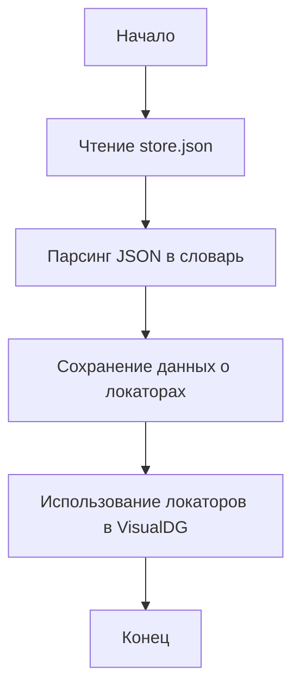

## Анализ кода: `hypotez/src/suppliers/visualdg/locators/store.json`

### <алгоритм>

1.  **Чтение файла JSON**:
    *   Файл `store.json` загружается и парсится.
    *   Пример: JSON файл `{ "element1": { "locator": "xpath://div[1]", "type": "element" }, "element2": { "locator": "id=button1", "type": "button" } }` преобразуется в структуру данных Python (словарь).

2.  **Использование данных**:
    *   Словарь, полученный из JSON, используется для доступа к данным о локаторах элементов.
    *   Пример: Чтобы получить локатор для элемента `"element1"`, используется `data["element1"]["locator"]`, что вернёт `"xpath://div[1]"`.

3.  **Работа с локаторами**:
    *   В файле содержатся локаторы (например, xpath, id, css) и их типы (например, element, button).
    *   Пример: `'locator': 'xpath://div[1]'` указывает, что элемент можно найти по xpath `//div[1]`, а `'type': 'element'` указывает на тип элемента.
    
4.  **Интеграция с остальной частью проекта**:
    *   Данные используются в `VisualDG` для поиска и взаимодействия с веб-элементами на странице.

### <mermaid>

**Описание зависимостей:**

*   **`Start`**: Начало процесса чтения и парсинга JSON файла.
*   **`ReadJSON`**: Этап чтения JSON файла `store.json` из файловой системы.
*   **`ParseJSON`**: Преобразование прочитанного JSON файла в структуру данных Python (словарь).
*   **`DataStore`**: Сохранение полученных данных о локаторах в памяти.
*   **`UseLocators`**: Использование полученных локаторов для взаимодействия с элементами в `VisualDG`.
*   **`End`**: Конец процесса обработки JSON файла.

### <объяснение>

**Общая информация:**

Файл `store.json` содержит словарь, где ключами являются имена элементов, а значениями — словари с информацией об их локаторах и типах.

**Импорты:**

В данном файле нет импортов, так как он является файлом данных (JSON) и не содержит исполняемого кода Python.

**Классы:**

В данном файле нет классов, так как он является файлом данных (JSON).

**Функции:**

В данном файле нет функций, так как он является файлом данных (JSON).

**Переменные:**

*   В файле определены структуры данных в формате JSON, где переменные — это ключи словаря (например, `element1`, `locator`, `type`) и их значения (например, `xpath://div[1]`, `element`).

**Цепочка взаимосвязей с другими частями проекта:**

1.  `VisualDG`: Этот файл JSON используется в модуле `VisualDG`, где он служит для хранения локаторов веб-элементов. `VisualDG` загружает этот файл и использует данные из него для поиска нужных элементов на веб-странице.

**Потенциальные ошибки и области для улучшения:**

1.  **Дублирование локаторов**: Возможно дублирование локаторов для разных элементов, что может привести к непредсказуемому поведению при взаимодействии с элементами.
2.  **Неточность локаторов**: Неточные или невалидные локаторы могут привести к ошибкам при поиске элементов.
3.  **Отсутствие валидации**: Отсутствует валидация данных в файле JSON, что может привести к ошибкам в `VisualDG`.
4.  **Жесткое кодирование**: Локаторы жёстко закодированы в JSON файле, что может усложнить поддержку при изменении структуры веб-страницы. Необходимо рассмотреть возможность параметризации локаторов.

**Дополнительно:**

*   Файл `store.json` предназначен для хранения конфигурационных данных.
*   Он является частью системы `VisualDG`, которая отвечает за автоматизацию тестирования и взаимодействия с веб-элементами.
*   Данный файл необходимо поддерживать актуальным для соответствия текущей структуре веб-страницы.