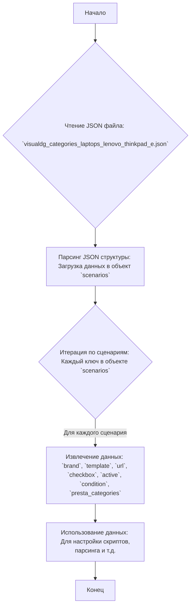

## Анализ кода

### 1. <алгоритм>

Данный код представляет собой JSON-файл, который содержит структуру данных для описания сценариев категорий ноутбуков Lenovo ThinkPad серии E. 
Общая схема работы:

1.  **Чтение JSON:** Файл `visualdg_categories_laptops_lenovo_thinkpad_e.json` читается как JSON.
2.  **Разбор структуры:** JSON парсится, и данные загружаются в структуру, где ключом верхнего уровня является `scenarios`.
3.  **Итерация по сценариям:** Происходит итерация по ключам внутри объекта `scenarios`. Каждый ключ представляет конкретный сценарий (например, "LENOVO THINKPAD E 13.4 - 13.3 I3").
4.  **Извлечение данных:** Для каждого сценария извлекаются данные, такие как:
    *   `brand`: Марка ноутбука (всегда "LENOVO").
    *   `template`: Шаблон модели (всегда "THINKPAD E").
    *   `url`: URL-адрес, связанный с продуктом.
    *   `checkbox`: Логическое значение (всегда `false`).
    *   `active`: Логическое значение (всегда `true`).
     *   `condition`: Состояние продукта (всегда `"new"`).
    *   `presta_categories`: Строка, представляющая категории PrestaShop, к которым относится продукт (числа, разделенные запятыми).
5.  **Использование данных:** Полученные данные могут использоваться для настройки скриптов, автоматизации, парсинга или других задач, связанных с импортом или управлением данными о продуктах.

**Пример для сценария "LENOVO THINKPAD E 13.4 - 13.3 I3":**

1.  JSON прочитан.
2.  Данные загружены в структуру `scenarios`.
3.  Берется ключ `"LENOVO THINKPAD E 13.4 - 13.3 I3"`.
4.  Извлекаются:
    *   `brand`: "LENOVO"
    *   `template`: "THINKPAD E"
    *   `url`: "-----------------THINKPAD E 13.4 - 13.3 I3-------------r "
    *   `checkbox`: `false`
    *   `active`: `true`
    *   `condition`: `"new"`
    *   `presta_categories`: "3,53,306,9,4,370,838"
5.  Эти данные могут быть переданы в систему управления каталогом продукции, систему парсинга и тд.

### 2. <mermaid>

**Объяснение диаграммы:**

*   **A (Начало):** Начальная точка процесса.
*   **B (Чтение JSON файла):** Происходит чтение файла `visualdg_categories_laptops_lenovo_thinkpad_e.json`.
*   **C (Парсинг JSON структуры):** JSON-файл анализируется, и данные загружаются в структуру, представленную объектом `scenarios`.
*   **D (Итерация по сценариям):** Запускается цикл, который обрабатывает каждый ключ (название сценария) в объекте `scenarios`.
*   **E (Извлечение данных):** Для текущего сценария извлекаются значения, такие как `brand`, `template`, `url`, `checkbox`, `active`, `condition`, `presta_categories`.
*    **F (Использование данных):** Извлеченные данные используются в различных целях, таких как настройка скриптов, парсинг данных или управление каталогом.
*   **G (Конец):** Конечная точка процесса.

### 3. <объяснение>

**Общая структура:**

Файл представляет собой JSON-объект, содержащий единственный ключ `scenarios`. Значением этого ключа является объект, в котором каждый ключ – это строковое представление названия сценария (например, "LENOVO THINKPAD E 13.4 - 13.3 I3"), а значение – это объект, содержащий параметры этого сценария.

**Свойства сценариев:**

*   `brand` (строка): Марка ноутбука (всегда "LENOVO" в данном файле).
*   `template` (строка): Шаблон модели ноутбука (всегда "THINKPAD E" в данном файле).
*   `url` (строка): URL-адрес, связанный с данным сценарием. Может быть как реальным URL, так и просто строкой-заглушкой.
*    `checkbox` (логическое): Булево значение, всегда `false` в данном файле.
*   `active` (логическое): Булево значение, всегда `true` в данном файле.
*   `condition` (строка): Условие товара, всегда `"new"` в данном файле.
*   `presta_categories` (строка): Строка, содержащая список идентификаторов категорий PrestaShop, разделенных запятыми.

**Использование:**

Данный файл, вероятно, используется для автоматизации процессов импорта товаров или настройки параметров для системы управления каталогом продукции, использующей PrestaShop. Каждая запись описывает параметры конкретной модели ноутбука Lenovo ThinkPad E-серии, и сопоставляет ее с предопределенными категориями PrestaShop.

**Примеры:**

*   Сценарий `"LENOVO THINKPAD E 14 I5"`:
    *   `brand`: "LENOVO"
    *   `template`: "THINKPAD E"
    *   `url`: "https://www.visualdg.co.il/172304-%D7%A0%D7%99%D7%99%D7%93%D7%99-ThinkPad-E-/253273/253295"
    *   `checkbox`: `false`
    *   `active`: `true`
    *   `condition`: `"new"`
    *   `presta_categories`: "3,53,104,10,5,378,838"

*   Сценарий `"LENOVO THINKPAD E 15 AMD"`:
    *   `brand`: "LENOVO"
    *   `template`: "THINKPAD E"
    *   `url`: "----------------LENOVO THINKPAD E 15 AMD------------- "
    *   `checkbox`: `false`
    *   `active`: `true`
     *   `condition`: `"new"`
    *   `presta_categories`: "3,53,105,11,234,388,838"

**Потенциальные ошибки и области для улучшения:**

*   **Непоследовательность URL:** Некоторые URL выглядят как реальные ссылки, в то время как другие – заглушки. Это может быть проблемой при обработке данных. Желательно иметь единый формат.
*   **Жестко закодированные значения:**  Поля `checkbox` всегда `false`, `active` всегда `true`, и `condition` всегда `new`. Возможно, они могут быть изменены.
*  **Отсутствие явного описания категорий:**  `presta_categories` содержит только ID, но нет описания, что может вызвать проблемы при отладке.
*  **Отсутствие валидации:** Нет никакой валидации, например, на то, что `presta_categories` являются числами.

**Взаимосвязи с другими частями проекта:**

Этот файл является частью системы, связанной с поставщиками (`suppliers`), в частности, с `visualdg`. Он предназначен для настройки сценариев категорий для ноутбуков конкретного бренда (Lenovo). Вероятно, этот файл используется совместно со скриптами, которые обрабатывают эти данные и либо загружают их в базу данных PrestaShop, либо используются для парсинга информации. Он может зависеть от других файлов, которые определяют работу с поставщиками и категориями PrestaShop.