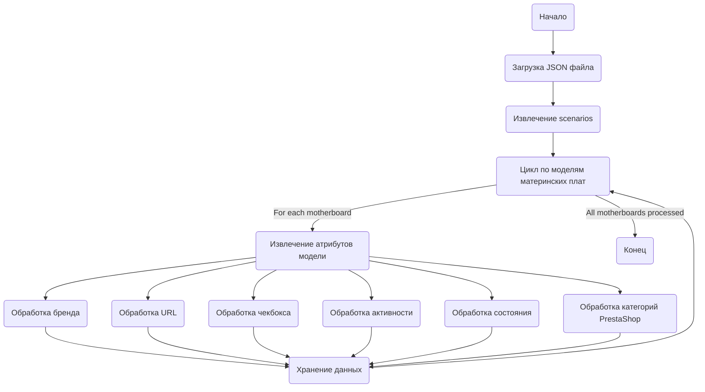

## Анализ `visualdg_categories_mb_asus.json`

### 1. <алгоритм>

JSON файл представляет собой структуру данных, описывающую различные модели материнских плат ASUS, которые предназначены для парсинга с сайта VisualDG. Каждая запись представляет собой определенную модель материнской платы и содержит следующие атрибуты:

1.  **Начало**: JSON файл загружается как словарь Python.
2.  **Итерация**:  Происходит итерация по ключам (названиям моделей материнских плат) словаря `scenarios`.
3.  **Обработка записи**: Для каждой модели материнской платы (например, `"MOTHERBOARD Intel 10 Gen H 410"`):
    *   Извлекаются атрибуты:
        *   `brand`: Бренд материнской платы (например, `"ASUS"`).
        *   `url`: URL-адрес страницы товара (если есть).
        *   `checkbox`:  Флаг, указывающий на необходимость применения чекбокса(всегда `false`).
        *   `active`: Флаг, указывающий на активность (всегда `true`).
        *    `condition`: Cостояние товара(всегда `"new"`).
        *   `presta_categories`: Категории PrestaShop, к которым относится товар в виде строки, разделенной запятыми(например, `"56,57,59,493"`).
4.  **Хранение**: Данные могут быть использованы для различных целей, например, для автоматического сбора данных или для построения структуры каталога товаров.

**Пример обработки одной записи:**

```
{
  "MOTHERBOARD Intel 10 Gen H 410": {
    "brand": "ASUS",
    "url": "https://www.visualdg.co.il/169412-%D7%9C%D7%95%D7%97%D7%95%D7%AA-%D7%90%D7%9D-ASUS/267795",
    "checkbox": false,
    "active": true,
    "condition":"new",
    "presta_categories": "56,57,59,493"
  }
}
```

1.  **Ключ**: `"MOTHERBOARD Intel 10 Gen H 410"`
2.  **Значение**: Словарь с атрибутами.
    *   `brand` : `"ASUS"`
    *   `url` : `"https://www.visualdg.co.il/169412-%D7%9C%D7%95%D7%97%D7%95%D7%AA-%D7%90%D7%9D-ASUS/267795"`
    *   `checkbox` : `false`
    *   `active` : `true`
    *    `condition`: `"new"`
    *   `presta_categories` : `"56,57,59,493"`

### 2. <mermaid>



**Объяснение диаграммы:**

1.  **`Start`**: Начало процесса обработки JSON файла.
2.  **`LoadJson`**: Загрузка JSON файла, представляющего собой конфигурации для скрапинга.
3.  **`ExtractScenarios`**: Извлечение словаря, содержащего данные о различных моделях материнских плат из ключа `scenarios`.
4.  **`LoopThroughScenarios`**: Цикл по ключам (названиям моделей материнских плат) словаря `scenarios`.
5.   **`ExtractAttributes`**: Извлечение атрибутов каждой модели материнской платы.
6. **`ProcessBrand`**, **`ProcessUrl`**, **`ProcessCheckbox`**, **`ProcessActive`**, **`ProcessCondition`**, **`ProcessPrestaCategories`**: Обработка каждого отдельного атрибута.
7.  **`StoreData`**: Сохранение извлеченных и обработанных данных в структуру данных.
8. **`LoopThroughScenarios`**: После обработки всех атрибутов модели материнской платы, цикл продолжается до тех пор, пока не будут обработаны все материнские платы.
9.  **`End`**: Конец процесса обработки JSON файла.

### 3. <объяснение>

**Импорты**:

В данном JSON-файле импорты не используются, так как это файл данных, а не исполняемый код.

**Классы**:

В данном файле классы не используются, так как это файл данных, а не исполняемый код.

**Функции**:

В данном файле функции не используются, так как это файл данных, а не исполняемый код.

**Переменные**:

Файл содержит единственный объект-словарь с ключом `"scenarios"`, значением которого является словарь, где ключами являются названия моделей материнских плат (например, `"MOTHERBOARD Intel 10 Gen H 410"`), а значениями - словари с атрибутами, описывающими каждую модель.

*   `scenarios` (словарь): Главный контейнер для всех сценариев.
    *   Ключ: Название модели материнской платы (строка).
    *   Значение: Словарь с атрибутами материнской платы.
        *   `brand` (строка): Бренд материнской платы (например, `"ASUS"`).
        *   `url` (строка): URL-адрес страницы товара. Может быть `null` или строкой с URL.
        *   `checkbox` (логическое значение): Флаг, указывающий на необходимость применения чекбокса(всегда `false`).
        *   `active` (логическое значение): Флаг, указывающий на активность (всегда `true`).
        *   `condition` (строка): Состояние товара(всегда `"new"`).
        *  `presta_categories` (строка): Категории PrestaShop, к которым относится товар в виде строки, разделенной запятыми(например, `"56,57,59,493"`).

**Взаимосвязь с другими частями проекта**:

Этот файл, скорее всего, используется для конфигурации скрипта, который собирает информацию о материнских платах ASUS с сайта VisualDG. Информация, содержащаяся в файле, используется для определения:

*   Какие материнские платы нужно искать.
*   Где искать информацию (URL-адрес).
*   В какие категории PrestaShop помещать товары.

**Потенциальные ошибки и области для улучшения**:

1.  **Отсутствие проверок**:  В файле отсутствуют проверки на корректность данных. Например, `url` может быть некорректным.
2.  **Неоднородность данных**: Некоторые URL-адреса  заменены на строку `----------------------...-----------------------` что может вызвать ошибки.

**Улучшения**:

1.  Добавить валидацию данных для проверки корректности форматов данных.
2.  Заменить строки `----------------------...-----------------------` на `null` или пустую строку, если это является признаком отсутствия URL.
3.  Разделить файл на несколько, если количество моделей станет очень большим для удобства сопровождения.