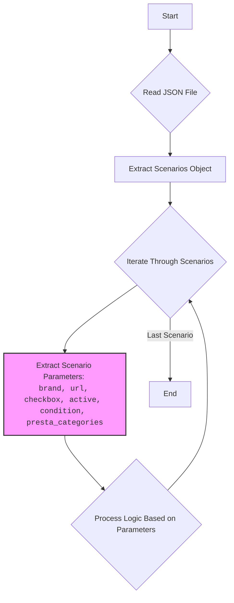

## Анализ кода `visualdg_categories_minipc_asus.json`

### 1. <алгоритм>
Данный JSON-файл представляет собой конфигурацию для обработки категорий товаров "MINIPC" от бренда "ASUS" для поставщика "visualdg". Структура файла состоит из единственного ключа `"scenarios"`, значением которого является объект, содержащий в себе перечень категорий мини-компьютеров ASUS, каждый из которых имеет свои параметры.

Пошаговый алгоритм обработки этого JSON файла:

1. **Чтение JSON файла:** Сначала файл `visualdg_categories_minipc_asus.json` считывается и десериализуется в объект (например, словарь в Python).
   
    ```python
    import json

    with open('visualdg_categories_minipc_asus.json', 'r') as f:
        data = json.load(f)
    # data будет содержать словарь со структурой, описанной в JSON.
    ```

2. **Доступ к сценариям:** Извлечение объекта со сценариями из общего объекта. Это объект, содержащий все конфигурации для каждой модели ASUS MINIPC.
   
    ```python
    scenarios = data['scenarios']
    # scenarios - словарь, где ключи - названия моделей (ASUS MINIPC I3, I5 и т.д.)
    ```

3. **Итерация по сценариям:** Перебор каждого сценария (каждой модели) в цикле.
   
    ```python
    for model_name, model_config in scenarios.items():
       # model_name - строка, например "ASUS MINIPC I3"
       # model_config - словарь, содержащий конфигурацию для конкретной модели
    ```

4. **Обработка конфигурации сценария:** Для каждого сценария извлекаются параметры (brand, url, checkbox, active, condition, presta_categories).
  
    ```python
        brand = model_config['brand']
        url = model_config['url']
        checkbox = model_config['checkbox']
        active = model_config['active']
        condition = model_config['condition']
        presta_categories = model_config['presta_categories']

        print(f"Model: {model_name}, Brand: {brand}, URL: {url}, Categories: {presta_categories}")
        # Здесь можно выполнять любые операции с полученными данными
    ```

5. **Логика на основе параметров:**
  На основе параметра `active` можно решить, нужно ли обрабатывать данную конфигурацию. Параметр `condition`  может определять, нужно ли обрабатывать новый или б/у товар, `presta_categories` определяет к каким категориям PrestaShop относится товар. `url` используется для определения адреса страницы товара на сайте поставщика.

### 2. <mermaid>

### 3. <объяснение>

**Импорты**:
В данном файле нет импортов, так как это файл данных в формате JSON. Этот файл используется как входные данные для программ на Python и других языках, которые могут его обрабатывать.

**Классы**:
В данном коде нет классов. Файл `visualdg_categories_minipc_asus.json` является файлом конфигурации, а не программным кодом. Он описывает структуру данных, которые будут использоваться другими компонентами проекта.

**Функции**:
В файле отсутствуют функции. Описанные выше действия подразумевают наличие функций в программах, которые обрабатывают этот файл. 

**Переменные**:
- `"scenarios"`: Ключ объекта верхнего уровня, значением которого является объект с набором конфигураций.
- `"ASUS MINIPC I3"`, `"ASUS MINIPC I5"`, ...: Ключи в объекте `"scenarios"`, представляющие названия конкретных моделей мини-компьютеров.
- `"brand"`: Строка, указывающая на бренд товара (всегда "ASUS" в этом файле).
- `"url"`: Строка, представляющая URL страницы товара на сайте поставщика.
- `"checkbox"`: Логическое значение (всегда `false` в данном файле), может использоваться для определения выбора товара в интерфейсе.
- `"active"`: Логическое значение (всегда `true` в данном файле), определяет, является ли данный сценарий активным.
- `"condition"`: Строка, представляющая состояние товара (всегда "new" в данном файле).
- `"presta_categories"`: Строка, содержащая список идентификаторов категорий PrestaShop, к которым относится товар.

**Объяснение:**
Файл `visualdg_categories_minipc_asus.json` используется для определения параметров для сбора данных о мини-компьютерах ASUS с сайта visualdg. Он определяет соответствие моделей категориям товаров в PrestaShop и служит конфигурационным файлом для парсинга, обработки и последующей загрузки данных о товарах.

**Потенциальные ошибки и улучшения:**
- **Отсутствие проверки URL:** В некоторых сценариях URL заменен на строку с дефисами. Проверка корректности URL является важной частью работы программы, использующей данный файл. Необходимо убедиться, что все URL действительны, прежде чем использовать их для парсинга данных.
- **Унификация значений:** Поля checkbox и active всегда имеют значения false и true, что выглядит избыточно. Возможно, их стоит исключить и обрабатывать как условие по умолчанию.
- **Динамическое получение категорий:** Категории PrestaShop заданы статически. Было бы лучше, если бы они получались динамически из системы.
- **Обработка ошибок:** Не предусмотрена обработка ошибок, например, если структура JSON не соответствует ожидаемой.

**Взаимосвязь с другими частями проекта**:
Этот файл конфигурации вероятно используется в других частях проекта для:
-   **Парсинга:** Получение данных о товарах с указанных URL.
-   **Маппинга:** Соотнесения товаров с категориями в PrestaShop.
-   **Обновления данных:** Автоматического обновления информации о товарах.

Этот JSON-файл служит важным звеном в процессе сбора и интеграции данных о товарах в рамках проекта.