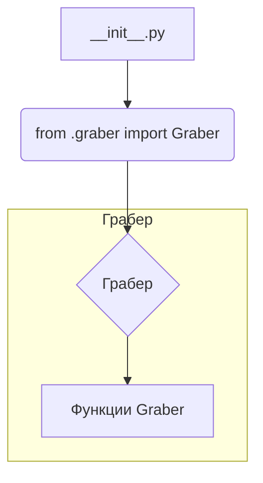

# <input code>

```python
## \file hypotez/src/suppliers/wallashop/__init__.py
# -*- coding: utf-8 -*-
#! venv/Scripts/python.exe
#! venv/bin/python/python3.12

"""
.. module: src.suppliers.wallashop 
	:platform: Windows, Unix
	:synopsis:

"""
MODE = 'dev'

from .graber import Graber
```

# <algorithm>



В данном коде файл `__init__.py` в пакете `hypotez/src/suppliers/wallashop` выполняет импорт класса `Graber` из модуля `graber.py` внутри того же пакета.  Этот импорт позволяет использовать класс `Graber` в других модулях этого пакета.  Нет прямого вызова функций или использования класса в этом файле `__init__.py`. Он просто делает его доступным для импорта.


# <mermaid>

```mermaid
graph LR
    A[hypotez/src/suppliers/wallashop/__init__.py] --> B(.graber);
    B --> C[graber.py];
    C --> D(Graber class);

    subgraph Грабер
        D -- импорт -- C;
    end
```
Диаграмма показывает, что модуль `__init__.py` импортирует класс `Graber` из файла `graber.py`.  `graber.py` содержит определение класса `Graber`.  Файл `__init__.py`  является точкой входа для модуля.


# <explanation>

* **Импорты:**
  `from .graber import Graber`: Этот импорт подключает класс `Graber` из модуля `graber.py`, который находится в том же пакете (`wallashop`).  Символ `.` перед именем файла `graber` указывает на относительный импорт, что важно для организации кода в структуре пакета.  Это позволяет избежать указания полного пути к файлу.

* **Классы:**
  Нет определения классов напрямую в этом файле.  Класс `Graber` определён в `graber.py` и доступен через импорт.

* **Функции:**
  Нет функций определённых в файле `__init__.py`.  Любые функции, связанные с  `wallashop` будут определены в файле `graber.py`.

* **Переменные:**
  `MODE = 'dev'`: Эта переменная задаёт режим работы (вероятно, для дебага или разработки). Значение `'dev'` задаёт режим разработки.

* **Возможные ошибки или улучшения:**
  - **Дополнения:**  Файл `__init__.py` обычно содержит  функции инициализации и конфигурации для пакета. В данный момент он только импортирует класс.
  - **Документация:**  Вместо комментария `""".. module: src.suppliers.wallashop ..."""` лучше использовать docstrings для функций и классов, чтобы описать их поведение и параметры. Это улучшит читаемость и понимание кода.
  - **Использование MODE:**  В настоящий момент переменная `MODE` просто хранится.  Для лучшей практики необходимо использовать её в логике кода, чтобы управлять поведением в разных режимах (например, в `graber.py`).


**Цепочка взаимосвязей:**
Файл `__init__.py` является частью пакета `wallashop` в `hypotez/src/suppliers`. Он предоставляет доступ к классу `Graber` из других частей проекта.  Связь с другими частями происходит при использовании этого класса в других модулях или скриптах, которые импортируют этот пакет.
```