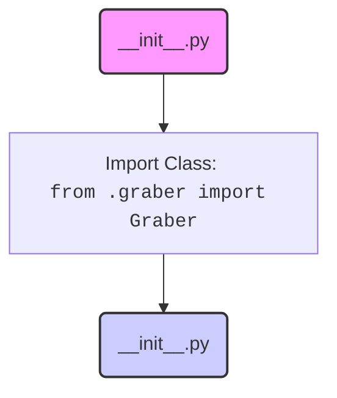

## Анализ кода `hypotez/src/suppliers/wallashop/__init__.py`

### 1. <алгоритм>

1.  **Начало**: Исполнение скрипта `__init__.py`.
2.  **Импорт**: Выполняется импорт класса `Graber` из модуля `graber.py`, расположенного в том же каталоге.
    *   Пример: `from .graber import Graber`
3.  **Конец**: Завершение исполнения скрипта. Теперь класс `Graber` доступен для использования в других модулях, импортирующих `src.suppliers.wallashop`.

### 2. <mermaid>

**Объяснение диаграммы:**

*   `Start(__init__.py)`: Начало выполнения скрипта `__init__.py`.
*   `ImportGraber`: Операция импорта класса `Graber` из модуля `graber.py`.
*   `End(__init__.py)`: Завершение выполнения скрипта `__init__.py`.

### 3. <объяснение>

**Импорты:**

*   `from .graber import Graber`: Этот импорт делает класс `Graber`, определенный в файле `graber.py` (который находится в той же директории `wallashop`), доступным для использования в других частях проекта, импортирующих пакет `src.suppliers.wallashop`. Точка (`.`) в `from .graber` означает, что модуль `graber` находится в текущей директории.

**Файлы и их назначение:**

*   `__init__.py`:  Этот файл является обязательным для Python, чтобы директория `wallashop` считалась пакетом. Хотя в данном случае он содержит только импорт, он имеет ключевое значение:
    *   Он делает все, что экспортируется через него (в данном случае класс `Graber`), доступным для импорта из пакета `src.suppliers.wallashop`.
    *   Позволяет другим частям проекта использовать `from src.suppliers.wallashop import Graber` вместо `from src.suppliers.wallashop.graber import Graber`.

*   `graber.py`: Этот файл, судя по импорту, должен содержать класс `Graber`. Он, вероятно, отвечает за извлечение или обработку данных, связанных с `wallashop`, что подразумевается названием класса.

**Классы:**

*   `Graber`: Класс, импортированный из `graber.py`. Его точная функциональность можно определить только при анализе кода `graber.py`. Исходя из названия, можно предположить, что он отвечает за "захват" или извлечение данных из источника, связанного с `wallashop`. Это может быть парсинг веб-страниц, чтение API или другие методы сбора данных.

**Переменные:**
    В данном коде нет явных переменных.

**Потенциальные ошибки и области для улучшения:**

*   **Отсутствие документации:** Код имеет строковый литерал docstring, что хорошо, но не хватает более подробной документации о роли пакета `wallashop` и класса `Graber`.
*   **Магические строки:** `#! venv/Scripts/python.exe` и `#! venv/bin/python/python3.12` выглядят как магические строки, которые не являются обязательными. Они, вероятно, предназначены для указания пути к интерпретатору Python, но являются избыточными и не должны быть в этом файле.

**Взаимосвязи с другими частями проекта:**
*   Пакет `src.suppliers.wallashop` предположительно является частью более широкой структуры проекта, где он отвечает за обработку данных конкретного поставщика, "wallashop".
*   Другие модули проекта, вероятно, будут импортировать `Graber` через `from src.suppliers.wallashop import Graber` и использовать его для конкретных задач.

**Цепочка взаимосвязей:**

1.  Другие модули импортируют `src.suppliers.wallashop`.
2.  При импорте `src.suppliers.wallashop` Python выполняет код в `__init__.py`.
3.  `__init__.py` импортирует `Graber` из `graber.py`.
4.  Другие модули могут использовать класс `Graber` из `src.suppliers.wallashop`.