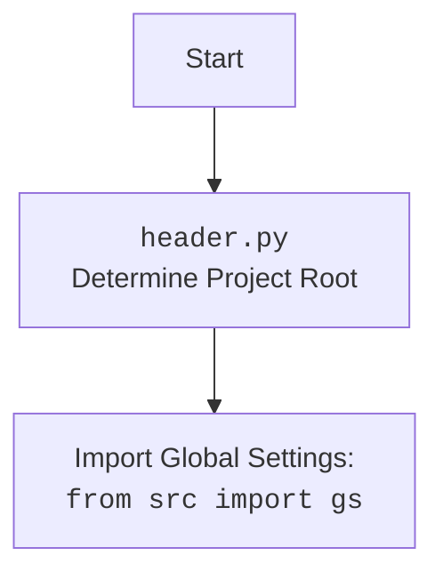

## АНАЛИЗ КОДА: `hypotez/src/suppliers/wallashop/graber.py`

### 1. <алгоритм>
   
   **Блок-схема:**
   
   ```mermaid
   flowchart TD
      Start[Начало] --> ImportModules[Импорт модулей];
      ImportModules --> ClassGraber[Определение класса `Graber`];
      ClassGraber --> InitMethod[Инициализация `__init__`];
      InitMethod --> SetPrefix[Установка `supplier_prefix`];
      SetPrefix --> SuperInit[Вызов `super().__init__`];
      SuperInit --> SetContextLocator[Установка `Context.locator_for_decorator = None`];
      SetContextLocator --> End[Конец];

   style Start fill:#f9f,stroke:#333,stroke-width:2px
   style End fill:#f9f,stroke:#333,stroke-width:2px
   ```

   **Примеры:**

   *   **Импорт модулей**:
        *   `from typing import Any`: Импортирует `Any` для аннотаций типов.
        *   `import header`: Импортирует модуль `header` для определения корня проекта.
        *   `from src.suppliers.graber import Graber as Grbr, Context, close_pop_up`: Импортирует класс `Graber` (как `Grbr`), `Context` и `close_pop_up` из модуля `src.suppliers.graber`.
        *   `from src.webdriver.driver import Driver`: Импортирует класс `Driver` из модуля `src.webdriver.driver`.
        *    `from src.logger.logger import logger`: Импортирует `logger` для логирования.
    
   *   **Определение класса `Graber`**:
        *   Создается класс `Graber`, наследующийся от `Grbr`.
        
   *   **Инициализация `__init__`**:
        *  Устанавливается `supplier_prefix` как `'wallashop'`.
        *  Вызывается конструктор родительского класса `Grbr` с установленным префиксом и драйвером.
        *   `Context.locator_for_decorator` устанавливается в `None` для отключения декоратора по умолчанию.
      
   
### 2. <mermaid>
```mermaid
    flowchart TD
        Start[Начало] --> ImportModules[Импорт модулей];
        ImportModules --> ClassGraber[Определение класса `Graber`];
        ClassGraber --> InitMethod[Метод `__init__`];
        InitMethod --> SetSupplierPrefix[Установка `supplier_prefix`];
        SetSupplierPrefix --> CallSuperInit[Вызов `super().__init__`];
        CallSuperInit --> SetContextLocator[Установка `Context.locator_for_decorator = None`];
        SetContextLocator --> End[Конец];

        classDef default fill:#f9f,stroke:#333,stroke-width:2px

        class Start default
        class End default

        style Start fill:#f9f,stroke:#333,stroke-width:2px
        style End fill:#f9f,stroke:#333,stroke-width:2px

        ImportModules -->|import header| HeaderModule[<code>header.py</code>]
    

    
```


 

   **Объяснение зависимостей `mermaid`:**

   *  `flowchart TD`:  Объявляет тип диаграммы как блок-схема.
   *   `Start --> ...`: Обозначает поток выполнения программы, начиная с блока `Start`.
   *   `ImportModules`: Блок, представляющий импорт модулей.
   *  `ClassGraber`: Блок, представляющий определение класса `Graber`.
   *  `InitMethod`: Блок, представляющий метод `__init__` класса `Graber`.
   *  `SetSupplierPrefix`: Блок, представляющий установку переменной `supplier_prefix`.
   *   `CallSuperInit`: Блок, представляющий вызов конструктора родительского класса.
   * `SetContextLocator`: Блок, представляющий установку `Context.locator_for_decorator = None`
   *   `End`: Конечный блок.
   *  `ImportModules -->|import header| HeaderModule[<code>header.py</code>]`: Показывает зависимость от `header.py`, который импортируется в `graber.py`.
  *  `HeaderModule`: Показывает, что импортируется модуль `header.py`, который определяет корень проекта.
    
### 3. <объяснение>

*   **Импорты:**
    *   `from typing import Any`:  Используется для аннотации типов, где `Any` означает, что переменная может быть любого типа.
    *   `import header`: Импортирует модуль `header`, который, как правило, отвечает за определение корня проекта и может содержать глобальные настройки.
    *   `from src.suppliers.graber import Graber as Grbr, Context, close_pop_up`: Импортирует:
        *   `Graber` (переименованный в `Grbr`) – родительский класс для сбора данных.
        *   `Context` – класс для хранения контекстной информации, например, драйвера веб-браузера и локаторов для декоратора.
        *   `close_pop_up` – функция-декоратор для закрытия всплывающих окон.
    *    `from src.webdriver.driver import Driver`: Импортирует класс `Driver`, который управляет веб-драйвером.
    *   `from src.logger.logger import logger`: Импортирует объект `logger` для логирования действий.

*   **Класс `Graber`:**
    *   **Роль**: Специализированный класс для сбора данных с сайта `wallashop.co.il`, наследуется от `src.suppliers.graber.Graber` (`Grbr`).
    *   **Атрибуты:**
        *   `supplier_prefix`: Строка, определяющая префикс поставщика (в данном случае `'wallashop'`).
    *   **Методы:**
        *   `__init__(self, driver: Driver)`: Конструктор класса:
            *   Принимает объект `Driver` для управления веб-браузером.
            *   Устанавливает префикс поставщика.
            *   Вызывает конструктор родительского класса `Grbr` для базовой инициализации.
            *   Устанавливает `Context.locator_for_decorator` в `None`, отключая использование декоратора по умолчанию в родительском классе.

*   **Переменные:**
    *   `supplier_prefix`: Строковая переменная, хранит префикс поставщика.
   
*   **Цепочка взаимосвязей:**
    1.  `header.py` определяет корень проекта и глобальные настройки, которые используются в других модулях.
    2.  `graber.py` наследуется от базового класса `Graber` (`Grbr`) из `src.suppliers.graber`, что позволяет использовать его функциональность для сбора данных.
    3.  Для управления браузером используется класс `Driver` из `src.webdriver.driver`.
    4.  Для логирования используется модуль `logger` из `src.logger.logger`.
    5.  Модуль использует класс `Context` для передачи контекстных данных и настроек.
*   **Потенциальные ошибки и области для улучшения:**
    *   В коде есть закомментированный блок с реализацией декоратора `@close_pop_up`.
    *   Несмотря на наличие блока `DECORATOR TEMPLATE`, он не используется, и вызов  `Context.locator` проигнорируется, т.к.  `Context.locator_for_decorator = None`.
    *   В целом, декоратор можно реализовать для более гибкой обработки данных до или после выполнения сбора.
    *   Логирование может быть расширено для более подробной отладки и мониторинга.
*  **Дополнительно:**
  *  В данном коде основной фокус на инициализации класса и настройке `Context`,  подразумевается, что вся основная логика сбора данных будет переопределена в методах родительского класса `Graber`.
  *  `Context.locator_for_decorator = None` по умолчанию отключает декоратор закрытия всплывающих окон.