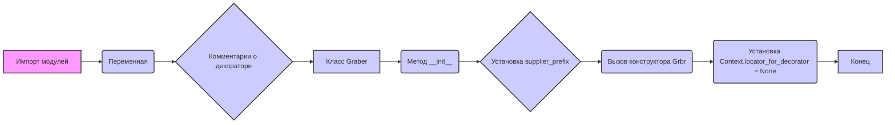

# Анализ кода `hypotez/src/suppliers/wallashop/graber.py`

## <алгоритм>

1.  **Импорт модулей**:
    *   Импортируются необходимые модули и классы для работы: `typing`, `header`, `src.suppliers.graber.Graber` (как `Grbr`), `Context`, `close_pop_up`, `src.webdriver.driver.Driver`, `src.logger.logger.logger`.
2.  **Определение переменной `MODE`**:
    *   Устанавливается переменная `MODE` в значение `'dev'`, что может указывать на режим разработки.
3.  **Комментарии о декораторе (неактивны)**:
    *   Присутствует закомментированный шаблон декоратора `close_pop_up`, предназначенного для закрытия всплывающих окон перед выполнением основных функций. Этот декоратор может быть активирован для выполнения предварительных действий перед запросами к веб-драйверу.
4.  **Объявление класса `Graber`**:
    *   Объявляется класс `Graber`, наследующий от `Grbr`.
    *   Определяется атрибут `supplier_prefix` класса как строка.
5.  **Инициализация `__init__`**:
    *   В методе `__init__` класса `Graber` устанавливается `supplier_prefix` в `'wallashop'`.
    *   Вызывается конструктор родительского класса `Grbr` с передачей `supplier_prefix` и объекта `Driver`.
    *   Объект `Context.locator_for_decorator` устанавливается в `None`.

### Поток данных:

1.  **Инициализация:**
    *   При создании объекта `Graber` в конструктор передается объект `Driver`.
    *   Внутри `__init__` происходит установка `supplier_prefix` и вызов конструктора родительского класса `Grbr`, а так же установка `Context.locator_for_decorator = None`.
2.  **Работа декоратора (закомментирован):**
    *   Если декоратор `close_pop_up` был бы активен (не закомментирован), он мог бы принимать функцию как аргумент, обертывать её, и выполнял бы действия по закрытию всплывающего окна до вызова основной функции. В коде представлен пример такого декоратора (закомментирован).
3. **Функциональность класса `Graber`**:
    *   Класс `Graber` использует методы и атрибуты родительского класса `Grbr` для выполнения задач по сбору данных. В текущем коде, методы родительского класса не переопределяются, а используются "как есть".

## <mermaid>

### Объяснение зависимостей `mermaid`:

*   **`graph LR`**: Указывает, что диаграмма является направленным графом, и поток идет слева направо (Left to Right).
*   **`A[Импорт модулей]`**: Начальный узел, который представляет импорт необходимых модулей.
*   **`B(Переменная )`**: Узел, который показывает установку переменной MODE.
*   **`C{Комментарии о декораторе}`**: Узел, представляющий закомментированный код декоратора.
*   **`D[Класс Graber]`**: Узел, представляющий объявление класса `Graber`.
*   **`E(Метод __init__)`**: Узел, показывающий выполнение метода `__init__` класса `Graber`.
*   **`F{Установка supplier_prefix}`**: Узел, указывающий на установку атрибута `supplier_prefix`.
*   **`G(Вызов конструктора Grbr)`**: Узел, показывающий вызов конструктора родительского класса `Grbr`.
*  **`H(Установка Context.locator_for_decorator = None)`**:  Узел, показывающий установку `Context.locator_for_decorator = None`.
*   **`I[Конец]`**: Конечный узел.

Диаграмма наглядно показывает последовательность операций при инициализации объекта класса `Graber`.

## <объяснение>

### Импорты:

*   **`from typing import Any`**: Импортирует `Any` из модуля `typing` для указания типов переменных, которые могут быть любыми.
*   **`import header`**: Импортирует модуль `header`, который может содержать общие настройки или заголовки для проекта. Взаимосвязь с другими частями проекта не ясна из данного кода.
*   **`from src.suppliers.graber import Graber as Grbr, Context, close_pop_up`**:
    *   Импортирует класс `Graber` из `src.suppliers.graber` и переименовывает его в `Grbr`.
    *   Импортирует класс `Context` для хранения глобальных настроек и контекста приложения.
    *   Импортирует функцию `close_pop_up`, которая предназначена для создания декоратора для закрытия всплывающих окон.
*   **`from src.webdriver.driver import Driver`**: Импортирует класс `Driver` из модуля `src.webdriver.driver`, который управляет веб-драйвером для взаимодействия с браузером.
*   **`from src.logger.logger import logger`**: Импортирует объект `logger` из модуля `src.logger.logger` для логирования событий и ошибок.

### Классы:

*   **`class Graber(Grbr)`**:
    *   Наследует функциональность от класса `Grbr` (родительский класс).
    *   Используется для сбора данных со страниц `wallashop.co.il`.
    *   Атрибут `supplier_prefix`:
        *   Тип: `str`.
        *   Используется для идентификации поставщика ('wallashop' в данном случае).
    *   Метод `__init__`:
        *   Аргументы: `driver` (объект `Driver`).
        *   Устанавливает `self.supplier_prefix` в `'wallashop'`.
        *   Вызывает конструктор родительского класса `Grbr`, передавая ему `supplier_prefix` и `driver`.
        *   Устанавливает `Context.locator_for_decorator = None`.
        *   Роль: инициализация объекта класса `Graber`.

### Функции:

*   **`close_pop_up(value: Any = None) -> Callable`** (закомментирована):
    *   Аргументы: `value` (любой тип, по умолчанию `None`).
    *   Возвращаемое значение: `Callable` (декоратор).
    *   Назначение: создаёт декоратор для закрытия всплывающих окон перед выполнением основной логики функции.
    *   Пример: может быть использован для предварительной обработки перед выполнением основной функции сбора данных, если бы он был активен.

### Переменные:

*   **``**:
    *   Тип: `str`.
    *   Используется для указания режима работы приложения, в данном случае – режим разработки.
*   **`supplier_prefix: str`**:
    *  Тип: `str`.
    *  Атрибут класса `Graber` для хранения префикса поставщика.
*   `Context.locator_for_decorator = None`
    * Тип: `None`
    * Используется для отключения работы декоратора по умолчанию
### Потенциальные ошибки и области для улучшения:

*   **Закомментированный декоратор**: Декоратор `close_pop_up` в настоящее время закомментирован. Если его функционал требуется, нужно раскомментировать и настроить его работу.
*   **Отсутствие конкретных методов**: В текущем виде класс `Graber` не переопределяет никаких методов родительского класса, а лишь вызывает конструктор родителя. Класс будет использовать методы родителя. Это может не соответствовать специфике поставщика wallashop, возможно надо переопределить методы родителя `Grbr`
*   **Неполное использование `Context`**:  `Context.locator_for_decorator` устанавливается в `None`.  При активном декораторе он мог бы использоваться для передачи локаторов.  Необходимо уточнить, как именно `Context` используется в данном проекте.
*   **Обработка ошибок**:  Присутствует обработка `ExecuteLocatorException` в декораторе, но нет общей обработки ошибок в классе `Graber`.
*   **Зависимость от `src`**: Класс имеет сильную зависимость от пакетов `src`,  Необходимо проверить наличие и правильность реализации этих пакетов.
*   **Неясное использование `header`**:  Использование импортируемого модуля `header` не ясно. Надо проверить его использование в других частях проекта.

### Взаимосвязи с другими частями проекта:

*   **`src.suppliers.graber.Graber` (`Grbr`)**: Родительский класс, от которого наследует `Graber`. Определяет общую логику сбора данных для всех поставщиков.
*   **`src.webdriver.driver.Driver`**: Используется для взаимодействия с веб-браузером.
*   **`src.logger.logger.logger`**: Используется для логирования, что помогает в отладке и мониторинге приложения.
*   **`src.Context`**: Используется для хранения глобальных настроек и контекста приложения.

Этот анализ предоставляет подробное описание функциональности кода, его зависимостей, а также потенциальных проблем и областей для улучшения.