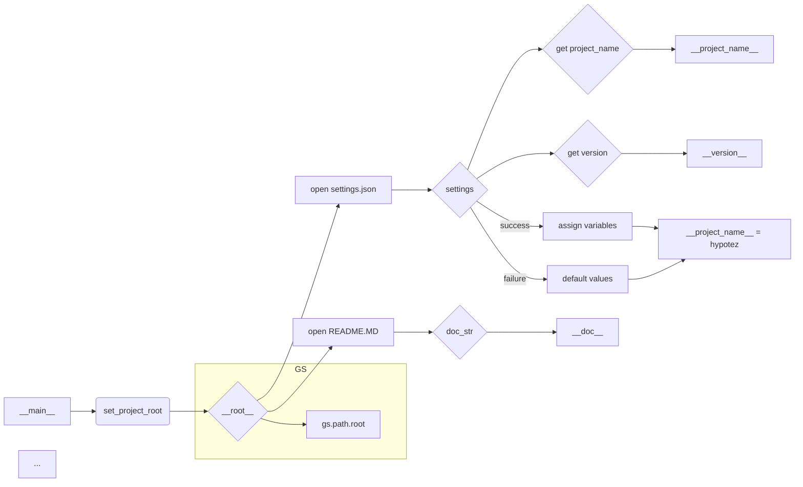

# <input code>

```python
## \file hypotez/src/suppliers/wallashop/header.py
# -*- coding: utf-8 -*-\n#! venv/Scripts/python.exe
#! venv/bin/python/python3.12

"""
.. module: src.suppliers.wallashop 
	:platform: Windows, Unix
	:synopsis:

"""
MODE = 'dev'

import sys
import json
from packaging.version import Version

from pathlib import Path
def set_project_root(marker_files=('pyproject.toml', 'requirements.txt', '.git')) -> Path:
    """
    Finds the root directory of the project starting from the current file's directory,
    searching upwards and stopping at the first directory containing any of the marker files.

    Args:
        marker_files (tuple): Filenames or directory names to identify the project root.
    
    Returns:
        Path: Path to the root directory if found, otherwise the directory where the script is located.
    """
    __root__:Path
    current_path:Path = Path(__file__).resolve().parent
    __root__ = current_path
    for parent in [current_path] + list(current_path.parents):
        if any((parent / marker).exists() for marker in marker_files):
            __root__ = parent
            break
    if __root__ not in sys.path:
        sys.path.insert(0, str(__root__))
    return __root__


# Get the root directory of the project
__root__ = set_project_root()
"""__root__ (Path): Path to the root directory of the project"""

from src import gs

settings:dict = None
try:
    with open(gs.path.root / 'src' / 'settings.json', 'r') as settings_file:
        settings = json.load(settings_file)
except (FileNotFoundError, json.JSONDecodeError):
    ...

doc_str:str = None
try:
    with open(gs.path.root / 'src' / 'README.MD', 'r') as settings_file:
        doc_str = settings_file.read()
except (FileNotFoundError, json.JSONDecodeError):
    ...


__project_name__ = settings.get("project_name", 'hypotez') if settings  else 'hypotez'
__version__: str = settings.get("version", '')  if settings  else ''
__doc__: str = doc_str if doc_str else ''
__details__: str = ''
__author__: str = settings.get("author", '')  if settings  else ''
__copyright__: str = settings.get("copyrihgnt", '')  if settings  else ''
__cofee__: str = settings.get("cofee", "Treat the developer to a cup of coffee for boosting enthusiasm in development: https://boosty.to/hypo69")  if settings  else "Treat the developer to a cup of coffee for boosting enthusiasm in development: https://boosty.to/hypo69"
```

# <algorithm>

**Шаг 1:** Функция `set_project_root` ищет корневую директорию проекта, начиная от текущей директории файла.
    * Входные данные: кортеж `marker_files` с именами файлов/папок, которые должны быть в корне проекта.
    * Выходные данные: путь к корню проекта (`Path`).
    * Пример: `marker_files = ('pyproject.toml', 'requirements.txt')`. Функция поднимается по дереву директорий, пока не найдет директорию содержащую один из файлов из `marker_files`.  Если корень не найден, возвращает путь к текущей директории.


**Шаг 2:**  В главном коде вызывается `set_project_root` для получения пути к корню проекта и сохраняется в `__root__`.


**Шаг 3:**  Импортируются модули `json`, `pathlib`, `sys` и `packaging.version`. Модуль `gs` импортируется из директории `src`.

**Шаг 4:** Программа пытается открыть `settings.json` в корне проекта, если файл найден, данные из него загружаются в переменную `settings`. Если файл не найден или произошла ошибка декодирования, то переменная `settings` остается `None`.

**Шаг 5:**  Происходит аналогичная попытка чтения `README.MD` в корне проекта, загружая его содержимое в переменную `doc_str`.


**Шаг 6:** Из переменной `settings` извлекаются значения атрибутов (`project_name`, `version`, `author`, `copyrihgnt`, `cofee`) или по умолчанию устанавливаются значения.


**Шаг 7:** Значения переменных  `__project_name__`, `__version__`, `__doc__`, `__details__`, `__author__`, `__copyright__`, `__cofee__` заполняются с учетом данных из `settings` или задаются по умолчанию.

# <mermaid>



**Примечание к диаграмме:**

Диаграмма отражает взаимосвязи между функциями и переменными, показывая поток данных и выполнение кода.  `gs.path.root` -  это переменная, доступ к которой осуществляется из импортированного модуля.  Вся логика получения корневой директории `__root__` показана в функции `set_project_root`.

# <explanation>

**Импорты:**

* `sys`: используется для доступа к системным переменным, в частности, для добавления пути к корню проекта в `sys.path`.
* `json`: используется для работы с файлами JSON (чтения и парсинга `settings.json`).
* `packaging.version`:  используется для работы с версиями программного обеспечения, но в текущем коде не применяется напрямую.
* `pathlib`: используется для работы с путями к файлам и директориям, в частности, для работы с `Path`.
* `gs`:  импортируется из `src` (вероятно, содержит вспомогательные функции для работы с путями). Необходима дополнительная информация.


**Классы:**

В коде нет определений классов.  Всё выполняется в глобальной области и в функции `set_project_root`.


**Функции:**

* `set_project_root(marker_files)`: Ищет корневую директорию проекта.
    * `marker_files`: кортеж, содержащий имена файлов/папок, указывающих на корень.
    * Возвращает `Path` к корневой директории или к текущей директории.
    * Пример использования:  `__root__ = set_project_root(('pyproject.toml', 'requirements.txt'))`.


**Переменные:**

* `MODE`, `__root__`, `settings`, `doc_str`:  Общедоступные переменные, хранят различные настройки проекта и данные.


**Возможные ошибки и улучшения:**

* **Обработка ошибок:** Обработка ошибок `FileNotFoundError` и `json.JSONDecodeError` в блоках `try...except` предотвращает аварийный выход программы при отсутствии файлов или некорректном формате JSON. Это хорошо.
* **Проверка на `None`:** Проверка `if settings` перед использованием элементов словаря `settings`  предотвращает ошибки доступа к несуществующим ключам. Это важно.
* **Документация:** Добавление дополнительных комментариев к каждой переменной, описывающей её назначение и тип данных.
* **Логирование:** Для отслеживания прогресса и выявления проблем при отсутствии `settings.json` или `README.MD` добавление логирования улучшило бы чтение ошибок.
* **Модуль `gs`:** Необходимо разобраться с ролью модуля `gs` и его назначением в проекте.  Без понимания модуля `gs` трудно точно сказать, как работает код.  Скорее всего, это вспомогательный модуль, отвечающий за работу с файловой системой, но информация об этом модуле должна быть в проекте.


**Цепочка взаимосвязей:**

Код в `header.py` читает данные из файлов `settings.json` и `README.MD` в корне проекта, поэтому имеет зависимость от этих файлов.  Также, он зависит от модуля `gs`, который используется для поиска корневого каталога.  В свою очередь, эти файлы и модуль могут зависеть от других частей проекта.  Более подробная схема взаимосвязей будет зависеть от структуры всего проекта.