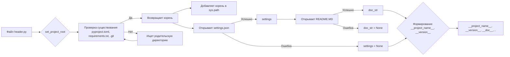

# <input code>

```python
## \file hypotez/src/suppliers/wallashop/header.py
# -*- coding: utf-8 -*-\
#! venv/Scripts/python.exe
#! venv/bin/python/python3.12

"""
.. module:: src.suppliers.wallashop 
	:platform: Windows, Unix
	:synopsis:

"""
MODE = 'dev'

import sys
import json
from packaging.version import Version

from pathlib import Path
def set_project_root(marker_files=('pyproject.toml', 'requirements.txt', '.git')) -> Path:
    """
    Finds the root directory of the project starting from the current file's directory,
    searching upwards and stopping at the first directory containing any of the marker files.

    Args:
        marker_files (tuple): Filenames or directory names to identify the project root.
    
    Returns:
        Path: Path to the root directory if found, otherwise the directory where the script is located.
    """
    __root__:Path
    current_path:Path = Path(__file__).resolve().parent
    __root__ = current_path
    for parent in [current_path] + list(current_path.parents):
        if any((parent / marker).exists() for marker in marker_files):
            __root__ = parent
            break
    if __root__ not in sys.path:
        sys.path.insert(0, str(__root__))
    return __root__


# Get the root directory of the project
__root__ = set_project_root()
"""__root__ (Path): Path to the root directory of the project"""

from src import gs

settings:dict = None
try:
    with open(gs.path.root / 'src' /  'settings.json', 'r') as settings_file:
        settings = json.load(settings_file)
except (FileNotFoundError, json.JSONDecodeError):
    ...

doc_str:str = None
try:
    with open(gs.path.root / 'src' /  'README.MD', 'r') as settings_file:
        doc_str = settings_file.read()
except (FileNotFoundError, json.JSONDecodeError):
    ...


__project_name__ = settings.get("project_name", 'hypotez') if settings  else 'hypotez'
__version__: str = settings.get("version", '')  if settings  else ''
__doc__: str = doc_str if doc_str else ''
__details__: str = ''
__author__: str = settings.get("author", '')  if settings  else ''
__copyright__: str = settings.get("copyrihgnt", '')  if settings  else ''
__cofee__: str = settings.get("cofee", "Treat the developer to a cup of coffee for boosting enthusiasm in development: https://boosty.to/hypo69")  if settings else "Treat the developer to a cup of coffee for boosting enthusiasm in development: https://boosty.to/hypo69"
```

# <algorithm>

**Алгоритм работы:**

1. **Находит корень проекта:**
   - `set_project_root` берет текущий файл, ищет родительские директории, пока не найдёт директорию, содержащую файлы из `marker_files`.
   - Пример: если текущий файл находится в `hypotez/src/suppliers/wallashop`, то функция будет искать `pyproject.toml`, `requirements.txt` и `.git`, и вернет директорию `hypotez`.
   - Если корень не найден, то возвращает текущую директорию.
   - Добавляет путь к корню в `sys.path`.


2. **Читает `settings.json`:**
   - Ищет файл `settings.json` в корне проекта.
   - Использует `json.load` для загрузки настроек.
   - Обрабатывает `FileNotFoundError` и `json.JSONDecodeError` в случае ошибки.


3. **Читает `README.MD`:**
   - Ищет файл `README.MD` в корне проекта.
   - Читает содержимое файла в `doc_str`.
   - Обрабатывает `FileNotFoundError` и `json.JSONDecodeError` в случае ошибки.

4. **Формирует метаданные проекта:**
   - Извлекает значения из `settings` или задаёт значения по умолчанию, если `settings` не найден или ключ отсутствует.
   - Использует `settings.get()` для безопасного извлечения значений (возвращает `default` если ключ не найден).
   - Например, `__project_name__` получает из `settings`, если есть, иначе `hypotez`.

**Пример данных:**

Входные данные: текущий файл в `hypotez/src/suppliers/wallashop/header.py`.
Файл `hypotez/src/settings.json`: `{ "project_name": "MyProject", "version": "1.0.0" }`
Файл `hypotez/src/README.MD`:  `My project README.`


Результат: `__project_name__` = "MyProject", `__version__` = "1.0.0", `__doc__` = "My project README."

# <mermaid>



# <explanation>

**Импорты:**

- `sys`: Модуль для доступа к системным переменным, в данном случае `sys.path`, чтобы добавить корень проекта в пути поиска модулей.
- `json`: Модуль для работы с JSON-данными, используется для загрузки `settings.json`.
- `packaging.version`: Модуль для работы с версиями пакетов, используется, вероятно, для работы с версиями, но в данном примере не применяется.
- `pathlib`: Модуль для работы с путями, позволяет работать с файлами и директориями в удобной форме.
- `src.gs`:  Этот импорт указывает на модуль `gs` внутри пакета `src`. Вероятно, он предоставляет функции и переменные, связанные с путями к файлам проекта (например, `gs.path.root`). Это показывает зависимость от других частей проекта.  Без детального понимания `gs` сложно сказать, что он конкретно делает.


**Классы:**

Нет классов в этом коде.

**Функции:**

- `set_project_root(marker_files)`: Находит корень проекта, начиная от текущего файла.
    - Аргументы: `marker_files` (кортеж строк), содержащие имена файлов, по которым определяется корень проекта.
    - Возвращаемое значение: `Path` к корневой директории или текущей директории, если корень не найден.


**Переменные:**

- `MODE`:  Строковая константа, указывающая режим работы (`dev`).
- `__root__`: Переменная, хранящая путь к корню проекта.
- `settings`, `doc_str`: Словари, хранящие данные из `settings.json` и `README.MD` соответственно.  Используются в загрузке метаданных.
- `__project_name__`, `__version__`, `__doc__`, `__details__`, `__author__`, `__copyright__`, `__cofee__`: Переменные, хранящие метаданные проекта, извлеченные из `settings.json`, если они есть, иначе с дефолтными значениями.


**Возможные ошибки и улучшения:**

- **Обработка ошибок:** Обработка `FileNotFoundError` и `json.JSONDecodeError` является хорошей практикой. Однако, можно рассмотреть более расширенную обработку ошибок (например, логирование или исключения других типов).
- **Проверка `settings`:** Если `settings` оказывается `None`, то get-метод будет использоваться с None, потенциально приведя к ошибке. Можно добавить проверку на `settings` перед использованием.
- **Улучшение поиска корня:** Алгоритм поиска корня может быть сделан более гибким, позволяя указывать различные файлы-маркеры.
- **Дополнить логирование:** Логирование ошибок и информационных сообщений улучшит отладку и понимание процесса работы скрипта.


**Взаимосвязи с другими частями проекта:**

- Явная зависимость от `src.gs` для определения путей к файлам проекта. Это показывает взаимосвязь между этим файлом и другими модулями в `src`.
- Файл `settings.json` и `README.MD` содержат конфигурацию и документацию проекта, влияющие на работу других файлов.
- Этот файл, вероятно, используется другими файлами в папке `suppliers` (например, `wallashop`) и другими папками (модулями).

Этот код выполняет важную роль в инициализации проекта, предоставляя необходимые метаданные и переменные для последующего использования в коде приложения.