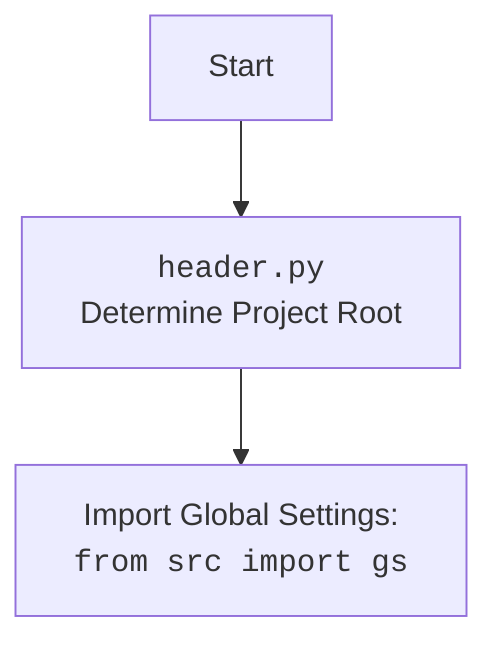

## ИНСТРУКЦИЯ:

Анализируй предоставленный код подробно и объясни его функциональность. Ответ должен включать три раздела:  

1. **<алгоритм>**: Опиши рабочий процесс в виде пошаговой блок-схемы, включая примеры для каждого логического блока, и проиллюстрируй поток данных между функциями, классами или методами.  
2. **<mermaid>**: Напиши код для диаграммы в формате `mermaid`, проанализируй и объясни все зависимости, 
    которые импортируются при создании диаграммы. 
    **ВАЖНО!** Убедитесь, что все имена переменных, используемые в диаграмме `mermaid`, 
    имеют осмысленные и описательные имена. Имена переменных вроде `A`, `B`, `C`, и т.д., не допускаются!  
    
    **Дополнительно**: Если в коде есть импорт `import header`, добавьте блок `mermaid` flowchart, объясняющий `header.py`:\
    ```mermaid\
    flowchart TD\
        Start --> Header[<code>header.py</code><br> Determine Project Root]\
    
        Header --> import[Import Global Settings: <br><code>from src import gs</code>] \
    ```

3. **<объяснение>**: Предоставьте подробные объяснения:  
   - **Импорты**: Их назначение и взаимосвязь с другими пакетами `src.`.  
   - **Классы**: Их роль, атрибуты, методы и взаимодействие с другими компонентами проекта.  
   - **Функции**: Их аргументы, возвращаемые значения, назначение и примеры.  
   - **Переменные**: Их типы и использование.  
   - Выделите потенциальные ошибки или области для улучшения.  

Дополнительно, постройте цепочку взаимосвязей с другими частями проекта (если применимо).  

Это обеспечивает всесторонний и структурированный анализ кода.
## Формат ответа: `.md` (markdown)
**КОНЕЦ ИНСТРУКЦИИ**
## <алгоритм>
1. **Начало**:
    - Запускается скрипт `header.py`.
2. **Определение корневой директории проекта (`set_project_root`):**
    -   Начинается поиск корневой директории проекта вверх по дереву каталогов от текущего файла.
    -   Используются `marker_files` (по умолчанию `__root__` и `.git`) для определения корневой директории.
    -   Пример:
        -   Если скрипт находится в `/home/user/project/src/suppliers/wallashop`, то поиск начинается с этой директории.
        -   Сначала проверяется наличие `__root__` или `.git` в `/home/user/project/src/suppliers/wallashop`.
        -   Если не найдено, поиск идет в `/home/user/project/src/suppliers`.
        -   Если опять не найдено, поиск идет в `/home/user/project/src`.
        -   Если опять не найдено, поиск идет в `/home/user/project`.
        -   Допустим, `.git` найден в `/home/user/project`.
        -   Корневой директорией проекта становится `/home/user/project`.
    -   Если корень проекта не найден, то корневым каталогом становится директория, в которой находится скрипт.
    -   Абсолютный путь к корневой директории добавляется в `sys.path`.
    -   Возвращается `Path` к корневой директории.
3. **Инициализация `__root__`**:
    -   Переменная `__root__` получает значение, возвращённое функцией `set_project_root`.
4. **Импорт глобальных настроек (`gs`)**:
    -   Из пакета `src` импортируется модуль `gs`, который, предположительно, содержит глобальные переменные и настройки.
    -   Пример:
        - `from src import gs` импортирует модуль `gs`, доступ к переменным будет, например, `gs.path.root`.
5. **Чтение файла настроек (`settings.json`)**:
    -   Пытаемся открыть `settings.json`, расположенный в `<root>/src/settings.json`.
    -   Если файл найден, он загружается с помощью `json.load` в словарь `settings`.
    -   Если файл не найден или возникают проблемы при чтении JSON, то переменная `settings` остаётся `None`.
6. **Чтение файла документации (`README.MD`)**:
     -   Пытаемся открыть `README.MD`, расположенный в `<root>/src/README.MD`.
     -   Если файл найден, то его содержимое считывается в строку `doc_str`.
     -   Если файл не найден или возникают проблемы при чтении, то переменная `doc_str` остаётся `None`.
7. **Инициализация глобальных переменных**:
    -   Глобальные переменные `__project_name__`, `__version__`, `__doc__`, `__details__`, `__author__`, `__copyright__`, `__cofee__`  инициализируются:
       -   Если `settings` загружены, то извлекаются значения из словаря `settings` или используются значения по умолчанию.
       -   Если `settings` не загружены, используются значения по умолчанию.
       -   `__doc__` устанавливается в значение переменной `doc_str` если она не `None` или устанавливается в пустую строку.
        -    `__cofee__` устанавливается в значение переменной `settings.get("cofee", "...")` если она не `None` или устанавливается в значение по умолчанию.
8. **Конец**.

## <mermaid>
```mermaid
flowchart TD
    Start --> FindProjectRoot[Find Project Root using marker files: <br><code>set_project_root()</code>]
    FindProjectRoot --> SetRootPath[Set <code>__root__</code>: <br>Project Root Path]
    SetRootPath --> AddToSysPath[Add Project Root to <code>sys.path</code>]
    AddToSysPath --> ImportGlobalSettings[Import Global Settings: <br><code>from src import gs</code>]
    ImportGlobalSettings --> LoadSettingsJson[Load <code>settings.json</code>]
    LoadSettingsJson --> LoadReadmeMd[Load <code>README.MD</code>]
    LoadReadmeMd --> InitializeGlobalVars[Initialize Global Variables <br> (<code>__project_name__</code>, <code>__version__</code>, etc.)]
    InitializeGlobalVars --> End
    
    classDef code fill:#f9f,stroke:#333,stroke-width:2px
    
    FindProjectRoot:::code
    SetRootPath:::code
    AddToSysPath:::code
    ImportGlobalSettings:::code
    LoadSettingsJson:::code
    LoadReadmeMd:::code
    InitializeGlobalVars:::code
```


## <объяснение>
**Импорты:**
- `import sys`:
  -   Используется для модификации `sys.path`, что позволяет импортировать модули из корневой директории проекта.
- `import json`:
   -  Используется для загрузки данных из файла `settings.json` в формате JSON.
- `from packaging.version import Version`:
   - Импортируется класс `Version` из библиотеки `packaging`.  Не используется в коде, но может потребоваться в дальнейшем для версионирования проекта.
- `from pathlib import Path`:
   - Используется для работы с путями к файлам и директориям в операционной системе в объектно-ориентированном стиле.
- `from src import gs`:
  -   Импортирует модуль `gs` из пакета `src`. Этот модуль, вероятно, содержит глобальные настройки и пути к файлам проекта. `gs` используется для доступа к корневому каталогу (`gs.path.root`).

**Функции:**
- `set_project_root(marker_files=('__root__', '.git')) -> Path`:
  -   **Назначение**: Определяет корневую директорию проекта.
  -   **Аргументы**:
        - `marker_files` (tuple): Кортеж имен файлов или директорий, которые служат индикаторами корневой директории проекта (по умолчанию `('__root__', '.git')`).
  -   **Возвращаемое значение**: `Path` -  объект, представляющий путь к корневой директории проекта, или путь директории где находится скрипт если не найден ни один маркерный файл.
  -  **Пример**:
       -  Если скрипт находится в `/home/user/project/src/suppliers/wallashop` и в `/home/user/project` есть директория `.git`, то функция вернет `Path('/home/user/project')`.
       - Если в `/home/user/project` нет директории `.git`, но есть файл `__root__` то функция вернет `Path('/home/user/project')`.
       - Если в `/home/user/project` нет ни `__root__`, ни `.git`, то функция вернет `Path('/home/user/project/src/suppliers/wallashop')`.
       -  Если `marker_files`  передан как `marker_files=('project.ini',)` и файл `project.ini` находится в `/home/user/project`, то функция вернет `Path('/home/user/project')`.
       -  Если `marker_files`  передан как `marker_files=('project.ini',)` и файл `project.ini`  не найден, то функция вернет `Path('/home/user/project/src/suppliers/wallashop')`.
   - **Логика:**
     - Получает текущий путь к файлу скрипта.
     - Итерирует по родительским каталогам текущего файла.
     - Проверяет наличие одного из `marker_files` в текущем родительском каталоге.
     - Если маркерный файл найден, то текущий родительский каталог становится корневым.
     - Добавляет путь к корневой директории в `sys.path`.
     - Возвращает путь к корневой директории.

**Переменные:**
- `__root__` (`Path`):  Переменная, хранящая путь к корневой директории проекта, устанавливается с помощью функции `set_project_root`.
- `settings` (`dict` или `None`): Словарь с настройками проекта, загружаемый из файла `settings.json`. Если файл не найден или возникают ошибки при чтении, значение `None`.
- `doc_str` (`str` или `None`): Строка, содержащая документацию, загруженную из файла `README.MD`. Если файл не найден или возникают ошибки при чтении, значение `None`.
- `__project_name__` (`str`):  Название проекта, извлекается из файла настроек `settings.json`. По умолчанию `hypotez`.
- `__version__` (`str`): Версия проекта, извлекается из файла настроек `settings.json`. По умолчанию `''`.
- `__doc__` (`str`):  Документация проекта, извлекается из файла `README.MD`.  По умолчанию `''`.
- `__details__` (`str`): Детали проекта, в коде  имеет значение `''`.
- `__author__` (`str`): Автор проекта, извлекается из файла настроек `settings.json`. По умолчанию `''`.
- `__copyright__` (`str`):  Информация об авторских правах, извлекается из файла настроек `settings.json`. По умолчанию `''`.
- `__cofee__` (`str`):  Строка с предложением "угостить" разработчика,  извлекается из файла настроек `settings.json`.  По умолчанию `"Treat the developer to a cup of coffee for boosting enthusiasm in development: https://boosty.to/hypo69"`.

**Потенциальные ошибки и области для улучшения:**

- **Обработка ошибок:** Код использует `try-except` блоки для обработки `FileNotFoundError` и `json.JSONDecodeError` при чтении `settings.json` и `README.MD`. Однако, в блоке `except` просто ставится `...`,  что является "заглушкой".  Можно добавить логирование ошибок или уведомление о том, что файл не найден или имеет неправильный формат.
- **Жестко заданные пути:**  Пути к файлам `settings.json` и `README.MD` жестко заданы. Можно использовать переменные или константы для их определения, чтобы сделать код более гибким.  Необходимость использовать константу `src` может быть нежелательной, если предполагается что проект может иметь более сложную структуру.
- **Ошибки в именах переменных**: В коде встречается опечатка в имени переменной `copyrihgnt`. Правильное написание `copyright`.
- **Зависимость от `gs`:** Код сильно зависит от модуля `gs`, который не описан в коде. Важно понимать структуру и назначение `gs`, чтобы полностью понять работу скрипта.
- **Отсутствие явного определения типа для `__root__`**: В коде есть явное определение типа `__root__:Path` только внутри функции `set_project_root`, но за пределами функции  нет явного определения типа  `__root__`, хотя и понятно, что `__root__` является `Path`.

**Взаимосвязи с другими частями проекта:**

- **Модуль `gs`**:  `header.py` зависит от модуля `gs` для получения пути к корневой директории проекта, что указывает на то, что `gs` является важной частью инфраструктуры проекта.
- **Файлы `settings.json` и `README.MD`**: Этот файл зависит от наличия `settings.json` и `README.MD` в корневой директории проекта. Эти файлы используются для получения настроек и документации проекта.
- **Использование `sys.path`**:  Изменение `sys.path` позволяет другим частям проекта импортировать модули из корневой директории, что делает этот скрипт центральным для настройки окружения проекта.
- **Глобальные переменные**: Переменные `__project_name__`, `__version__`, `__doc__`, и др., определенные в `header.py`, могут использоваться в других частях проекта для получения основной информации о проекте.

**Общая функциональность:**
Скрипт `header.py` является важным компонентом проекта, поскольку он определяет корневую директорию, загружает настройки и документацию, а также устанавливает переменные, используемые в других частях проекта. Он выполняет роль центрального файла, определяющего окружение проекта.