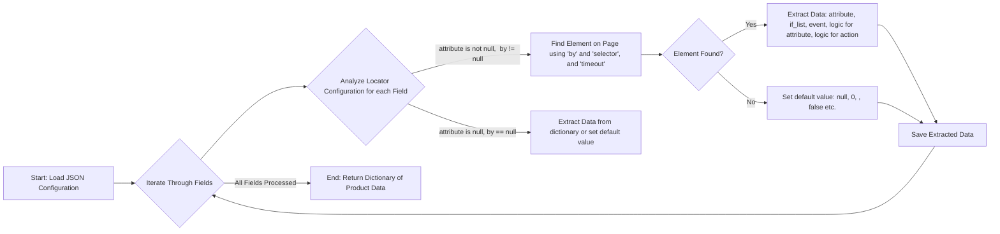

## ИНСТРУКЦИЯ:

Анализируй предоставленный код подробно и объясни его функциональность. Ответ должен включать три раздела:

1.  **<алгоритм>**: Опиши рабочий процесс в виде пошаговой блок-схемы, включая примеры для каждого логического блока, и проиллюстрируй поток данных между функциями, классами или методами.
2.  **<mermaid>**: Напиши код для диаграммы в формате `mermaid`, проанализируй и объясни все зависимости,
    которые импортируются при создании диаграммы.
    **ВАЖНО!** Убедитесь, что все имена переменных, используемые в диаграмме `mermaid`,
    имеют осмысленные и описательные имена. Имена переменных вроде `A`, `B`, `C`, и т.д., не допускаются!

    **Дополнительно**: Если в коде есть импорт `import header`, добавьте блок `mermaid` flowchart, объясняющий `header.py`:
    ```mermaid
    flowchart TD
        Start --> Header[<code>header.py</code><br> Determine Project Root]

        Header --> import[Import Global Settings: <br><code>from src import gs</code>]
    ```

3.  **<объяснение>**: Предоставьте подробные объяснения:
    -   **Импорты**: Их назначение и взаимосвязь с другими пакетами `src.`.
    -   **Классы**: Их роль, атрибуты, методы и взаимодействие с другими компонентами проекта.
    -   **Функции**: Их аргументы, возвращаемые значения, назначение и примеры.
    -   **Переменные**: Их типы и использование.
    -   Выделите потенциальные ошибки или области для улучшения.

Дополнительно, постройте цепочку взаимосвязей с другими частями проекта (если применимо).

Это обеспечивает всесторонний и структурированный анализ кода.
## Формат ответа: `.md` (markdown)
**КОНЕЦ ИНСТРУКЦИИ**

## <алгоритм>

Представленный JSON-файл представляет собой конфигурацию локаторов для извлечения данных о товаре с веб-страницы, вероятно, с целью последующего импорта в систему управления товарами.  По сути, это набор правил, определяющих, как найти и извлечь конкретные данные о товаре, такие как его ID, название, цену, характеристики и т.д. Каждый ключ в JSON-объекте (например, `id`, `name`, `price`) представляет собой поле данных о товаре, а соответствующее значение — это объект, описывающий, как это поле найти.

**Пошаговая блок-схема:**

1.  **Начало:** Загрузка JSON-файла конфигурации локаторов.
2.  **Итерация по полям:** Проход по каждому ключу (названию поля) в JSON-объекте.
3.  **Анализ локатора для поля:**
    *   **attribute**: Определяет, какой атрибут элемента HTML нужно извлечь (например, `innerText`, `value`, `innerHTML`).
    *   **by**: Указывает метод поиска элемента на странице (`XPATH`, `VALUE`, `null` - если нужно взять значение из словаря или не нужно искать элемент).
    *   **selector**:  Строка, представляющая селектор для поиска элемента (XPath-выражение, значение или null).
    *   **if_list**: Определяет, какое значение нужно взять из найденного списка элементов ("first" - первое, "all" - все).
    *   **use_mouse**: Флаг, указывающий, нужно ли использовать мышь (обычно `false`).
    *   **mandatory**:  Флаг, указывающий, является ли это поле обязательным (обычно `true`).
    *   **timeout**: Время ожидания поиска элемента (обычно `0`).
    *   **timeout_for_event**: Тип ожидания (`presence_of_element_located`).
    *   **event**: Событие, которое нужно выполнить после поиска элемента, например, `screenshot()`, `wait(click(),2,after)`.
    *   **logic for action[AND|OR|XOR|VALUE|null]**: Логика для выполнения действия (если нужно).
    *   **logic for attribue[AND|OR|XOR|VALUE|null]**: Логика для выбора атрибута (если нужно).
    *   **locator_description**: Описание локатора.

4.  **Извлечение данных:**
    *   Если `by` не `null`, то на основе `by`, `selector` и `timeout` происходит поиск элемента на странице.
    *   Если элемент найден, извлекается его атрибут, заданный в `attribute`, или значение элемента.
    *   Если `if_list` = `first`, то извлекается первый элемент из списка, если `all` - все элементы.
    *   Если `by` = `null`, тогда используется значение из словаря, если оно есть.
    *   Если `event` не `null` то вызывается соответствующая функция.
    *   Если `logic for action` или `logic for attribue` не null, то применяется соответствующая логика.
5.  **Сохранение результата:** Извлеченные данные сохраняются в словарь или другое подходящее хранилище.
6.  **Повторение:** Переход к следующему полю товара.
7.  **Конец:** После обработки всех полей, возвращается словарь с данными о товаре.

**Примеры:**

*   **`id`**:
    *   `attribute`: `null` (значение берется из словаря).
    *   `by`: `null` (поиск элемента не требуется).
    *   `selector`: `null`
    *   Извлекается значение из словаря.

*   **`id_supplier`**:
    *   `attribute`: `2777` (значение берется из словаря).
    *   `by`: `VALUE` (значение берется из словаря).
    *   `selector`: `null`
    *   Извлекается значение `2777` из словаря.

*   **`Name*`**:
    *   `attribute`: `innerText` (извлекается текст элемента).
    *   `by`: `XPATH` (поиск элемента по XPath).
    *   `selector`: `//span[@id='productTitle']` (XPath-выражение для поиска элемента).
    *   Находится элемент по XPath, извлекается текст элемента.

*   **`Price tax excluded`**:
    *   `attribute`: `innerText` (извлекается текст элемента).
    *   `by`: `XPATH` (поиск элемента по XPath).
    *   `selector`: `//div[contains(@id,'corePrice')]//span[@class ='a-price-whole'][1]` (XPath-выражение для поиска элемента).
    *   Находится элемент по XPath, извлекается текст элемента.

*   **`Screenshot`**:
    *   `attribute`: `null`
    *   `by`: `XPATH`
    *   `selector`: `//img[@id='landingImage']|//img[@class='a-dynamic-image']`
    *   `event`: `screenshot()`
    *   Находится элемент по XPath и делается скриншот.

*   **`affiliate short link`**:
    *   `attribute`: `[null, "value"]` (сначала не используется атрибут, затем берется значение).
    *   `by`: `["XPATH", "XPATH"]`
    *    `selector`: `["//li[contains(@id,'amzn-ss-text-link')]", "//textarea[contains(@id,'amzn-ss-text-shortlink-textarea')]"]`
    *   `event`: `["wait(click(),2,after)", null]`
    *   `logic for action`: `[null, null]`
    *   Происходит поиск элементов по очереди, на первом элементе выполняется `wait(click(),2,after)` а на втором ничего не выполняется. Берется `value` второго найденного элемента.

## <mermaid>



**Объяснение `mermaid` диаграммы:**

*   `Start: Load JSON Configuration`: Начало процесса. Загружается JSON-файл, содержащий конфигурацию локаторов.
*   `Iterate Through Fields`:  Цикл, который перебирает каждое поле (ключ) в JSON-конфигурации.
*   `Analyze Locator Configuration for each Field`: Для каждого поля анализируется его конфигурация локатора (атрибут, метод поиска `by`, селектор `selector`, и т.д.).
*    `Find Element on Page using 'by' and 'selector', and 'timeout'`: Если `attribute`  не null и `by` не null, то производится поиск HTML элемента на странице, используя указанный метод и селектор, и происходит ожидание `timeout`.
*    `Element Found?`: Проверяет, был ли найден элемент на странице.
*    `Extract Data: attribute, if_list, event, logic for attribute, logic for action`: Если элемент найден, то извлекается его значение атрибута, текст и т.д.
*   `Set default value: null, 0, "", false etc.`: Если элемент не найден, то задается значение по умолчанию.
*    `Extract Data from dictionary or set default value`: Если `attribute` null и `by` null, то извлекается значение из словаря если оно есть, иначе устанавливается значение по умолчанию.
*   `Save Extracted Data`:  Извлеченные данные сохраняются в словарь.
*   `End: Return Dictionary of Product Data`:  После обработки всех полей возвращается словарь с данными о продукте.

## <объяснение>

**Общее назначение:**

JSON-файл представляет собой конфигурационный файл, который описывает структуру и правила извлечения данных о товарах с веб-страницы. Он используется в автоматизированном процессе сбора данных (веб-скрапинге).

**Структура файла:**

Файл представляет собой JSON-объект, где каждый ключ является идентификатором поля товара (например, "id", "name", "price"), а значение — это объект, содержащий инструкции по извлечению значения данного поля.

**Основные параметры конфигурации для каждого поля (локатора):**

*   **`attribute`**: Определяет, какой атрибут HTML-элемента нужно извлечь. Например:
    *   `innerText`: Текстовое содержимое элемента.
    *   `innerHTML`: HTML-содержимое элемента.
    *   `value`: Значение атрибута value (например, для полей ввода).
    *   `null`: Значение берется из словаря или устанавливается значение по умолчанию.
*   **`by`**: Указывает, какой метод поиска элемента будет использоваться:
    *   `XPATH`: Использование XPath-выражения для поиска элемента.
    *   `VALUE`: Значение берется из словаря.
    *   `null`: Значение берется из словаря или устанавливается значение по умолчанию.
*   **`selector`**: Строка, представляющая селектор для поиска элемента.  Для `XPATH` это XPath-выражение, для `VALUE` null.
*   **`if_list`**: Указывает, как обрабатывать список найденных элементов:
    *   `first`: Извлекает значение первого элемента из списка.
    *   `all`: Извлекает значения всех элементов из списка.
*   **`use_mouse`**: Обычно false, указывает, нужно ли использовать мышь для взаимодействия с элементом (например, клик).
*   **`mandatory`**:  Указывает, является ли извлечение данного поля обязательным.
*   **`timeout`**: Время ожидания (в секундах) при поиске элемента на странице.
*   **`timeout_for_event`**: Событие, которое нужно ожидать перед извлечением данных (например, появление элемента на странице).
*   **`event`**: Событие, которое нужно выполнить после нахождения элемента (например, `screenshot()`  - сделать скриншот, `wait(click(),2,after)` - подождать клик и тд)
*   **`logic for action[AND|OR|XOR|VALUE|null]`**: Логика для выполнения действия.
*   **`logic for attribue[AND|OR|XOR|VALUE|null]`**: Логика для выбора атрибута.
*    **`locator_description`**: Описание локатора.

**Примеры полей и их значений:**

*   **`id`**: Поле ID товара, значение берется из словаря.
*   **`id_supplier`**: Поле ID поставщика, значение берется из словаря.
*   **`id_category_default`**:  Поле ID категории товара по умолчанию, значение берется из словаря.
*   **`Name*`**: Название товара. Поиск элемента по XPath, извлекается текстовое содержимое.
*    **`Price tax excluded`**: Цена товара без налога. Поиск элемента по XPath, извлекается текстовое содержимое.
*   **`Screenshot`**: Скриншот товара, выполняется по xpath и вызывается событие `screenshot()`.
*    **`affiliate short link`**:  Поиск короткой ссылки по xpath с последовательным вызовом событий.
*   **`Description`**: Полное описание товара, поиск по xpath, извлекается текстовое содержимое элемента.
*   **`Specification`**: Технические характеристики товара, поиск по xpath.

**Потенциальные ошибки и области для улучшения:**

*   **Зависимость от структуры HTML:** Локаторы, использующие XPath, очень чувствительны к изменениям в структуре HTML-страницы. Если верстка сайта изменится, локаторы могут перестать работать.
*   **Отсутствие обработки ошибок:** В файле не предусмотрено явной обработки ошибок, например, если элемент не найден.  Это может привести к сбою всего процесса.
*   **Необходимость валидации данных:** После извлечения данных желательно проверять их корректность и соответствие ожидаемым форматам.
*   **Разная структура для одного и того же поля:** Иногда одно и тоже поле может находится по разным селекторам, это нужно будет обрабатывать с помощью дополнительных проверок.
*   **Не все поля заполнены `attribute` и `by`:** Часть полей помечена как `attribute = null, by = null`. Это означает, что значения данных полей нужно брать из словаря, это может привести к ошибкам, если значения в словаре не будет.

**Взаимосвязь с другими частями проекта:**

Этот JSON-файл является частью модуля для работы с поставщиком "wallashop". Этот файл используется в процессе импорта товаров для извлечения данных с веб-страниц поставщика.
Данные, полученные с помощью этого файла, могут быть использованы в других частях проекта, таких как:
*   Заполнение базы данных товаров.
*   Формирование XML/CSV файлов для импорта.
*   Синхронизация данных с другими системами.

**Заключение:**

Представленный JSON-файл представляет собой важную часть системы сбора и обработки данных о товарах. Он позволяет гибко настраивать процесс извлечения данных с веб-страниц, но требует внимательного подхода к настройке локаторов и обработке ошибок. Понимание его структуры и назначения является ключевым для работы с этой системой.