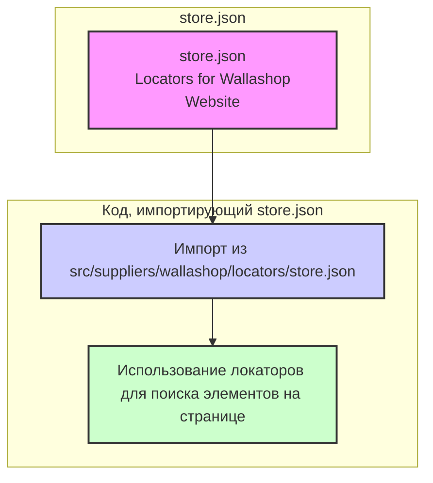

## АНАЛИЗ КОДА: `hypotez/src/suppliers/wallashop/locators/store.json`

### 1. <алгоритм>

**Описание:**

Файл `store.json` представляет собой JSON-файл, который содержит структуру данных, описывающую локаторы элементов веб-страницы для магазина Wallashop. Он состоит из одного основного объекта, содержащего локаторы для различных элементов, таких как:
- Поиск товаров
- Категории товаров
- Карточка товара
- Корзина
- Страница оформления заказа
- Меню пользователя
- Сообщения
- Уведомления
- Модальные окна
- Страницы категорий товаров

**Пример:**

```json
{
  "search": {
    "input": "//input[@placeholder='Поиск товаров']",
    "button": "//button[@type='submit']"
  },
    "categories": {
    "menu": "//ul[@role='menu']",
        "item": "//ul[@role='menu']/li",
         "item_link": "//ul[@role='menu']/li/a"
  },
  "product_card": {
        "add_to_cart_button": "//button[contains(text(), 'В корзину')]",
        "price": "//span[@class='price']"
    },
   "cart": {
        "checkout_button": "//a[contains(text(), 'Оформить заказ')]"
    },
    "checkout":{
         "place_order_button": "//button[contains(text(), 'Оформить заказ')]"
   },
    "user_menu": {
        "profile_link": "//a[contains(text(), 'Профиль')]"
   },
   "messages": {
     "success": "//div[@class='success-message']",
     "error": "//div[@class='error-message']"
   },
  "notifications": {
    "notification": "//div[@class='notification']",
    "close_button": "//button[@aria-label='Закрыть уведомление']"
  },
   "modal": {
       "modal_window": "//div[@role='dialog']",
        "close_button": "//button[@aria-label='Закрыть']"
   },
   "category_page": {
       "product_item": "//div[@class='product-item']",
       "product_link": "//div[@class='product-item']/a"
    }
}
```

**Поток данных:**
Файл `store.json` используется как источник данных для локаторов. При выполнении тестов или взаимодействии с веб-сайтом Wallashop, код, импортирующий данные из `store.json`, будет использовать эти локаторы для поиска элементов на странице.

### 2. <mermaid>



**Объяснение `mermaid`:**

Диаграмма `mermaid` показывает поток данных, начинающийся с файла `store.json`, который содержит локаторы веб-элементов.
- `A` представляет файл `store.json`
- `B` представляет импорт файла `store.json` кодом в проекте.
- `C` представляет использование импортированных локаторов для поиска элементов на веб-странице.

### 3. <объяснение>

**Импорты:**

В данном случае нет импортов, так как `store.json` – это файл данных, а не модуль Python. Данный файл не зависит от других пакетов `src.` и используется непосредственно, как источник данных.

**Классы:**

В файле нет классов. Файл представляет собой JSON-объект.

**Функции:**

В файле нет функций.

**Переменные:**

- Файл `store.json` содержит один основной объект, представленный в виде JSON.
- Объект состоит из различных полей, которые соответствуют группам элементов (например, `search`, `categories`, `product_card`, `cart` и т.д.).
- Каждое поле содержит набор локаторов, определенных как XPath-выражения, в виде строк.
- XPath выражения предназначены для точного определения местоположения элементов в DOM веб-страницы.

**Объяснение:**

Файл `store.json` играет ключевую роль в автоматизации тестирования и взаимодействия с веб-сайтом Wallashop. Вместо того, чтобы жестко прописывать локаторы в коде, они хранятся в отдельном файле данных. Это позволяет:

-   **Упростить поддержку:** При изменении верстки сайта достаточно обновить локаторы в `store.json`, не меняя основной код.
-   **Повысить читаемость:** Код, использующий локаторы, становится более чистым и понятным, так как не содержит длинных XPath-выражений.
-   **Упростить повторное использование:** Локаторы можно использовать в различных тестах и частях приложения.

**Цепочка взаимосвязей с другими частями проекта:**

Файл `store.json` используется в тестах, которые тестируют функциональность веб-сайта Wallashop. Тесты используют данные из `store.json` для поиска элементов на странице, выполнения действий и проверки результатов. Таким образом, `store.json` является источником данных, который связывает тесты с веб-сайтом Wallashop.

**Потенциальные ошибки и области для улучшения:**

1.  **Сложные XPath:**  Некоторые XPath-запросы могут быть слишком сложными и хрупкими, что может привести к сбоям тестов при незначительных изменениях верстки.
2.  **Отсутствие уникальности:** Локаторы не всегда могут быть уникальными. Желательно, чтобы каждый локатор указывал на единственный элемент на странице.
3.  **Неоднозначность:** Использование общих атрибутов, например `class` (если селектор не уникален), может привести к проблемам. Следует стараться использовать более специфичные селекторы.
4.  **Отсутствие явных атрибутов**: Желательно для некоторых элементов применять селекторы, которые основаны на атрибутах, которые специально предназначены для тестирования (например, `data-test-id`).

**В заключении:**
Файл `store.json` предоставляет удобный и структурированный способ хранения локаторов элементов веб-страницы, что упрощает автоматизацию тестирования и взаимодействия с веб-сайтом Wallashop, обеспечивает гибкость, поддерживаемость и читаемость кода. Однако, при составлении локаторов необходимо обращать внимание на их уникальность и стабильность.