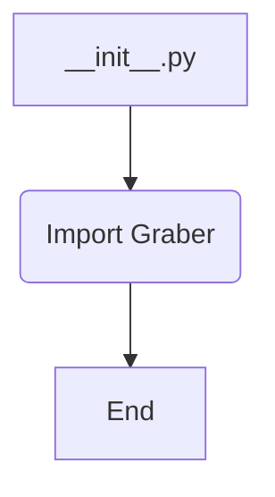
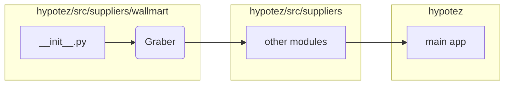

# <input code>

```python
## \file hypotez/src/suppliers/wallmart/__init__.py
# -*- coding: utf-8 -*-
#! venv/Scripts/python.exe
#! venv/bin/python/python3.12

"""
.. module: src.suppliers.wallmart 
	:platform: Windows, Unix
	:synopsis:

"""


from .graber import Graber
```

# <algorithm>

Этот код является файлом инициализации для модуля `wallmart` внутри пакета `suppliers` проекта `hypotez`.  Он импортирует класс `Graber` из модуля `graber.py` в той же директории.  Алгоритм работы сводится к одной операции: импорту.  В данном случае это импорт класса.  Нет циклов, условий или вызовов других функций.

**Блок-схема:**



**Пример:**

Этот код не выполняет никакой работы самостоятельно. Он просто делает импорт, что позволяет другим частям проекта использовать класс `Graber` из модуля `graber.py`.

# <mermaid>



# <explanation>

**Импорты:**

- `from .graber import Graber`: Этот импорт необходим для использования класса `Graber` в других модулях внутри пакета `wallmart`. `.` указывает на то, что модуль `graber` находится в текущей директории.  Таким образом, `wallmart/__init__.py` импортирует `graber.py` из своего же подкаталога.

**Классы:**

- `Graber`:  Этот класс, который импортируется, определен в файле `graber.py`.  Без содержимого `graber.py` мы не знаем его функциональности.  Предполагается, что `Graber` отвечает за получение данных (scraping) с сайта Walmart.

**Функции:**

В файле `__init__.py` нет определенных функций.  Функциональность реализована в `graber.py`, содержащем класс `Graber`.

**Переменные:**

Нет переменных в `__init__.py`.


**Возможные ошибки или области для улучшений:**

- **Документация:** Недостаточно документации в коде.  Необходимо более подробное описание, что делает `Graber` и какие параметры он принимает.
- **Обработка ошибок:**  `graber.py` должен обрабатывать возможные ошибки при сборе данных (например, проблемы с подключением к сайту, некорректные данные).
- **Тестирование:**  Необходимо тестировать `Graber` для проверки корректности его работы и обработки различных ситуаций.


**Цепочка взаимосвязей:**

1. Модуль `wallmart.__init__.py` импортирует класс `Graber`.
2. Класс `Graber` (находится в `graber.py`) используется другими модулями в пакете `suppliers` или в `hypotez` для доступа к данным Walmart.
3. Другие модули проекта `hypotez` могут использовать полученные данные из `Graber` для дальнейшей обработки или отображения.


В целом, код выполняет свою задачу - импорт необходимых компонентов.  Для полноценного анализа необходимо посмотреть на код `graber.py`.