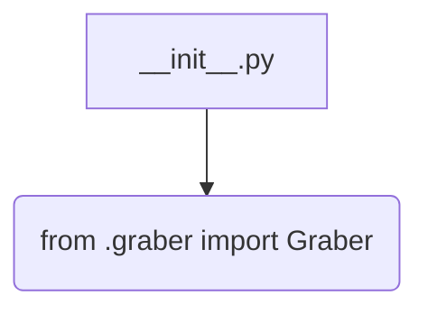
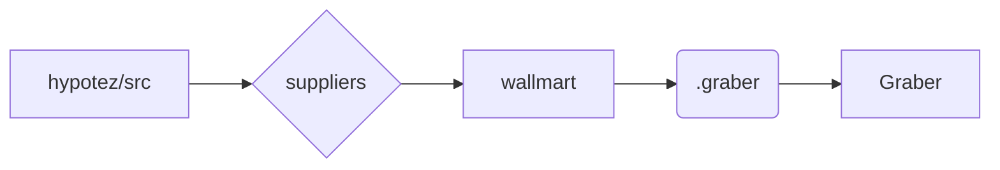

```MD
# <input code>

```python
## \file hypotez/src/suppliers/wallmart/__init__.py
# -*- coding: utf-8 -*-
#! venv/Scripts/python.exe
#! venv/bin/python/python3.12

"""
.. module: src.suppliers.wallmart 
	:platform: Windows, Unix
	:synopsis:

"""


from .graber import Graber
```

# <algorithm>

Этот код представляет собой инициализационный модуль для пакета `wallmart` в рамках проекта `hypotez`. Он содержит единственный импорт, который подключает класс `Graber` из подмодуля `graber`.

Блок-схема:



Пример:

В этом примере данные не передаются между функциями или классами, так как в файле `__init__.py` просто выполняется импорт.  При последующем использовании модуля `wallmart` в других частях проекта, `Graber` будет доступен.


# <mermaid>



Описание диаграммы:

Диаграмма иллюстрирует иерархию импорта. Модуль `hypotez/src` содержит папку `suppliers`, которая, в свою очередь, содержит папку `wallmart`.  Модуль `wallmart` импортирует класс `Graber` из подмодуля `graber`.  Это показывает, как `Graber` доступен для использования в коде пакета `wallmart`.


# <explanation>

* **Импорты**:
    * `from .graber import Graber`:  Этот импорт подключает класс `Graber` из модуля `graber`, который, предположительно, находится в той же директории, что и `__init__.py`. Символ `.` перед именем модуля означает, что импорт осуществляется из текущего пакета. Это важный элемент модульной структуры Python. Без импорта `Graber` не будет доступен для использования в других частях пакета `wallmart`.

* **Классы**:
    * `Graber`: Этот класс, определенный в модуле `graber`, является основной частью функциональности пакета. Он представляет собой абстракцию для работы с данным поставщиком (Walmart).  Без просмотра кода `graber.py` трудно судить о его детальной функциональности.

* **Функции**:
    * Нет явных функций в этом файле.  Все функции, которые используются, находятся в классе `Graber`, описание которого отсутствует.


* **Переменные**:
    * Нет явных переменных в этом файле.  Возможны переменные внутри класса `Graber`, но их невозможно определить без кода `graber.py`.


* **Возможные ошибки или области для улучшений**:

    * **Недостаток информации:** Без кода `graber.py` трудно оценить функциональность.

    * **Документация:** В `__init__.py` должна быть документация для описания класса `Graber` и его методов.


* **Цепочка взаимосвязей**:


    * `hypotez/src/suppliers/wallmart/__init__.py` импортирует `Graber` из `hypotez/src/suppliers/wallmart/graber.py`.
    * `Graber` вероятно используется в других частях пакета `wallmart` для получения данных, обработки и сохранения информации о товарах, ценах и т.п. от Walmart.
    * Взаимодействие с другими частями `hypotez` может происходить при помощи функций, которые передают данные, обработанные классом `Graber`.


**Подразумеваемая функциональность:**

Этот модуль `__init__.py` выполняет роль точки входа для использования функциональности сбора данных с Walmart в проекте `hypotez`.  Он подготавливает необходимые ресурсы, предоставляя доступ к классу `Graber` (функциональный модуль), ответственный за работу с API или другими источниками данных.