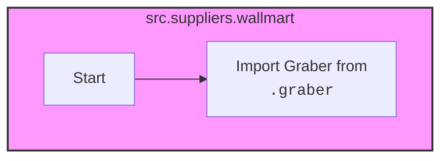

## Анализ кода `hypotez/src/suppliers/wallmart/__init__.py`

### <алгоритм>

1.  **Импорт `Graber`**:
    *   Импортируется класс `Graber` из модуля `src.suppliers.wallmart.graber`.
    *   Это означает, что в текущем пакете `src.suppliers.wallmart` будет доступен класс `Graber` для дальнейшего использования.

### <mermaid>

**Объяснение:**

*   Диаграмма показывает, что в файле `__init__.py` внутри директории `src.suppliers.wallmart` происходит импорт класса `Graber` из файла `graber.py`, находящегося в той же директории.
*   `src.suppliers.wallmart` является файлом, где происходит импорт.
*   `src.suppliers` является родительской директорией, то есть пакетом.
*   Обозначения `file` и `package` используются для наглядности, что есть файл и пакет.

### <объяснение>

**Импорты:**

*   `from .graber import Graber`:
    *   Этот импорт загружает класс `Graber` из модуля `graber.py`, который находится в той же директории, что и `__init__.py`.
    *   Использование точки (`.`) в начале указывает на то, что импорт является относительным и относится к текущему пакету.

**Классы:**

*   `Graber`:
    *   Этот класс, вероятно, отвечает за извлечение данных с веб-сайта Walmart. Его подробное описание находится в файле `graber.py`.
    *   Предположительно, он может содержать методы для загрузки веб-страниц, парсинга HTML и извлечения конкретной информации.
    *   В данном файле `__init__.py`  мы просто делаем этот класс доступным для использования в рамках пакета `src.suppliers.wallmart`.

**Функции:**

*   В данном файле нет явных функций.

**Переменные:**

*   В данном файле нет явных переменных.

**Потенциальные ошибки и области для улучшения:**

*   Наличие магических строк в начале файла (``, `#! venv/bin/python/python3.12`) может привести к проблемам, если используется другая среда. Эти строки предназначены для запуска скриптов и указывают на путь к интерпретатору Python. Лучше использовать стандартизированные подходы, если это требуется, но чаще это не нужно для пакета.
*   Документация модуля `src.suppliers.wallmart` не дает понимания о его цели и использовании.

**Цепочка взаимосвязей:**

1.  `hypotez/src/suppliers/wallmart/__init__.py` импортирует `Graber` из `hypotez/src/suppliers/wallmart/graber.py`.
2.  Класс `Graber` вероятно,  взаимодействует с HTTP-клиентами (например, `requests`) для получения веб-страниц с сайта Walmart.
3.  Пакет `src.suppliers.wallmart` может быть частью более широкой системы сбора данных `hypotez/src/suppliers`.
4.  Данные, извлеченные `Graber`, вероятно, передаются в другие части проекта для хранения, обработки и анализа.