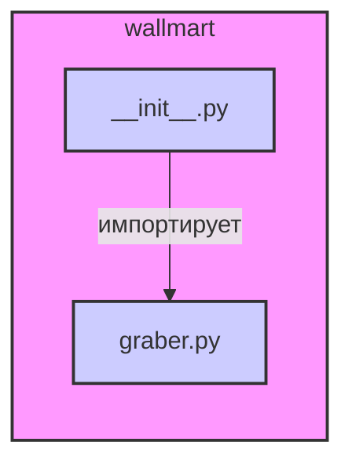

## Анализ кода `hypotez/src/suppliers/wallmart/__init__.py`

### <алгоритм>

1.  **Импорт модуля `graber`:**
    *   Импортируется класс `Graber` из модуля `graber`, находящегося в том же каталоге (`.`).
    *   Пример: `from .graber import Graber`
    *   Поток данных: класс `Graber` становится доступным для использования в текущем модуле (`__init__.py`).

### <mermaid>

**Объяснение зависимостей `mermaid`:**

*   Диаграмма `mermaid` показывает зависимость между файлом `__init__.py` и `graber.py`.
*   `__init__.py` импортирует `graber.py`.
*   Стиль элементов задает цвет и толщину рамки.
*   Узел с именем `wallmart` является подграфом и представляет пакет `wallmart`.
*   Стрелка `импортирует` показывает импорт из `graber.py` в `__init__.py`

### <объяснение>

**Импорты:**

*   `from .graber import Graber`:
    *   Импортирует класс `Graber` из модуля `graber.py`, который находится в том же каталоге, что и файл `__init__.py`.
    *   Назначение: делает класс `Graber` доступным для использования в пакете `wallmart`.
    *   Взаимосвязь: этот импорт устанавливает связь между текущим модулем и модулем `graber`. Это позволяет использовать функциональность класса `Graber`.

**Классы:**

*   `Graber`:
    *   Класс `Graber` импортируется, но его точное определение не представлено в данном коде, оно находится в файле `graber.py`. Предположительно, класс `Graber` отвечает за скрейпинг данных с сайта Wallmart.
    *   Роль: класс, вероятно, содержит методы для загрузки и обработки данных с веб-сайта Wallmart.
    *   Взаимодействие:  модуль `__init__.py`  просто делает этот класс доступным, а его взаимодействие с другими компонентами зависит от того, как он будет использоваться в остальной части проекта.

**Функции:**

*   В этом файле нет явных функций, кроме неявной инициализации модуля.

**Переменные:**

*   В этом файле нет переменных, кроме тех, что неявно создаются при импорте.

**Потенциальные ошибки и области для улучшения:**

*   На данном этапе сложно сказать о потенциальных ошибках, так как большая часть функциональности находится в классе `Graber`, код которого не предоставлен.
*   Область для улучшения:  документирование кода, добавление докстрингов и более подробных комментариев для лучшего понимания.
*   Возможные ошибки: ошибки связанные с импортом `Graber`, если он не реализован.
*   Отсутствует явное использование импортированного класса `Graber` в данном файле.

**Цепочка взаимосвязей с другими частями проекта:**

*   Этот файл (`__init__.py`) является точкой входа в пакет `wallmart`.
*   Импорт класса `Graber` связывает этот пакет с модулем `graber.py`.
*   Зависит от структуры и функциональности класса `Graber`, определенного в модуле `graber.py`, который не предоставляется.
*   Исходя из контекста, этот пакет `wallmart` вероятно является частью системы сбора данных для поставщиков, и этот пакет является одним из поставщиков.
*   Этот пакет будет использоваться для получения данных с веб-сайта Wallmart, который потом, возможно будет обрабатываться или сохраняться в базе данных.