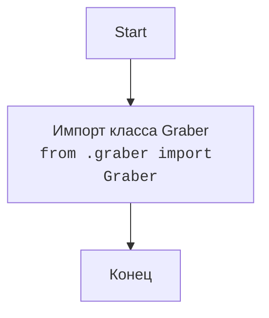

# Анализ кода `hypotez/src/suppliers/wallmart/__init__.py`

## <алгоритм>

1. **Импорт `Graber`**: Из модуля `graber.py`, находящегося в текущем пакете `src.suppliers.wallmart`, импортируется класс `Graber`. Этот класс, вероятно, предназначен для сбора данных (парсинга) со страниц сайта Walmart.

```
Начало
 |
 | Импорт: from .graber import Graber
 V
Класс Graber импортирован
 |
Конец
```

## <mermaid>



### Описание `mermaid` диаграммы

Диаграмма представляет собой простой поток, показывающий процесс импорта класса `Graber`.

*   `Start`: Начало процесса.
*   `ImportGraber`: Операция импорта класса `Graber` из модуля `graber.py`, который находится в той же директории (`.`).
*   `End`: Завершение процесса импорта.

## <объяснение>

### Импорты

*   `from .graber import Graber`:
    *   `.` (точка) указывает на текущий пакет `src.suppliers.wallmart`.
    *   `graber` - это название модуля (файла `graber.py`) в текущем пакете.
    *   `Graber` - это класс, который импортируется из модуля `graber.py`. Этот класс, как предполагается, выполняет функции сбора данных (парсинга) со страниц сайта Walmart.

    **Взаимосвязь с `src`:** Импорт `from .graber` указывает, что модуль `graber.py` является частью пакета `src.suppliers.wallmart`, и, следовательно, данный файл находится внутри иерархии `src` проекта.

### Классы

*   **`Graber`**: 
    *   Роль: Предназначен для сбора данных со страниц сайта Walmart. Предположительно, он содержит логику для загрузки веб-страниц, их парсинга и извлечения необходимых данных.
    *   Атрибуты и методы: Подробности о методах и атрибутах класса `Graber` недоступны, так как код `graber.py` не был предоставлен.
    *   Взаимодействие: Класс `Graber` вероятно используется для получения данных, которые затем обрабатываются другими частями системы или сохраняются в базу данных.

### Функции

*   В данном файле нет никаких функций.

### Переменные

*   В данном файле нет никаких переменных.

### Потенциальные ошибки и области для улучшения

1.  **Отсутствие обработки ошибок**: Код не показывает никаких механизмов обработки ошибок. В реальной ситуации необходимо предусмотреть обработку исключений при импорте.
2.  **Недостаток документации**: Комментарии не дают исчерпывающей информации о функциональности модуля, особенно класса `Graber`. Документация должна быть более подробной.
3.  **Нет примера использования**: В файле нет примера, как используется импортированный класс `Graber`. Хорошей практикой было бы включить пример использования для наглядности.
4.  **Нет явного назначения модуля**: В комментарии `synopsis:` нет явного описания назначения модуля, желательно это исправить.

### Взаимосвязь с другими частями проекта

*   **`src.suppliers`**: Модуль `src.suppliers.wallmart` является частью пакета `src.suppliers`. Он отвечает за сбор данных с сайта Walmart, а другие модули `src.suppliers` могут отвечать за сбор данных с других поставщиков.
*   **Другие части проекта**: Данные, полученные с помощью класса `Graber`, вероятно, используются в других частях системы, например, для анализа, сравнения цен или обновления данных в базе данных.