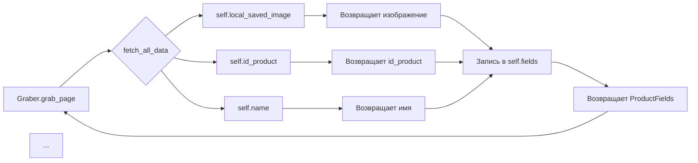

# <input code>

```python
## \file hypotez/src/suppliers/wallmart/graber.py
# -*- coding: utf-8 -*-\
#! venv/Scripts/python.exe
#! venv/bin/python/python3.12

"""
.. module: src.suppliers.wallmart 
	:platform: Windows, Unix
	:synopsis: Класс собирает значение полей на странице  товара `wallmart.com`. 
    Для каждого поля страницы товара сделана функция обработки поля в родительском классе.
    Если нужна нестандертная обработка, функция перегружается в этом классе.
    ------------------
    Перед отправкой запроса к вебдрайверу можно совершить предварительные действия через декоратор. 
    Декоратор по умолчанию находится в родительском классе. Для того, чтобы декоратор сработал надо передать значение 
    в `Context.locator`, Если надо реализовать свой декоратор - раскоментируйте строки с декоратором и переопределите его поведение

"""
MODE = 'dev'

import asyncio
from pathlib import Path
from types import SimpleNamespace
from typing import Any, Callable, Optional
from dataclasses import dataclass, field
from functools import wraps
from pydantic import BaseModel

from src import gs

from src.suppliers import Graber as Grbr, Context, close_pop_up, Locator
from src.product import ProductFields
from src.webdriver import Driver
from src.utils.jjson import j_loads_ns
from src.logger import logger
from src.logger.exceptions import ExecuteLocatorException

from dataclasses import dataclass, field
from types import SimpleNamespace
from typing import Any, Callable


# # Определение декоратора для закрытия всплывающих окон
# # В каждом отдельном поставщике (`Supplier`) декоратор может использоваться в индивидуальных целях
# # Общее название декоратора `@close_pop_up` можно изменить 


# def close_pop_up(value: Any = None) -> Callable:
#     """Создает декоратор для закрытия всплывающих окон перед выполнением основной логики функции.

#     Args:
#         value (Any): Дополнительное значение для декоратора.

#     Returns:
#         Callable: Декоратор, оборачивающий функцию.
#     """
#     def decorator(func: Callable) -> Callable:
#         @wraps(func)
#         async def wrapper(*args, **kwargs):
#             try:
#                 # await Context.driver.execute_locator(Context.locator.close_pop_up)  # Await async pop-up close  
#                 ... 
#             except ExecuteLocatorException as e:
#                 logger.debug(f'Ошибка выполнения локатора: {e}')
#             return await func(*args, **kwargs)  # Await the main function
#         return wrapper
#     return decorator


class Graber(Grbr):
    """Класс для операций захвата Morlevi."""
    supplier_prefix: str

    def __init__(self, driver: Driver):
        """Инициализация класса сбора полей товара."""
        self.supplier_prefix = 'wallmart'
        super().__init__(supplier_prefix=self.supplier_prefix, driver=driver)
        # Устанавливаем глобальные настройки через Context
        
        Context.locator_for_decorator = None # <- если будет уастановлено значение - то оно выполнится в декораторе `@close_pop_up`


    async def grab_page(self, driver: Driver) -> ProductFields:
        """Asynchronous function to grab product fields.

        Args:
            driver (Driver): The driver instance to use for grabbing.

        Returns:
            ProductFields: The grabbed product fields.
        """
        d = self.d = driver  
        
        ...
        # Логика извлечения данных
        async def fetch_all_data(**kwards):
        
            # Call function to fetch specific data
            # await fetch_specific_data(**kwards)  

            # Uncomment the following lines to fetch specific data
            await self.id_product(kwards.get("id_product", ''))
            # ... (много строк с await self.метод(параметр))

        # Call the function to fetch all data
        await fetch_all_data()
        return self.fields
```



# <explanation>

**Импорты**:

Код импортирует необходимые модули и классы из различных частей проекта ( `src`):

- `asyncio`: Для асинхронного кода.
- `pathlib`: Для работы с файлами и путями.
- `types`, `typing`, `dataclasses`, `functools`, `pydantic`:  Стандартные библиотеки Python для различных типов данных, декораторов, и работы с данными.
- `src.gs`: Вероятно,  модуль для работы с Google Sheets.
- `src.suppliers.Graber`, `src.suppliers.Context`, `src.suppliers.close_pop_up`, `src.suppliers.Locator`:  Модули для работы с поставщиками данных.
- `src.product`: Классы и типы данных для описания продукта (поле `ProductFields`).
- `src.webdriver`:  Модуль для работы с веб-драйвером.
- `src.utils.jjson`: Модуль для работы с JSON.
- `src.logger`, `src.logger.exceptions`: Модули для логирования и обработки исключений.


**Классы**:

- `Graber(Grbr)`:  Наследуется от `Graber` в родительском модуле `src.suppliers` (`Grbr`).  Предназначен для сбора данных о товарах со страницы `wallmart.com`.
    - `supplier_prefix`:  Строка, обозначающая поставщика ('wallmart').
    - `__init__(driver: Driver)`: Инициализирует объект `Graber`, принимая экземпляр `Driver` (из `src.webdriver`) для работы с веб-драйвером.
    - `grab_page(driver: Driver) -> ProductFields`: Асинхронный метод, собирающий данные о товаре.  
        - Внутри `fetch_all_data` вызываются методы (например, `id_product`, `name`) для извлечения конкретных полей товара.


**Функции**:

- `fetch_all_data(**kwards)`:  Асинхронная вспомогательная функция, которая в цикле вызывает функции для извлечения данных о товаре (например, `id_product`, `name`).  
- `id_product`, `name`, `local_saved_image` и другие методы:  Вероятно, асинхронные функции, извлекающие конкретные поля продукта.


**Переменные**:

- `self.fields`: Скорее всего, объект `ProductFields`, хранящий собранные данные о товаре.


**Возможные ошибки и улучшения**:

- **Отсутствие обработки исключений:** Внутренние асинхронные вызовы (`await self.id_product(...)`) не содержат обработки исключений. Если какая-то функция `self.метод` кидает ошибку, то это приведет к ошибке всей функции `grab_page`. Нужно добавить `try...except` блоки вокруг каждой вызываемой функции внутри `fetch_all_data`.
- **Жесткая привязка к полям:**  Использование `kwards.get()` для доступа к параметрам делает код более гибким, но все поля должны быть в `kwards`.  Разработать механизм гибкого доступа к данным.
- **Незадокументированные методы:** Методы `id_product`, `name`, `local_saved_image` и т.д. не задокументированы.  Необходимо добавить документацию для каждой функции.
- **Неэффективное использование асинхронности:** Возможно, асинхронность используется неэффективно. Если выполнение задач не зависит друг от друга, можно рассмотреть параллельную обработку.


**Взаимосвязи с другими частями проекта**:

`Graber` напрямую взаимодействует с `Context`, `Driver`, `ProductFields` и другими классами из `src`, обеспечивая сбор данных о товаре из веб-страницы и формирование структуры данных.

```