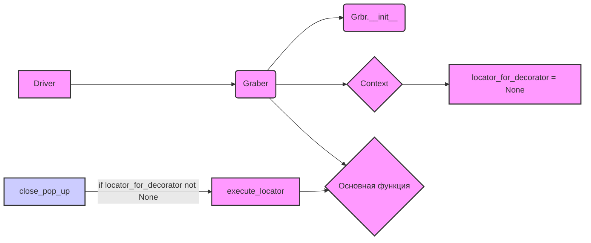

## Анализ кода `hypotez/src/suppliers/wallmart/graber.py`

### <алгоритм>

1. **Инициализация:**
   -  Создается экземпляр класса `Graber`, принимая в качестве аргумента объект `Driver`.
   -  Устанавливается префикс поставщика `supplier_prefix` как `wallmart`.
   -  Вызывается конструктор родительского класса `Graber` (из `src.suppliers.graber`) с `supplier_prefix` и `driver`.
   -  Устанавливается `Context.locator_for_decorator` в `None`, что указывает на отсутствие действий по умолчанию в декораторе `close_pop_up`.

2.  **Декоратор (закомментирован):**
    -   Определение `close_pop_up`, который должен закрывать всплывающее окно перед выполнением функции.
    -   Принимает опциональное значение `value`.
    -   Возвращает декоратор `decorator`, который в свою очередь возвращает `wrapper`.
    -   `wrapper` пытается выполнить действие по локатору `Context.locator.close_pop_up`, который, если установлен, закроет всплывающее окно.
    -   В случае ошибки `ExecuteLocatorException`, ошибка логируется.
    -   После этого выполняется основная функция.

3.  **Класс `Graber`:**
    -   Наследуется от класса `Graber` из `src.suppliers.graber`.
    -   Содержит атрибут `supplier_prefix`, который установлен на `wallmart`.
    -   Имеет конструктор `__init__`, который инициализирует класс и его родительский класс, а также устанавливает начальные настройки контекста.

**Пример работы:**

1. Создается объект `driver` (из `src.webdriver.driver`).
2. Создается экземпляр `Graber` с передачей `driver`.
3. При вызове методов `Graber`, если в `Context.locator_for_decorator` будет установлено значение, будет вызван метод закрытия всплывающего окна перед выполнением основной логики функции с декоратором `close_pop_up`.
4.  Если `Context.locator_for_decorator` равен `None` (как в текущем коде), то декоратор `close_pop_up` не выполнит действия по закрытию окна.

**Поток данных:**

- `Driver` -> `Graber.__init__`
- `Graber` -> `Grbr.__init__` (родительский класс)
- `Context.locator_for_decorator` -> `close_pop_up` (если не `None`)

### <mermaid>

**Объяснение зависимостей в mermaid:**

-   `Driver`: Класс из `src.webdriver.driver`, предоставляющий интерфейс для управления веб-браузером. Он передается в конструктор `Graber`.
-   `Graber`: Класс `Graber` из текущего файла, который наследуется от `Grbr`.
-   `Grbr.__init__`: Конструктор родительского класса `Graber` из `src.suppliers.graber`, который вызывается для инициализации общих параметров.
-   `Context`:  Класс `Context`  из `src.suppliers.graber`, используемый для хранения контекстной информации, такой как локаторы и другие настройки, необходимые для работы граббера.
-   `locator_for_decorator`: Атрибут `locator_for_decorator` класса `Context`, установленный в `None` в конструкторе, управляет использованием декоратора `close_pop_up`.
-    `close_pop_up`: Функция-декоратор, которая может закрыть всплывающее окно перед выполнением основной функции.
-   `execute_locator`:  Метод, который пытается выполнить действие по локатору для закрытия окна.
-   `Основная функция`: Захваченная функция, к которой применяется декоратор `close_pop_up`, если это необходимо.

### <объяснение>

**Импорты:**

-   `typing.Any`: Используется для аннотации типа, указывая, что переменная может быть любого типа.
-   `header`:  Импортируется модуль `header`, но в коде не используется. Возможно, это остаток от предыдущей разработки или недоработка.
-   `src.suppliers.graber.Graber as Grbr, Context, close_pop_up`: Импортируется родительский класс `Graber` (переименован в `Grbr`), класс `Context`, и функция `close_pop_up` из модуля `src.suppliers.graber`. `Grbr` используется для наследования, `Context` для управления контекстом выполнения и `close_pop_up` как декоратор.
-   `src.webdriver.driver.Driver`: Импортируется класс `Driver` для взаимодействия с веб-драйвером.
-   `src.logger.logger.logger`: Импортируется логгер для записи отладочной информации.

**Классы:**

-   `Graber`:
    -   **Роль**: Класс для сбора данных с веб-страниц wallmart.com.
    -   **Атрибуты**:
        -   `supplier_prefix`: Строка, указывающая префикс поставщика (`wallmart`).
    -   **Методы**:
        -   `__init__`: Конструктор класса, инициализирует префикс поставщика, вызывает конструктор родительского класса и устанавливает значение `Context.locator_for_decorator`.
        -  Методы захвата полей из родительского класса (не показаны в данном фрагменте, но подразумеваются)
    -   **Взаимодействие**:
        -   Наследуется от `Graber` из `src.suppliers.graber`, используя его функциональность.
        -   Использует `Driver` для управления веб-браузером.
        -   Управляет контекстом через `Context` для настройки декоратора.

**Функции:**
-  `close_pop_up` (закомментировано):
    -   **Аргументы**:
        - `value: Any`: Опциональное значение, передаваемое декоратору.
    -   **Возвращаемое значение**:
        -   Декоратор, который обертывает функцию для обработки закрытия всплывающих окон.
    -  **Назначение**:
        -   Создает декоратор, который позволяет закрывать всплывающие окна перед выполнением основной логики функции.
    -   **Примеры**:
        -   Пример использования закомментирован в коде. Декоратор можно было бы использовать для любой функции, которая использует `Context.locator_for_decorator` для закрытия всплывающих окон.

**Переменные:**

-   `MODE`: Строка, устанавливающая режим работы, сейчас установлена в `dev`.
-   `supplier_prefix`: Атрибут класса `Graber`, строка `wallmart`.

**Потенциальные ошибки и области для улучшения:**

1.  **Неиспользуемый импорт**: Импорт `header` не используется в коде, и его можно удалить.
2.  **Закомментированный декоратор**: Декоратор `close_pop_up` закомментирован. Если планируется его использование, то необходимо его раскомментировать и настроить.
3.  **Жестко заданный префикс**: `supplier_prefix` задан жестко в конструкторе. Возможно, лучше было бы передавать его в конструктор как параметр.
4.  **Обработка ошибок**:  Хотя в декораторе есть блок `try...except` для обработки `ExecuteLocatorException`, остальные части кода не имеют явной обработки ошибок. Следует предусмотреть более детальную обработку ошибок, в зависимости от логики работы.
5.  **Отсутствие примеров использования**: В коде отсутствуют примеры использования класса `Graber`, что усложняет понимание его работы и интеграции в проект.
6. **Неоднозначный комментарий `Устанавливаем глобальные настройки через Context`**: Непонятно, какие именно глобальные настройки имеются ввиду, кроме `locator_for_decorator`.

**Взаимосвязи с другими частями проекта:**

-   Зависимость от `src.suppliers.graber`: Этот модуль наследует класс `Graber` и использует его функциональность.
-   Зависимость от `src.webdriver.driver`: Использует `Driver` для управления веб-браузером, что является частью инфраструктуры.
-   Зависимость от `src.logger.logger`: Использует логгер для записи отладочной информации, что позволяет следить за выполнением кода.

**Общее заключение:**

Код представляет собой класс для сбора данных с веб-страниц `wallmart.com`, который использует драйвер веб-браузера и предоставляет механизмы для предварительной обработки страниц (декоратор `close_pop_up`).  Однако, код имеет некоторые недостатки, которые описаны выше и которые стоит исправить.