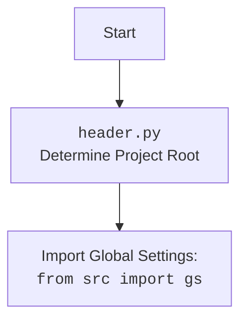

# Анализ кода `hypotez/src/suppliers/wallmart/graber.py`

## <алгоритм>

1. **Импорт модулей**:
   - Импортируются необходимые модули и классы из других частей проекта, такие как `header`, `src.suppliers.graber`, `src.webdriver.driver`, `src.logger.logger`, а также стандартные библиотеки `typing` и `wraps`.
   - Пример: `from src.suppliers.graber import Graber as Grbr, Context, close_pop_up`

2. **Определение класса `Graber`**:
   - Создается класс `Graber`, наследующий функциональность от класса `Graber` (который переименован как `Grbr`) из `src.suppliers.graber`.
   - Пример: `class Graber(Grbr):`

3. **Инициализация экземпляра `Graber` (`__init__`)**:
   - Метод инициализирует атрибут `supplier_prefix` значением 'wallmart'.
   - Вызывается конструктор родительского класса `Grbr` через `super().__init__`, передавая `supplier_prefix` и объект `driver`.
   - Задается значение `Context.locator_for_decorator = None`, что отключает выполнение декоратора по умолчанию.
   - Пример:
     ```python
     def __init__(self, driver: Driver):
        self.supplier_prefix = 'wallmart'
        super().__init__(supplier_prefix=self.supplier_prefix, driver=driver)
        Context.locator_for_decorator = None
     ```

4. **(Опционально) Реализация декоратора `close_pop_up` (закомментировано)**:
   -  Предоставлен шаблон декоратора `close_pop_up` для закрытия всплывающих окон.
   -  Декоратор принимает значение `value` (по умолчанию `None`) и оборачивает функцию, выполняя код по закрытию всплывающего окна.
   -  Пример:
    ```python
     def close_pop_up(value: Any = None) -> Callable:
         def decorator(func: Callable) -> Callable:
            @wraps(func)
            async def wrapper(*args, **kwargs):
                try:
                    ...
                except ExecuteLocatorException as e:
                    logger.debug(f'Ошибка выполнения локатора: {e}')
                return await func(*args, **kwargs)
            return wrapper
        return decorator
    ```

5. **Завершение**:
   - Класс `Graber` готов к использованию для сбора данных о товарах с сайта wallmart.com.

## <mermaid>

```mermaid
flowchart TD
    Start[Start] --> ImportModules[Импорт модулей и классов]
    ImportModules --> DefineGraberClass[Определение класса Graber]
    DefineGraberClass --> InitGraber[Инициализация экземпляра Graber (__init__)]
    InitGraber --> SetSupplierPrefix[Установка supplier_prefix = 'wallmart']
    SetSupplierPrefix --> CallSuperInit[Вызов конструктора родительского класса Grbr]
    CallSuperInit --> SetContextLocatorNone[Установка Context.locator_for_decorator = None]
    SetContextLocatorNone --> End[Конец]
    
    subgraph Декоратор close_pop_up (закомментирован)
        DecorStart[Начало декоратора] --> DecorDefine[Определение декоратора close_pop_up]
        DecorDefine --> DecorWrapper[Определение обертки wrapper]
        DecorWrapper --> DecorTryCatch[Выполнение логики try-catch закрытия всплывающего окна]
        DecorTryCatch --> DecorReturn[Возврат обернутой функции]
        DecorReturn --> DecorEnd[Конец декоратора]
    end
    
    
    style ImportModules fill:#f9f,stroke:#333,stroke-width:2px
    style DefineGraberClass fill:#ccf,stroke:#333,stroke-width:2px
    style InitGraber fill:#aaf,stroke:#333,stroke-width:2px
    style SetSupplierPrefix fill:#ddf,stroke:#333,stroke-width:2px
    style CallSuperInit fill:#aaf,stroke:#333,stroke-width:2px
    style SetContextLocatorNone fill:#ddf,stroke:#333,stroke-width:2px
    style DecorStart fill:#eee,stroke:#ccc,stroke-width:2px
     style DecorDefine fill:#eee,stroke:#ccc,stroke-width:2px
     style DecorWrapper fill:#eee,stroke:#ccc,stroke-width:2px
     style DecorTryCatch fill:#eee,stroke:#ccc,stroke-width:2px
     style DecorReturn fill:#eee,stroke:#ccc,stroke-width:2px
```


**Описание `mermaid` диаграммы:**

- **flowchart TD**: Определяет тип диаграммы как блок-схему (flowchart) с направлением слева направо (TD).
-   **Start**: Начало выполнения программы.
-   **ImportModules**: Блок, представляющий импорт необходимых модулей, таких как `header`, `src.suppliers.graber`, `src.webdriver.driver`, `src.logger.logger`, `typing`, `wraps`.
-   **DefineGraberClass**: Блок, представляющий определение класса `Graber`, который наследуется от класса `Graber` из `src.suppliers.graber` (обозначенного как `Grbr`).
-   **InitGraber**: Блок, представляющий инициализацию экземпляра класса `Graber` в методе `__init__`.
-   **SetSupplierPrefix**: Блок, устанавливающий значение атрибута `supplier_prefix` равным `'wallmart'`.
-   **CallSuperInit**: Блок, представляющий вызов конструктора родительского класса `Grbr` с передачей `supplier_prefix` и объекта `driver`.
-   **SetContextLocatorNone**: Блок, который устанавливает `Context.locator_for_decorator` в `None`.
-   **End**: Конец выполнения программы.
-   **Декоратор `close_pop_up`**: Подграф, представляющий логику (закомментированного) декоратора `close_pop_up`.
    -   **DecorStart**: Начало определения декоратора.
    -   **DecorDefine**: Определение декоратора `close_pop_up`.
    -   **DecorWrapper**: Определение обертки `wrapper` внутри декоратора.
    -   **DecorTryCatch**: Блок обработки исключений при попытке закрытия всплывающего окна.
    -   **DecorReturn**: Возврат обернутой функции.
    -   **DecorEnd**: Конец определения декоратора.
- **Стилизация**: Блоки выделены цветом и обведены рамкой для визуального разделения логических этапов.
- **header.py**: Начало процесса обработки `header.py`.
- **Import Global Settings**: Импорт глобальных настроек из `src.gs`.

## <объяснение>

### Импорты

-   `typing.Any`: Используется для аннотации типов, указывая, что переменная может быть любого типа.
-   `header`: Предположительно, это модуль для определения пути к корневому каталогу проекта и, возможно, для загрузки глобальных настроек.
-   `src.suppliers.graber.Graber as Grbr, Context, close_pop_up`:
    -   `Graber as Grbr`: Импортирует класс `Graber` из модуля `src.suppliers.graber` и переименовывает его в `Grbr`. Это родительский класс для текущего класса `Graber`.
    -   `Context`:  Импортирует класс или объект `Context`, используемый для хранения глобальных данных, таких как драйвер веб-браузера, локаторы элементов и т. д.
    -   `close_pop_up`: Импортирует функцию `close_pop_up` (или декоратор), предназначенный для закрытия всплывающих окон.
-   `src.webdriver.driver.Driver`: Импортирует класс `Driver` из модуля `src.webdriver.driver`. Этот класс, вероятно, используется для управления веб-драйвером (например, Selenium).
-   `src.logger.logger.logger`: Импортирует объект `logger` из модуля `src.logger.logger` для журналирования событий и отладки.

### Классы

-   **`Graber(Grbr)`**:
    -   **Роль**: Класс `Graber` предназначен для сбора данных о товарах с веб-сайта Wallmart. Он наследует функциональность от класса `Grbr` из `src.suppliers.graber`.
    -   **Атрибуты**:
        -   `supplier_prefix` (str): Атрибут, хранящий префикс поставщика (в данном случае 'wallmart').
    -   **Методы**:
        -   `__init__(self, driver: Driver)`: Конструктор класса. Инициализирует атрибут `supplier_prefix`, вызывает конструктор родительского класса и устанавливает `Context.locator_for_decorator` в `None`.
        - **`close_pop_up` (закомментирован)**:  Предоставлен шаблон декоратора для закрытия всплывающих окон, который можно использовать, раскомментировав его. Он обертывает функции и выполняет логику для закрытия всплывающего окна перед их выполнением.

### Функции

-   **`__init__(self, driver: Driver)`**
    -   **Аргументы**:
        -   `driver` (Driver): Экземпляр класса `Driver` для управления веб-драйвером.
    -   **Возвращаемое значение**: Нет.
    -   **Назначение**: Инициализирует экземпляр класса `Graber`. Устанавливает префикс поставщика, вызывает конструктор родительского класса, передавая префикс и драйвер, и отключает декоратор по умолчанию, устанавливая `Context.locator_for_decorator` в `None`.
    - **Пример**:
        ```python
            grabber = Graber(driver=my_driver)
        ```

- **`close_pop_up(value: Any = None)` (закомментирована)**
    -   **Аргументы**:
        -   `value` (Any, optional): Дополнительное значение для декоратора (по умолчанию None).
    -   **Возвращаемое значение**: Декоратор `decorator` (Callable).
    -   **Назначение**: Создает декоратор для закрытия всплывающих окон. Декоратор оборачивает функцию и выполняет логику закрытия всплывающего окна перед её вызовом. Использует `try-except` для обработки возможных исключений при выполнении локатора.
     -   **Пример**: (предположительное использование, если раскомментировать)
    ```python
    @close_pop_up()
    async def my_function():
        #Основная логика функции
        pass
    ```

### Переменные

-   `supplier_prefix` (str): Атрибут класса, хранящий префикс поставщика ('wallmart').
-   `driver` (Driver): Экземпляр класса `Driver`, используемый для управления веб-драйвером.
-  `Context.locator_for_decorator` (Any): Атрибут класса `Context` который может хранить локатор, используемый декоратором `@close_pop_up`, если он задан, в ином случае декоратор по умолчанию не работает.

### Потенциальные ошибки и области для улучшения

- **Зависимость от `Context.locator_for_decorator`**: Код зависит от глобального объекта `Context` для управления декоратором. Это может привести к трудностям при тестировании и отладке.
- **Закомментированный декоратор**: Декоратор `close_pop_up` закомментирован. Для его использования необходимо раскомментировать и предоставить реализацию.
- **Обработка ошибок**: Блок `try-except` в `close_pop_up` регистрирует ошибку, но не предпринимает никаких действий для восстановления. Возможно, следует добавить обработку ошибок более детально.

### Взаимосвязь с другими частями проекта

-   Класс `Graber` наследует от `src.suppliers.graber.Graber`, что предполагает наличие общего интерфейса для всех граберов поставщиков.
-   Использует `src.webdriver.driver.Driver` для управления веб-драйвером.
-   Логгирование осуществляется через `src.logger.logger`.
-   Использует `src.header.py` для определения путей к проекту и загрузки настроек
-   `Context` используется для передачи данных между разными частями приложения.

Этот анализ предоставляет подробное описание функциональности кода, его структуры, взаимодействия с другими частями проекта и потенциальных улучшений.