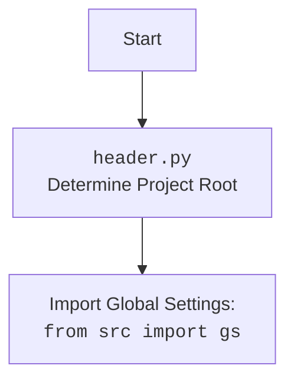

## <алгоритм>

1.  **Импорт модулей**:
    *   Импортируются необходимые модули, такие как `typing`, `header`, `src.suppliers.graber`, `src.webdriver.driver`, и `src.logger.logger`.
    *   Пример: `from src.suppliers.graber import Graber as Grbr, Context, close_pop_up`
2.  **Определение класса `Graber`**:
    *   Класс `Graber` наследуется от класса `Graber` (переименованного в `Grbr`) из модуля `src.suppliers.graber`.
    *   Пример: `class Graber(Grbr):`
3.  **Инициализация `__init__`**:
    *   Конструктор класса `__init__` принимает аргумент `driver` типа `Driver`.
    *   Устанавливается префикс поставщика `supplier_prefix` как `'wallmart'`.
    *   Вызывается конструктор родительского класса `Grbr` с префиксом поставщика и драйвером.
        *   Пример: `super().__init__(supplier_prefix=self.supplier_prefix, driver=driver)`
    *   Устанавливается `Context.locator_for_decorator` в `None`.
        *   Пример: `Context.locator_for_decorator = None`

## <mermaid>

```mermaid
flowchart TD
    Start[Start] --> ImportModules[Import Modules];
    ImportModules --> ClassGraber[Class Graber Definition];
    ClassGraber --> InitMethod[__init__ method];
    InitMethod --> SetSupplierPrefix[Set supplier_prefix = 'wallmart'];
    SetSupplierPrefix --> CallParentInit[Call super().__init__];
    CallParentInit --> SetContextLocator[Set Context.locator_for_decorator = None];
    SetContextLocator --> End[End];

    classDef imported fill:#f9f,stroke:#333,stroke-width:2px
    class ImportModules,header,src.suppliers.graber,src.webdriver.driver,src.logger.logger imported
```



## <объяснение>

**Импорты:**

*   `typing`: Модуль для поддержки аннотаций типов, используется для статической проверки кода и улучшения его читаемости.
*   `header`: Локальный модуль, вероятно, определяющий корневую директорию проекта и глобальные настройки.
*   `src.suppliers.graber`:  Импортирует класс `Graber` (переименован в `Grbr`), класс `Context` и функцию `close_pop_up` из модуля `src.suppliers.graber`. Этот модуль, вероятно, содержит базовую логику для сбора данных со страниц поставщиков, предоставляя общую структуру и методы для работы с веб-страницами, а `Context`, вероятно, содержит общие данные для работы грабера.
*   `src.webdriver.driver`: Модуль, содержащий класс `Driver` для управления веб-драйвером (например, Chrome или Firefox), который используется для взаимодействия с веб-страницами.
*    `src.logger.logger`: Модуль для логирования, используемый для записи сообщений о работе приложения, отладки и поиска ошибок.

**Классы:**

*   `Graber(Grbr)`:
    *   **Роль**: Класс `Graber` предназначен для сбора данных со страниц `wallmart.com`. Он наследует функциональность базового класса `Grbr` и переопределяет поведение для конкретного поставщика.
    *   **Атрибуты**:
        *   `supplier_prefix`: Строка, определяющая префикс поставщика (`'wallmart'`).
    *   **Методы**:
        *   `__init__(self, driver: Driver)`:
            *   Конструктор класса, инициализирует экземпляр класса `Graber`.
            *   Принимает объект `Driver`, необходимый для управления веб-драйвером.
            *   Устанавливает `supplier_prefix` в `'wallmart'`.
            *   Вызывает конструктор родительского класса `Grbr` для настройки базовой функциональности грабера.
            *   Устанавливает атрибут `Context.locator_for_decorator` в `None`, отключая дефолтный декоратор при инициализации.

**Функции:**

*   `close_pop_up`: Это закомментированная функция, которая демонстрирует пример декоратора для закрытия всплывающих окон перед выполнением основной логики функции. В текущей реализации она не используется.
    *   **Аргументы**:
        *   `value`: Значение любого типа.
    *   **Возвращаемое значение**: Декоратор, оборачивающий функцию.
    *   **Назначение**:  Предназначен для обработки всплывающих окон до выполнения основной функции. Декоратор использует `Context.locator` для поиска и закрытия окна.

**Переменные:**

*   `supplier_prefix`: Строка, определяющая префикс поставщика ('wallmart').
*   `Context.locator_for_decorator`: Атрибут класса `Context`, который управляет применением декоратора. В этом коде установлено в `None`, отключая дефолтный декоратор при инициализации.

**Потенциальные ошибки и области для улучшения:**

*   Закомментированный код декоратора `close_pop_up` может быть удален или использоваться в будущем, если потребуется кастомизация обработки всплывающих окон.
*   Отсутствие обработки исключений в `__init__` может привести к неожиданным сбоям при инициализации.
*   Желательно добавить логирование, чтобы отслеживать работу грабера и выявлять возможные проблемы.
*   Необходимо убедиться, что все импортируемые модули `src.*` существуют и соответствуют ожидаемой структуре проекта.

**Взаимосвязи с другими частями проекта:**

*   Класс `Graber` взаимодействует с модулем `src.suppliers.graber`, наследуя от него функциональность для сбора данных.
*   Класс использует `src.webdriver.driver` для управления веб-драйвером и взаимодействия с веб-страницами.
*   Логика работы класса зависит от конфигурации `header.py`.
*   Взаимодействует с модулем логирования `src.logger.logger` для записи событий.
*   Используется класс `Context` для хранения и передачи общего контекста и состояния.