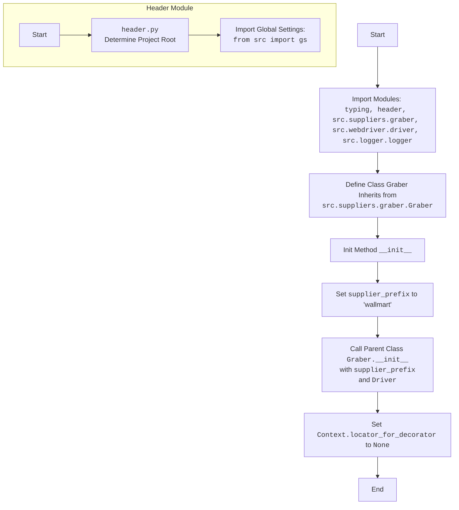

## ИНСТРУКЦИЯ:

Анализируй предоставленный код подробно и объясни его функциональность. Ответ должен включать три раздела:

1. **<алгоритм>**: Опиши рабочий процесс в виде пошаговой блок-схемы, включая примеры для каждого логического блока, и проиллюстрируй поток данных между функциями, классами или методами.
2. **<mermaid>**: Напиши код для диаграммы в формате `mermaid`, проанализируй и объясни все зависимости,
    которые импортируются при создании диаграммы.
    **ВАЖНО!** Убедитесь, что все имена переменных, используемые в диаграмме `mermaid`,
    имеют осмысленные и описательные имена. Имена переменных вроде `A`, `B`, `C`, и т.д., не допускаются!

    **Дополнительно**: Если в коде есть импорт `import header`, добавьте блок `mermaid` flowchart, объясняющий `header.py`:
    ```mermaid
    flowchart TD
        Start --> Header[<code>header.py</code><br> Determine Project Root]

        Header --> import[Import Global Settings: <br><code>from src import gs</code>]
    ```

3. **<объяснение>**: Предоставьте подробные объяснения:
   - **Импорты**: Их назначение и взаимосвязь с другими пакетами `src.`.
   - **Классы**: Их роль, атрибуты, методы и взаимодействие с другими компонентами проекта.
   - **Функции**: Их аргументы, возвращаемые значения, назначение и примеры.
   - **Переменные**: Их типы и использование.
   - Выделите потенциальные ошибки или области для улучшения.

Дополнительно, постройте цепочку взаимосвязей с другими частями проекта (если применимо).

Это обеспечивает всесторонний и структурированный анализ кода.
## Формат ответа: `.md` (markdown)
**КОНЕЦ ИНСТРУКЦИИ**

## <алгоритм>

1. **Импорт модулей:**
    - Импортируются необходимые модули: `typing`, `header`, `src.suppliers.graber`, `src.webdriver.driver`, `src.logger.logger`.
    *Пример:* Импорт `header` для определения корневой директории проекта и глобальных настроек.

2. **Определение класса `Graber`:**
    - Класс `Graber` наследует от `Graber` из `src.suppliers.graber`.
    *Пример:* `class Graber(Grbr):` - класс `Graber` получает все методы и атрибуты от класса `Grbr`.
    - Определяется атрибут `supplier_prefix` со значением `'wallmart'`.
    *Пример:* `self.supplier_prefix = 'wallmart'` - указывает, что этот грабер предназначен для магазина Wallmart.
    - Инициализируется конструктор `__init__`, который принимает объект `Driver`
    *Пример:* `def __init__(self, driver: Driver):` - конструктор принимает объект `Driver` для управления браузером.

3. **Инициализация `__init__`:**
    - Устанавливается `supplier_prefix` значением `'wallmart'`.
    - Вызывается конструктор родительского класса `Grbr` с указанием `supplier_prefix` и объекта `Driver`.
    *Пример:* `super().__init__(supplier_prefix=self.supplier_prefix, driver=driver)` - инициализация родительского класса `Graber`.
    - Устанавливается `Context.locator_for_decorator = None`, отключая декоратор по умолчанию.
    *Пример:* `Context.locator_for_decorator = None` -  декоратор не будет использоваться для обработки веб элементов.

## <mermaid>



**Анализ зависимостей в `mermaid`:**

-   **`Start`**: Начало процесса.
-   **`ImportModules`**: Импортируются все необходимые модули, которые нужны для работы класса.
-    **`ClassGraber`**: Объявление класса `Graber`, который наследуется от класса `Graber` в модуле `src.suppliers.graber`. Это означает, что класс `Graber` в `wallmart.graber.py` будет использовать и расширять функциональность класса `Graber` из `src.suppliers.graber`.
-   **`InitMethod`**: Внутри класса `Graber` вызывается конструктор (`__init__`).
-   **`SetSupplierPrefix`**: В конструкторе устанавливается значение атрибута `supplier_prefix`, который определяет, для какого поставщика предназначен данный грабер.
-   **`CallParentInit`**: Вызывается конструктор родительского класса `Graber` из `src.suppliers.graber`, что позволяет унаследовать его функциональность и правильно инициализировать объект.
-   **`SetContextLocator`**: Устанавливается `Context.locator_for_decorator` в `None`, чтобы отключить стандартный декоратор.
-  **`End`**: Конец процесса инициализации класса `Graber`.
- **`Header Module`**:  Показывает процесс инициализации `header.py`.
    - **`HeaderStart`**: Начало процесса инициализации.
    -  **`HeaderModule`**: Определение корневой директории проекта в `header.py`.
    -  **`ImportGlobalSettings`**: Импортирование глобальных настроек из `src.gs`.

**Зависимости:**

-   Класс `Graber` зависит от:
    -   `src.suppliers.graber.Graber` (родительский класс).
    -   `src.webdriver.driver.Driver` (для управления браузером).
    -   `src.logger.logger` (для логирования).
    -   `header` (для определения корневой директории проекта и импорта глобальных настроек).
-   Импорт `header` необходим для определения глобальных настроек проекта через `from src import gs`.

## <объяснение>

**Импорты:**

-   `typing`:  Модуль для статической типизации, используется для объявления типов переменных и функций. В данном случае используется `Any` для указания того, что переменная может быть любого типа.
-   `header`: Кастомный модуль, вероятно, для определения корневой директории проекта и импорта глобальных настроек. В коде показан фрагмент, где импортируется `src.gs` из этого модуля.
-   `src.suppliers.graber`: Содержит базовый класс `Graber`, от которого наследуется текущий класс. Класс `Context` и функция `close_pop_up` используются для работы с контекстом и декораторами.
-   `src.webdriver.driver`: Содержит класс `Driver`, который управляет веб-браузером для сбора данных.
-  `src.logger.logger`:  Модуль для логирования событий, используется для отладки и мониторинга работы программы.

**Классы:**

-   `Graber(Grbr)`:
    -   **Роль:** Класс для сбора данных со страниц товаров Wallmart.
    -   **Атрибуты:**
        -   `supplier_prefix`: Строка, обозначающая поставщика - 'wallmart'.
    -   **Методы:**
        -   `__init__(self, driver: Driver)`: Конструктор класса, инициализирует объект грабера. Вызывает конструктор родительского класса `Graber` и устанавливает начальное значение `Context.locator_for_decorator`.

**Функции:**

-  `close_pop_up`: Закомментированная функция-декоратор.

**Переменные:**

-   `supplier_prefix`:  Строковая переменная, хранит префикс поставщика ('wallmart').
-  `Context.locator_for_decorator`: Глобальная переменная, управляющая работой декоратора.

**Потенциальные ошибки и области для улучшения:**

-   **Закомментированный декоратор:** Код содержит закомментированный пример декоратора `close_pop_up`. В будущем можно реализовать логику работы с декораторами.  Для этого надо раскомментировать и настроить.
-   **Отсутствие конкретной реализации сбора данных:**  Класс `Graber` в текущем виде не содержит никакой конкретной логики для сбора данных. В дальнейшем потребуется добавление методов для сбора данных с веб-страниц Wallmart.
-   **Обработка ошибок:**  Отсутствует полноценная обработка ошибок. Необходимо добавить try-except блоки для обработки возможных исключений при работе с веб-драйвером.

**Взаимосвязь с другими частями проекта:**

-   Класс `Graber` является частью модуля `src.suppliers`, который предназначен для сбора данных с различных поставщиков.
-   Класс `Graber` использует `src.webdriver.driver` для управления браузером.
-   Класс `Graber` использует `src.logger.logger` для логирования.
-   Класс `Graber` наследуется от `src.suppliers.graber.Graber`, что обеспечивает общую структуру и поведение для граберов разных поставщиков.
-   `header.py` обеспечивает доступ к глобальным настройкам проекта через `from src import gs`.