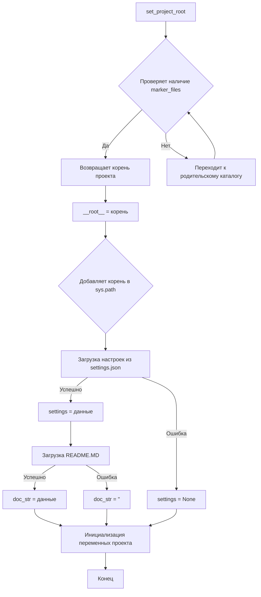

```MD
# <input code>

```python
## \file hypotez/src/suppliers/wallmart/header.py
# -*- coding: utf-8 -*-\
#! venv/Scripts/python.exe
#! venv/bin/python/python3.12

"""
.. module: src.suppliers.wallmart 
	:platform: Windows, Unix
	:synopsis:

"""
MODE = 'dev'


import sys
import json
from packaging.version import Version

from pathlib import Path
def set_project_root(marker_files=('pyproject.toml', 'requirements.txt', '.git')) -> Path:
    """
    Finds the root directory of the project starting from the current file's directory,
    searching upwards and stopping at the first directory containing any of the marker files.

    Args:
        marker_files (tuple): Filenames or directory names to identify the project root.
    
    Returns:
        Path: Path to the root directory if found, otherwise the directory where the script is located.
    """
    __root__:Path
    current_path:Path = Path(__file__).resolve().parent
    __root__ = current_path
    for parent in [current_path] + list(current_path.parents):
        if any((parent / marker).exists() for marker in marker_files):
            __root__ = parent
            break
    if __root__ not in sys.path:
        sys.path.insert(0, str(__root__))
    return __root__


# Get the root directory of the project
__root__ = set_project_root()
"""__root__ (Path): Path to the root directory of the project"""

from src import gs

settings:dict = None
try:
    with open(gs.path.root / 'src' / 'settings.json', 'r') as settings_file:
        settings = json.load(settings_file)
except (FileNotFoundError, json.JSONDecodeError):
    ...

doc_str:str = None
try:
    with open(gs.path.root / 'src' / 'README.MD', 'r') as settings_file:
        doc_str = settings_file.read()
except (FileNotFoundError, json.JSONDecodeError):
    ...


__project_name__ = settings.get("project_name", 'hypotez') if settings  else 'hypotez'
__version__: str = settings.get("version", '')  if settings  else ''
__doc__: str = doc_str if doc_str else ''
__details__: str = ''
__author__: str = settings.get("author", '')  if settings  else ''
__copyright__: str = settings.get("copyrihgnt", '')  if settings  else ''
__cofee__: str = settings.get("cofee", "Treat the developer to a cup of coffee for boosting enthusiasm in development: https://boosty.to/hypo69")  if settings  else "Treat the developer to a cup of coffee for boosting enthusiasm in development: https://boosty.to/hypo69"
```

# <algorithm>

**Шаг 1**: Функция `set_project_root` ищет корень проекта, начиная с текущей директории.

* **Входные данные**: кортеж `marker_files` с файлами-маркерами проекта.
* **Выходные данные**: `Path` к корневой директории проекта.
* **Логика**: Проверяет все родительские директории текущей относительно `__file__`,  используя `current_path.parents`, пока не найдёт директорию, содержащую хотя бы один из файлов из `marker_files`. Если ничего не найдено, возвращает директорию текущего файла.  Добавляет корневую директорию в `sys.path` для импортов.


**Шаг 2**: `__root__ = set_project_root()`: Вызов функции для получения корня проекта.


**Шаг 3**: Чтение настроек из `settings.json` и `README.MD` (оба файла находятся в корне проекта).

* **Входные данные**: Пути к файлам.
* **Выходные данные**: `settings` (словарь), `doc_str` (строка).
* **Логика**: При успешном чтении файла и распаковке данных, переменные наполняются соответствующими данными, в противном случае остаются со значениями по умолчанию.

**Шаг 4**: Создание переменных проекта: `__project_name__`, `__version__`, `__doc__`, `__details__`, `__author__`, `__copyright__`, `__cofee__`.


# <mermaid>



**Объяснение зависимостей в mermaid**:

* `set_project_root`: Зависимость от `Path` для работы с путями.
* Чтение файлов `settings.json` и `README.MD`: Зависимость от `json` для парсинга JSON и от `pathlib` для работы с файловыми путями.
* `gs`:  Объект `gs` предположительно из модуля `src.gs`, отвечает за получение пути к корню проекта.


# <explanation>

**Импорты**:

* `sys`: для работы с переменными среды.
* `json`: для работы с JSON файлами.
* `packaging.version`: для работы с версиями.
* `pathlib`:  для работы с путями файлов.
* `src.gs`: предположительно модуль, предоставляющий функции для работы с путями к проекту.


**Классы**:

В данном коде нет классов, только функции.


**Функции**:

* `set_project_root(marker_files)`: находит корневую директорию проекта.  Важная функция для обеспечения независимости кода от конкретного пути к проекту.


**Переменные**:

* `MODE`: константа, вероятно, задаёт режим работы.
* `__root__`: путь к корню проекта.
* `settings`: словарь с настройками проекта (из `settings.json`).
* `doc_str`: строка с содержимым `README.MD`.
* `__project_name__`, `__version__`, `__doc__`, `__details__`, `__author__`, `__copyright__`, `__cofee__`: строковые переменные, хранящие информацию о проекте, получаемые из `settings` или имеющие значения по умолчанию.


**Возможные ошибки и улучшения**:

* **Обработка ошибок:** Блоки `try...except` для чтения файлов важны для предотвращения аварийных завершений программы при отсутствии файлов или неправильном формате. Но более подробный лог ошибок (например, в `logging`) улучшил бы диагностику.
* **`gs.path.root`**: Неясно, откуда берётся объект `gs.path.root` и как он реализован.  Необходимо знать реализацию этого объекта для лучшего понимания его работы.


**Взаимосвязи с другими частями проекта**:

Функция `set_project_root` важна, чтобы  код в `src` мог обращаться к файлам проекта, независимо от места вызова. Модуль `src.gs` используется для получения корня проекта. Файлы `settings.json` и `README.MD` содержат конфигурацию и документацию соответственно.  Этот заголовочный файл вероятно используется другими частями проекта для получения данных о проекте и его путях.